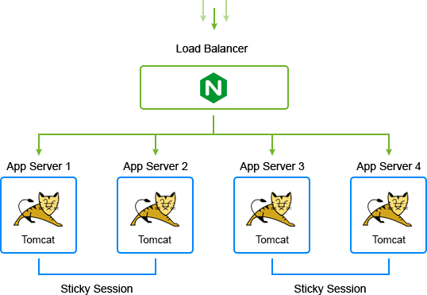
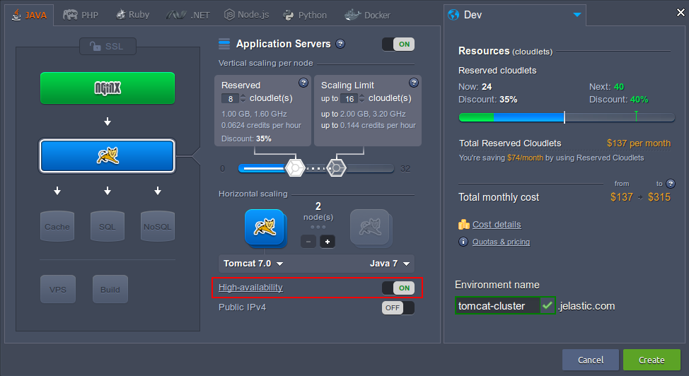

<!-- ## Tomcat Cluster in the Cloud -->

The platform multicast and redirecting requests to each server with load balancer provides session replication between the pairs of server nodes. This guarantees session exchange between the nodes through the local net and eliminates the need of additional software or Memcached. With this approach you can use a big clustered app hosting.

This instruction shows the clustering technology used in the platform by the example of the Tomcat app server.

<div style={{
    display:'flex',
    justifyContent: 'center',
    margin: '0 0 1rem 0'
}}>



</div>

The given scheme presents a **Tomcat cluster** with two servers and one load balancer. All requests are handled and distributed by the balancer between different nodes due to the availability and server load.

If one of the servers fails, the users from that node will be automatically switched to the other instance of this Tomcat cluster. Thanks to the replication, the other instance already has all the sessions of the failed node, so end-users never notice any change.

**To use the Tomcat clustering in the platform, you have to perform the next steps:
**

1. Log into your platform dashboard.

2. Click **New Environment**.

<div style={{
    display:'flex',
    justifyContent: 'center',
    margin: '0 0 1rem 0'
}}>


</div>

3. Pick **Tomcat** as the application server you want to use, specify the cloudlet limits and turn on **High-availability** as shown in the picture below. State the name of the environment and click **Create**.

<div style={{
    display:'flex',
    justifyContent: 'center',
    margin: '0 0 1rem 0'
}}>



</div>

:::tip Note

_Horizontal scaling_ and _High Availability_ mode are two different functionalities in the platform. With the first one you have multiple servers and the load is distributed evenly between the chosen number of instances with the load balancer. High Availability mode sets replication between pair or few pairs of servers using multicast membership.

:::

When you enable _High Availability_ a special Tomcat config file (**_jelastic-ha.xml_**) is generated for each node by our system. Here is an example:

```bash
<Cluster className="org.apache.catalina.ha.tcp.SimpleTcpCluster"
      channelSendOptions="4">

<Manager className="org.apache.catalina.ha.session.DeltaManager"
      expireSessionsOnShutdown="false"
      notifyListenersOnReplication="true"/>

<Channel className="org.apache.catalina.tribes.group.GroupChannel">

 <Membership className="org.apache.catalina.tribes.membership.McastService"
       address="228.0.0.4"
       port="${MagicPort}"
       frequency="500"
       dropTime="3000"/>

 <Receiver className="org.apache.catalina.tribes.transport.nio.NioReceiver"
       address="${ReceiverIp}"
       port="4000"
       autoBind="100"
       selectorTimeout="5000"
       maxThreads="6"/>

 <Sender className="org.apache.catalina.tribes.transport.ReplicationTransmitter">
 <Transport className="org.apache.catalina.tribes.transport.nio.PooledParallelSender"/>
 </Sender>

 <Interceptor className="org.apache.catalina.tribes.group.interceptors.TcpFailureDetector"/>
 <Interceptor className="org.apache.catalina.tribes.group.interceptors.MessageDispatch15Interceptor"/>
</Channel>

 <Valve className="org.apache.catalina.ha.tcp.ReplicationValve"
     filter=""/>
 <Valve className="org.apache.catalina.ha.session.JvmRouteBinderValve"/>

 <ClusterListener className="org.apache.catalina.ha.session.JvmRouteSessionIDBinderListener"/>
 <ClusterListener className="org.apache.catalina.ha.session.ClusterSessionListener"/>
</Cluster>
```

Let’s look through this file in details:

1. This is the major element, inside which all the other cluster elements are configured.

```bash
<Cluster className="org.apache.catalina.ha.tcp.SimpleTcpCluster"
       channelSendOptions="4">
```

The **_channelSendOptions_** flag is attached to every message sent by **_SimpleTcpCluster_** class or any objects that are calling the **_SimpleTcpCluster.send_** method.

2. The **_DeltaManager_** uses the **_SimpleTcpCluster.send_** method to send information though the channel.

```bash
<Manager className="org.apache.catalina.ha.session.DeltaManager"
     expireSessionsOnShutdown="false"
     notifyListenersOnReplication="true"/>;
```

3. The group communication framework inside Tomcat is called **Tribes**. It is used as the channel element here. It encapsulates everything that relates the membership, logic and communication.

```bash
<Channel className="org.apache.catalina.tribes.group.GroupChannel">
```

4. Membership is made using **multicast**. Tomcat cluster separation consists of a multicast address and port number. Communication between nodes is realized over TCP.

```bash
<Membership className="org.apache.catalina.tribes.membership.McastService"
    address="228.0.0.4"
    port="${MagicPort}"
    frequency="500"
    dropTime="3000"/>
    <Membership className="org.apache.catalina.tribes.membership.McastService"
        address="228.0.0.4"
        port="${MagicPort}"
        frequency="500"
        dropTime="3000"/>
```

**_{MagicPort}_** is a unique port number for the cluster, which is generated on the fly from the Java arguments.

5. Tribes' logic of sending and receiving data includes two components: sender and receiver. The **Receiver** is responsible for data receiving. There is a thread pool in this element which has a **_maxThreads_** and **_minThreads_** setting. The address attribute is the host address that will be broadcasted by the membership component to the other nodes.

```bash
<Receiver className="org.apache.catalina.tribes.transport.nio.NioReceiver"
    address="${ReceiverIp}"
    port="4000"
    autoBind="100"
    selectorTimeout="5000"
    maxThreads="6"/>
```

6. The **Sender** component is responsible for sending messages to other nodes. The Sender includes the **_ReplicationTransmitter_**, a special shell component, and **_Transport_** sub component. Messages can be sent concurrently with the NIO sender and parallel with pool of senders.

```bash
<Sender className="org.apache.catalina.tribes.transport.ReplicationTransmitter">
<Transport className="org.apache.catalina.tribes.transport.nio.PooledParallelSender"/>
</Sender>
```

7. The elements of the Tribes stack interceptors are:

- **_TcpFailureDetector_** - verifies crashed members via TCP
- **_MessageDispatch15Interceptor_** - dispatches messages to a thread pool to send message asynchronously

```bash
<Interceptor className="org.apache.catalina.tribes.group.interceptors.TcpFailureDetector"/>
<Interceptor className="org.apache.catalina.tribes.group.interceptors.MessageDispatch15Interceptor"/>
</Channel>
```

8. The cluster uses valves to track requests to web applications:

- **_ReplicationValve_** finds out when the request has been completed and initiates the replication
- **_JvmRouteBinderValve_** is responsible for backing up your data

```bash
<Valve className="org.apache.catalina.ha.tcp.ReplicationValve"
     filter="">
<Valve className="org.apache.catalina.ha.session.JvmRouteBinderValve"/>
```

9. The **_SimpleTcpCluster_** is a sender and receiver of the Channel object, so components are registered as listeners to this cluster.

```bash
<ClusterListener className="org.apache.catalina.ha.session.JvmRouteSessionIDBinderListener"/>
<ClusterListener className="org.apache.catalina.ha.session.ClusterSessionListener"/>
```

High Availability configuration is automated so you can easily set it up for every Java app server supported by the platform.
