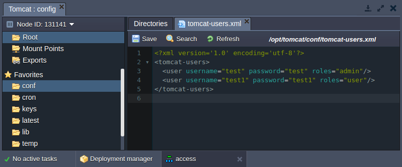
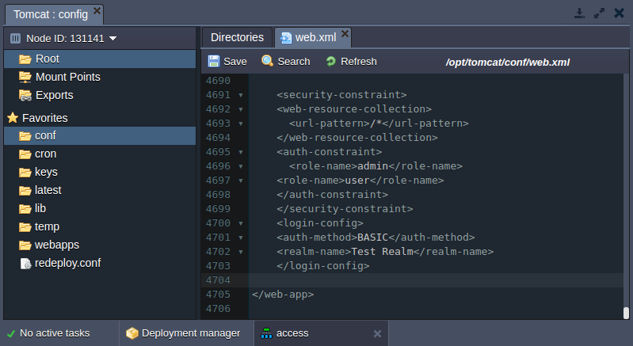
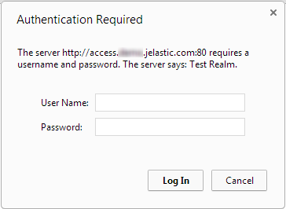
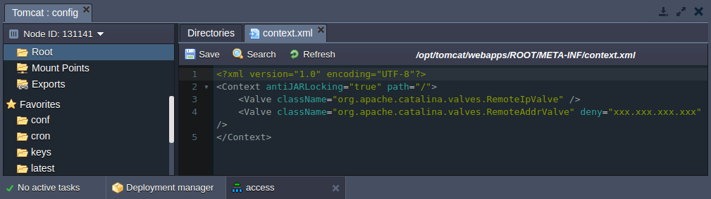
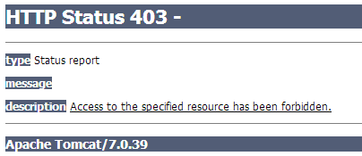

<!-- ## Security Configs for Tomcat Applications -->

This instructions shows how to protect an application running on a **Tomcat** server in the platform. We recommend two possible solutions on how to restrict access to your app:

- request the user authentication
- deny the access for specified IP addresses

You can choose one of them or use both methods together.

## Authentication
To set up the authentication in front of your web-application deployed to Tomcat server, perform the next configurations:

- Open the platform dashboard and click the **Config** button next to the Tomcat server in your environment.
- Go to the ***/opt/tomcat/conf*** folder and double-click the tomcat-users.xml file in order to open it. Use the following string format in order to specify new users roles and credentials. Save the changes made.

`<user username=“test” password=“test” roles=“admin”/>`

- Then navigate to the ***web.xml*** file (it is contained in the same ***/opt/tomcat/conf*** folder) and specify the security constraint for the newly created user.
`<security-constraint>
<web-resource-collection>
`
- `<url-pattern>/</url-pattern>*
*</web-resource-collection>*
*<auth-constraint>*`

- `<role-name>admin</role-name>*`

- `<role-name>user</role-name>*
*</auth-constraint>*
*</security-constraint>*
*<login-config>*
*<auth-method>BASIC</auth-method>*
*<realm-name>Test Realm</realm-name>*
*</login-config>*`

- Don’t forget to **Save** the changes and **Restart** your Tomcat application server.

If you’ve done everything correctly, a user will meet the authentication window while trying to access the application.

## Deny Client IP Addresses
In the case you would like to deny the access to your web-application for particular client IP addresses follow the next steps:

- Press the **Config** button for the Tomcat app server in the environment with your application deployed.
- Navigate to the **/opt/tomcat/webapps/ROOT/META-INF** folder and open the file named ***context.xml***.
- Enter the next strings in the **context.xml** file:

!content missing

:::tip note

In the case you’ve attached the **Public IP** to your environment you can omit this string:

!content missing

:::

- Press **Save** button and **Restart** Tomcat server.

After the configurations setted up, the user with denied IP address will meet the HTTP Status 403 error while trying to access your application.

