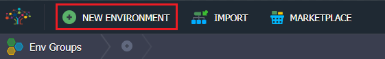
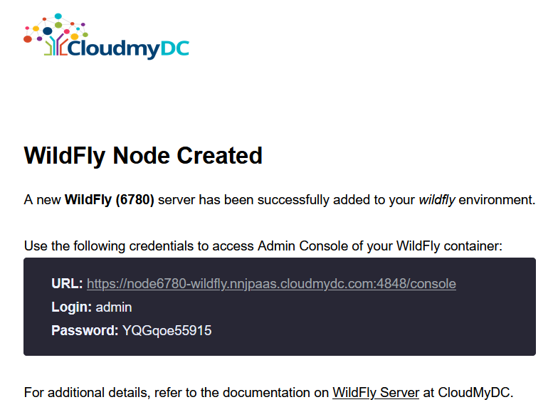

<!-- ## Automatic WildFly Clustering in Managed Domain Mode and Scaling inside Containers -->

Nowadays it’s easy to get up and running WildFly standalone server in a container. But what if you need to enable clustering in Managed Domain mode which is one of the key features of [Jakarta EE](https://jakarta.ee/) in general. That is not so easy task. Some people claim it’s nearly impossible in the cloud-native world, because Jakarta EE clustering was designed before the containers era. The old question at the official [developers portal](https://developer.jboss.org/thread/249340) is still not answered with any adequate instruction that just proves the presence of the issue.

As a result, developers go with standalone nodes as the only available production-ready option in containers integrating clustering and management features from the 3rd party solutions. Or they just keep running applications in VMs facing complexity that makes migration nearly impossible.

But what developers should do if they are looking for a solution to migrate from VMs to containers already existing and nicely working Jakarta EE clusters in managed domain mode?

Till this time there were very few examples (e.g. for GlassFish and WebLogic) how to run and scale Java application servers in managed domain mode within containers correctly. In most cases, lack of knowledge or even the absence of a working solution for the domain mode in containers leads to the loss of integrated Jakarta EE clustering features that just become obsolete.

But managed domain mode is still awesome! A vast portion of mission-critical and large-scale applications such as banking and billing are still running on [Jakarta EE](https://jakartablogs.ee/) in VMs. Integrated Jakarta EE clustering provides functionality that people are interested in, including high-availability and automated deployment among distributed Java application servers regardless of underlying infrastructure, and, of course, Admin Panel to manage your cluster using a nice UI.

To get familiar with benefits of natively integrated clustering technology please refer to a good article “[Under the Hood of J2EE Clustering](https://www.theserverside.com/news/1364410/Under-the-Hood-of-J2EE-Clustering)”. Merging this rich functionality with ready-to-go containers provides a huge benefit by saving time and efforts of the team, and enables fast iterations as the majority of developers do not deal with containers or VMs if environment setup is fully automated.

## When, What and Why Managed Domain Mode?

Every WildFly standalone server has its own admin console and is managed independently. At the same time, WildFly multiple instances running in the domain mode share the same management interface called domain controller. So you can issue commands and deploy applications to all running WildFly servers from one place. The official documentation suggests considering the domain mode for:

- Multi-server production environments with the ability to use centralized management capabilities that a managed domain provides.
- For advanced development scenarios, i.e. those involving interaction between multiple WildFly instances.

We can easily run one big service or several small interrelated services per cluster running in managed domain mode. Deployment to such cluster is automated so applications running in VMs can be [lifted and shifted to containers without re-architecturing](https://www.techtarget.com/searchcloudcomputing/definition/cloud-migration). It provides a very convenient way for replicating on-premise applications in the cloud while avoiding costly and time-consuming re-design. As a result, the legacy applications can benefit from cost-efficiency of cloud-native features such as elastic compute and auto-scaling.

## Complexity of Managed Domain Topology

Let’s have a look at the topology of WildFly cluster in managed domain mode, which is illustrated in the official documentation. The illustration below provides a sense of the complexity of managed domain architecture. This scheme is considered as a classical Jakarta EE topology in VMs, or so-called “legacy dragon” which should be tamed and decomposed properly into containers.

We adjusted this illustration for a little bit better view of the topology, as well as to show additional “hidden” Java processes inside each VM or bare metal host. This will help us during the further decomposition.

- W**orker Server** is a JVM process where the enterprise Jakarta EE applications are deployed and handle requests.
- **Host Controller** is a JVM process that is responsible for configuring Worker Servers, and synchronization between the Servers and Domain Controller.
- **Process Controller** is a JVM process that is responsible for a lifecycle (start/stop/restart) of Worker Servers. It is absent in the original scheme but it is important to take into account while decomposition.
- **Domain Controller** is a type of Host Controller that is designated to act as master admin server (or orchestrator) at the cluster running in managed domain mode and provides a single pane for managing distributed Worker Servers.

## Running Multiple Processes in an Application Container

As we can see from the illustration above, the VM1 contains 2 Java processes inside: Process Controller and Domain Controller. And every other VM contains at least 3 Java processes (or more, depending on how many server instances you want to run inside every host): Process Controller, Host Controllers and Worker Server(s).

That’s not easy to run it in containers. Such topology conflicts with the anti-pattern in the application containers world. The [official Docker documentation](https://docs.docker.com/config/containers/multi-service_container/) warns us about running multiple Java processes inside the same container:

_“It’s ok to have multiple processes, but to get the most benefit out of Docker, avoid one container being responsible for multiple aspects of your overall application.”_

So users feel confused when they get the message to perform this “seems-unreliable” action. Previous bad experience led to loss of trust and it is rather reasonable.

## Running Multiple Processes in a System Container

However, the situation is not so bad. If configured properly, the domain mode works perfectly inside [system containers](https://www.excella.com/insights/application-vs-system-containers). They can handle as many processes as required inside one container. This kind of containers drastically simplifies migration from heavy VMs to a much lightweight virtualization. And there are two well-known options on the market [LXD](https://linuxcontainers.org/lxd/) and [OpenVZ](https://openvz.org/). Moreover, system containers and application containers are complementary, the combination of both provides [VM characteristics for dockerized applications](https://linux.softpedia.com/blog/infographic-lxd-machine-containers-from-ubuntu-linux-492602.shtml).

Jelastic PaaS implemented support of system containers at early days of 2011 and can confirm that many customers are happy with running multiple processes inside the same container in production when it’s required.

Moreover, system containers provide a better resource and security isolation compared to the application containers, so cloud providers can safely host applications of different projects on the same infrastructure reducing the cost of ownership and complexity of management. As a side effect, system containers are starting up a little bit slower compared to the application containers, but they are still much slimmer and faster than VMs.

## Decomposition and Building Modified Topology

We are ready to start our decomposition journey. The first rule is in the spirit of microservices - it is always better to put only one Worker Server per one container. Also, we create only one server group per domain for all containers inside the cluster. Such simple adjustments will give tremendous and desired flexibility for scaling each Worker Server vertically, gaining resource usage efficiency, and scaling the group of containers horizontally by adding new instances on demand.

Please note that each container for handling incoming requests runs 3 Java processes: Worker Server (WS), Host Controller (HC) and Process Controller (PC). And admin container that manages the cluster runs 2 Java processes: Domain Controller (DC) and Process Controller (PC).

## WildFly Managed Domain in Jelastic

In order to facilitate the migration of legacy Jakarta EE applications from VMs to containers, we created a special embedded [Auto-Clustering](/application-setting/scaling-and-clustering/auto-clustering-of-instances) mode for WildFly that can be enabled for new instances.

The main advantage of this solution is an automatic interconnection of multiple application servers upon the environment topology change, which implements the commonly used clustering configuration in managed domain mode.

Below you’ll see how standalone WildFly transforms into the cluster by means of Auto-Clustering feature and a simple [Horizontal Scaling](/application-setting/scaling-and-clustering/horizontal-scaling) with no manual configurations required. Also, we’ll describe infrastructure topology specifics and the way to get the appropriate development and production environments up and running inside Jelastic PaaS.

## Create Standalone WildFly

With Jelastic, the required topology can be built using a convenient wizard:

1. Create a new environment

- Choose a proper version of WildFly
- Set up vertical scaling limits
- Change the name of environment if needed (e.g. **wildfly**)

You will receive an email confirmation of environment creation with the credentials to the Admin Panel.

2. Now, you are ready to deploy the application to the just provisioned standalone server.

In the Deployment manager, click **Deploy to…** button.

Specify the **Context** as required or just leave default ROOT value.

Make sure that your application is up and running, pressing **Open in browser** near the created environment.

If you log in to your container via built-in [Web SSH client](/deployment-tools/ssh/ssh-access/web-ssh), you’ll see only one running process of **Standalone** server.

## Get Clustered WildFly with Managed Domain Mode

WildFly clustering with domain mode is configured automatically by means of Auto-Clustering feature. Once it was enabled the servers can be scaled manually or automatically.

- Manually

Add new servers via wizard while creating the environment or by [changing its topology](/quickstart/dashboard-guide).

Just refer to the application server layer within the left-side environment panel, enable Auto-Clustering mode and add **(+)** nodes within the [Horizontal Scaling](/application-setting/scaling-and-clustering/horizontal-scaling) frame.

- Automatically

The number of servers can be changed automatically by setting up [scaling triggers](/application-setting/scaling-and-clustering/automatic-horizontal-scaling) based on the resource consumption within S**ettings > Auto Horizontal Scaling**.

:::tip Note

- during the initial transformation from standalone to domain mode, your application will be down for about 1 minute
- all the further scaling changes happen with no downtime
- if you enable Auto-Clustering and start from 2 instances at once, the domain mode will be created from the beginning, so no downtime will happen during the scaling

:::

Afterwards, as the scaling is completed (manual or automatic), all WildFly instances will join the cluster, working in operation mode of WildFly Managed Domain. Domain Controller and Load Balancer are added automatically as required components of the cluster.

Upon this scaling, the previously deployed application is also automatically redeployed to the rest of WildFly instances of the cluster. Also, database connection pool configurations and other config customizations, previously made via WildFly admin console, are replicated across the whole application server layer.

You can check how WildFly topology is changed from standalone mode to managed domain cluster:

Worker Nodes run 3 processes instead of one as it was in standalone mode:

- Server:worker
- Process Controller
- Host Controller

And Domain Controller node has two processes running:

- Process Controller
- Host Controller

Also, the topology changes are synchronized and shown within WildFly Admin Panel.

In this way you get a ready-to-use WildFly cluster that can be scaled out and in, making hosting of your applications extremely flexible and cost-effective.

## Application Availability among Workers

The application deployed to the standalone server is redeployed to all server instances during transformation to the cluster. To check this you can click **Open in browser** at each Worker.

Also, you can make sure that the cluster provides high availability. For this, press **Restart node** button for one or even two nodes and try to access your application via **Open in browser** for the whole cluster.

The application will be up and running without any interruptions.

## Cloning Cluster in Domain Mode

When releasing new application version or just applying some essential adjustments, it’s a good practice to check how the newly implemented changes could affect the service work. The Jelastic PaaS allows you to accomplish such testing ‘on-fly’ (i.e. without service downtime and implicitly for your customers) with the **Clone Environment option**.

A cloned environment is a ready-to-work cluster copy with all the required modifications already applied. The newly provisioned Domain Controller node operates with the appropriate cloned Workers, which are already listed within its admin panel. And the application from the original environment is deployed to the cloned one. Thus, the only thing that remains is to recheck your application’s code and custom server configurations for the hardcoded IPs/domains and fix them accordingly (if there are any issues).

This way, you can apply the implied changes to your environment copy without affecting the actual production. To increase the high availability of the system, Jelastic uses **several synchronized Load-Balancers**, placed at different nodes, for handling requests simultaneously. All of them work with a single data storage, which makes them fully interchangeable in case of any issue occurs at one of the instances.

## Summary

This instruction proves that there is no need to rebuild the whole application architecture in order to gain the required outcome from both managed domain mode and container technology. Migration of legacy projects from VMs to micro clusters with system containers is not that painful at all. It brings a “rich taste” of flexibility and efficiency for increasing competitive advantage. Just give it a try! Create your own cluster with Jelastic PaaS at one of the decentralized service providers worldwide.
