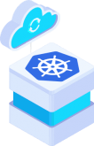
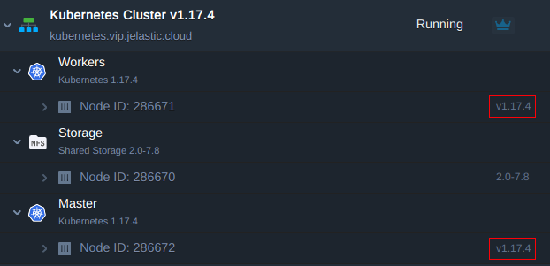
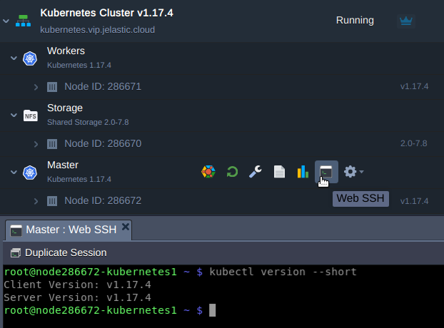
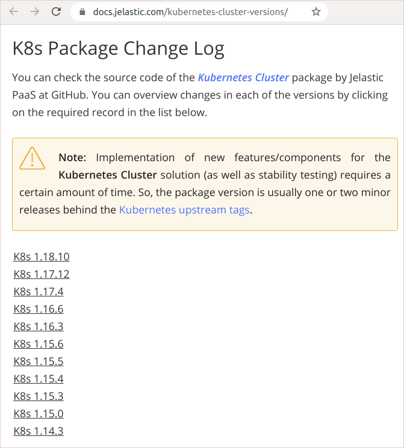
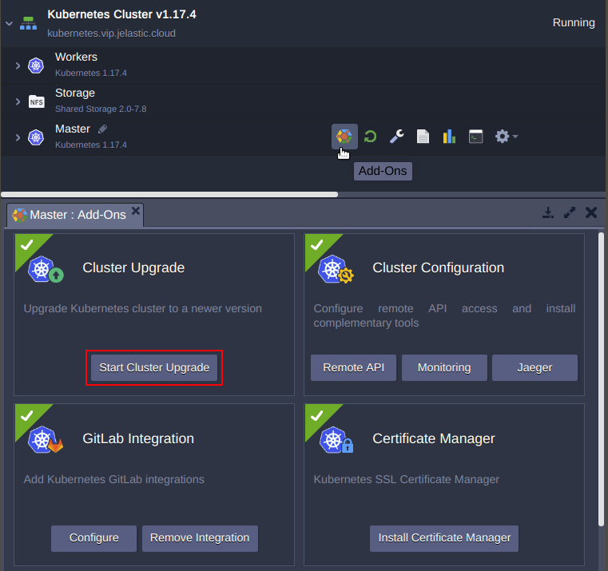
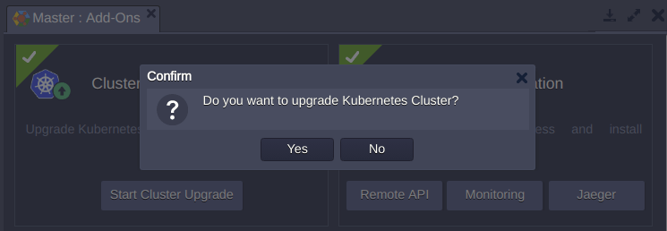
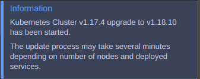
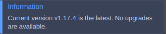
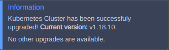
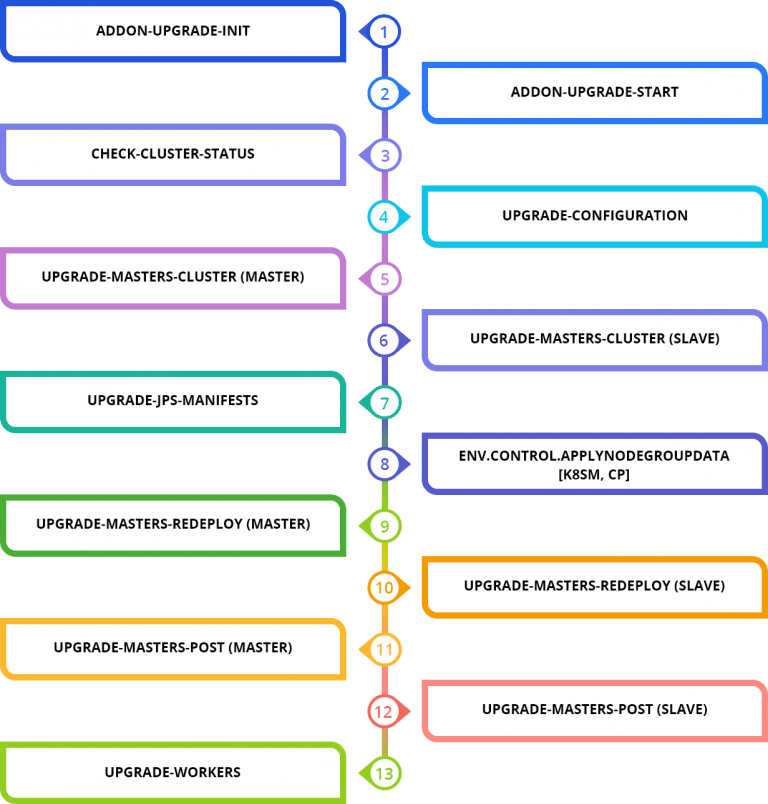

<div style={{
    display: 'grid',
    gridTemplateColumns: '0.15fr 1fr',
    gap: '10px'
}}>
<div>
<div style={{
    display: 'flex',
    alignItems: 'center',
    justifyContent: 'cetner',
}}>



</div>
</div>
<div>

Flexibility, accelerated development and delivery, improved scalability and high availability are the main reasons companies are adopting Kubernetes (K8s) technology. But managing and keeping the system up to date can be so complex for organizations that they need to hire a separate department just to handle everything properly.

With Jelastic’s Kubernetes automation you can improve DevOps productivity and focus on your business aims rather than fighting infrastructure complexity. In this article, we will cover how to streamline the Kubernetes cluster lifecycle via delivering upgrades automatically.

</div>
</div>

## Kubernetes Cluster Versioning

Before taking the decision regarding the upgrade, you can check a current version of your cluster using one of the following options:

- via the dashboard next to the master and worker nodes

<div style={{
    display:'flex',
    justifyContent: 'center',
    margin: '0 0 1rem 0'
}}>



</div>

- via WebSSH client by issuing the command to get the [Kubernetes version](https://kubernetes.io/releases/version-skew-policy/)
  **kubectl version --short**

<div style={{
    display:'flex',
    justifyContent: 'center',
    margin: '0 0 1rem 0'
}}>



</div>

Then compare the current cluster version with available auto-upgrade packages which are presented in the [Jelastic Kubernetes versions page](/kubernetes-hosting/kubernetes-cluster/cluster-versions#k8s-package-change-log).

<div style={{
    display:'flex',
    justifyContent: 'center',
    margin: '0 0 1rem 0'
}}>



</div>

Despite the new Kubernetes versions are released regularly, not all of them are suitable for auto-upgrade right away. When a K8s version has passed through Jelastic QA testing and has accumulated enough cluster usage to prove stability over time, we may add it as an option.

Using a special Jelastic add-on (described in the next block), the upgrade can be automatically performed to the next available release that will already include all intermediate patches. If the current version of the cluster is much older than the latest one, you will need to use the upgrade add-on several times to get to the final point step-by-step. This sequential approach helps to eliminate any risks in terms of compatibility and ensures a smooth update process.

:::tip Note

Kubernetes cluster will become non-functional if you try upgrading manually to the version that is not adopted by Jelastic.

:::

## Kubernetes Cluster Auto-Upgrade Add-On

In order to automatically get the newer version, you need to use “**Cluster Upgrade**” add-on.

1.Press **Add-Ons** on the Master node and click **Start Cluster Upgrade**.

<div style={{
    display:'flex',
    justifyContent: 'center',
    margin: '0 0 1rem 0'
}}>



</div>

2. Confirm upgrade process to proceed.

<div style={{
    display:'flex',
    justifyContent: 'center',
    margin: '0 0 1rem 0'
}}>



</div>

:::tip Note

After you have upgraded Kubernetes to a newer version, you can’t downgrade it. Therefore, you should make sure that applications deployed on the cluster are compatible with the version you plan to activate. For this, spin up a development cluster and test new version's compatibility with your applications before doing the upgrade on production.

:::

3. The system automatically checks what new Kubernetes version are available at the platform and starts cluster upgrade

<div style={{
    display:'flex',
    justifyContent: 'center',
    margin: '0 0 1rem 0'
}}>



</div>

or informs you that your cluster is of the latest version available.

<div style={{
    display:'flex',
    justifyContent: 'center',
    margin: '0 0 1rem 0'
}}>



</div>

4. When the cluster is upgraded to the latest version, the successful confirmation pop-up appears:

<div style={{
    display:'flex',
    justifyContent: 'center',
    margin: '0 0 1rem 0'
}}>



</div>

Zero downtime upgrade is possible only for Production installation as it includes 3 masters, 2 API load balancers and 2 workers by default. It is ready to perform an uninterruptible upgrade except for possible short ingress controller downtime (if it is upgrading to a new version).

At the same time, you should keep in mind that zero downtime is dependent not only on Jelastic automation but also on how the application is deployed. For example, there are two Kubernetes worker nodes running in the cluster: worker 1 and worker 2. A developer has launched the application running as one replica on worker 1. During the rolling update, all pods will be rescheduled from worker 1 to worker 2. Thus, it means that the application will be experiencing downtime during upgrade. But, if the user has launched two replicas of application - one on each worker node, no downtime will be observed during rolling updates.

<div style={{
    display:'flex',
    justifyContent: 'center',
    margin: '0 0 1rem 0'
}}>


</div>

## Kubernetes Cluster Update Process

Let’s check in more details how the update process is performed inside and what components are influenced. All these changes are done automatically by the platform so you just track the process and no interventions are required.

Kubernetes cluster consists of master and worker nodes. The workloads that these two sets of nodes run are different. And components they consist of are also different.

<div style={{
        width: '100%',
        margin: '0 0 5rem 0',
        borderRadius: '7px',
        overflow: 'hidden',
    }} >
    <div>
        <div style={{
            width: '100%',
            height: 'auto',
            border: '1px solid var(--ifm-toc-border-color)',
            display: 'grid', 
            fontWeight: '500',
            color: 'var(--table-color-primary)',
            background: 'var(--table-bg-primary-t2)', 
            gridTemplateColumns: '1fr 1fr',
            overflow: 'hidden',
        }}>
            <div style={{
                display: 'flex', 
                alignItems: 'center', 
                justifyContent: 'center',
                padding: '20px',
                wordBreak: 'break-all',
                borderRight: '1px solid var(--ifm-toc-border-color)',
            }}>
                Control Plane
            </div>
            <div style={{
                display: 'flex', 
                alignItems: 'center', 
                justifyContent: 'center',
                padding: '20px',
                borderRight: '1px solid var(--ifm-toc-border-color)',
                wordBreak: 'break-all'
            }}>
               Worker
            </div>
        </div>
        <div style={{
            width: '100%',
            height: 'auto',
            border: '1px solid var(--ifm-toc-border-color)',
            display: 'grid', 
            gridTemplateColumns: '1fr 1fr',
            fontWeight: '400',
        }}>
            <div style={{
                padding: '20px',
                borderRight: '1px solid var(--ifm-toc-border-color)',
                display: 'flex', 
                alignItems: 'center', 
                justifyContent: 'flex-start',
                wordBreak: 'break-all',
                padding: '20px',
            }}>Kubelet
            </div>
            <div style={{
                padding: '20px',
                wordBreak: 'break-all'
            }}>Kubelet
            </div>
        </div> 
        <div style={{
            width: '100%',
            height: 'auto',
            border: '1px solid var(--ifm-toc-border-color)',
            display: 'grid', 
            gridTemplateColumns: '1fr 1fr',
            fontWeight: '400',
        }}>
            <div style={{
                padding: '20px',
                borderRight: '1px solid var(--ifm-toc-border-color)',
                display: 'flex', 
                alignItems: 'center', 
                justifyContent: 'flex-start',
                wordBreak: 'break-all',
                padding: '20px',
            }}>API Server
            </div>
            <div style={{
                padding: '20px',
                wordBreak: 'break-all'
            }}>Kube Proxy
            </div>
        </div> 
        <div style={{
            width: '100%',
            height: 'auto',
            border: '1px solid var(--ifm-toc-border-color)',
            display: 'grid', 
            gridTemplateColumns: '1fr 1fr',
            fontWeight: '400',
        }}>
            <div style={{
                padding: '20px',
                borderRight: '1px solid var(--ifm-toc-border-color)',
                display: 'flex', 
                alignItems: 'center', 
                justifyContent: 'flex-start',
                wordBreak: 'break-all',
                padding: '20px',
            }}>Controller Manager
            </div>
            <div style={{
                padding: '20px',
                wordBreak: 'break-all'
            }}>
            </div>
        </div> 
        <div style={{
            width: '100%',
            height: 'auto',
            border: '1px solid var(--ifm-toc-border-color)',
            display: 'grid', 
            gridTemplateColumns: '1fr 1fr',
            fontWeight: '400',
        }}>
            <div style={{
                padding: '20px',
                borderRight: '1px solid var(--ifm-toc-border-color)',
                display: 'flex', 
                alignItems: 'center', 
                justifyContent: 'flex-start',
                wordBreak: 'break-all',
                padding: '20px',
            }}>Scheduler
            </div>
            <div style={{
                padding: '20px',
                wordBreak: 'break-all'
            }}>
            </div>
        </div> 
        <div style={{
            width: '100%',
            height: 'auto',
            border: '1px solid var(--ifm-toc-border-color)',
            display: 'grid', 
            gridTemplateColumns: '1fr 1fr',
            fontWeight: '400',
        }}>
            <div style={{
                padding: '20px',
                borderRight: '1px solid var(--ifm-toc-border-color)',
                display: 'flex', 
                alignItems: 'center', 
                justifyContent: 'flex-start',
                wordBreak: 'break-all',
                padding: '20px',
            }}>Kube Proxy
            </div>
            <div style={{
                padding: '20px',
                wordBreak: 'break-all'
            }}>
            </div>
        </div> 
        <div style={{
            width: '100%',
            height: 'auto',
            border: '1px solid var(--ifm-toc-border-color)',
            display: 'grid', 
            gridTemplateColumns: '1fr 1fr',
            fontWeight: '400',
        }}>
            <div style={{
                padding: '20px',
                borderRight: '1px solid var(--ifm-toc-border-color)',
                display: 'flex', 
                alignItems: 'center', 
                justifyContent: 'flex-start',
                wordBreak: 'break-all',
                padding: '20px',
            }}>CoreDNS
            </div>
            <div style={{
                padding: '20px',
                wordBreak: 'break-all'
            }}>
            </div>
        </div> 
        <div style={{
            width: '100%',
            height: 'auto',
            border: '1px solid var(--ifm-toc-border-color)',
            display: 'grid', 
            gridTemplateColumns: '1fr 1fr',
            fontWeight: '400',
        }}>
            <div style={{
                padding: '20px',
                borderRight: '1px solid var(--ifm-toc-border-color)',
                display: 'flex', 
                alignItems: 'center', 
                justifyContent: 'flex-start',
                wordBreak: 'break-all',
                padding: '20px',
            }}>Etcd
            </div>
            <div style={{
                padding: '20px',
                wordBreak: 'break-all'
            }}>
            </div>
        </div> 
    </div> 
</div>

The master node is actually a control plane that should be upgraded first, and then it’s the workers’ turn. The sequence of upgrade actions and accompanying ones taken in package manifest is outlined below:

1. addon-upgrade-init

- Instances tags validation
- Display a notification in case upgrade is not possible
- List formation of available versions
- List formation of upgrade sequence

2. addon-upgrade-start

- Call the kubernetes upgrade script
- Display a notification about the start of the cluster upgrade
- Run cluster upgrade manifest (upgrade.jps)

3. check-cluster-status

- Cluster status check before updating
- Validation of the API response, key components and nodes status readiness within the cluster. In case of inconsistency, the update procedure is terminated and the user is prompted to check the cluster status

4. upgrade-configuration

- Cluster reconfiguration
- Jelastic K8s distribution components are detected and updated
- The outdated cluster components are removed and new ones are installed
- This block is specific for each version (its contents may change from version to version)

5. upgrade-masters-cluster (master)

- Validation of the current k8sm configuration (control plane) in the cluster
- Kubeadm installation for new K8s version, changing status of k8sm master to maintenance and cleaning the pods
- Applying the configuration of the new version to the current instance
- Upgrading the instance to the new version and withdrawing from the maintenance

6. upgrade-masters-cluster (slave)

- Sequential execution across all other k8sm instances
- Validation of the current configuration of k8sm (control plane)
- Kubeadm installation for new K8s version
- Changing status of k8sm master to maintenance and cleaning the pods
- Applying the configuration of the new version to the current instance, upgrading the instance to the new version
- Withdrawing from the maintenance

7. upgrade-jps-manifests

- Main manifest update to the version declared in the kubernetes assembly
- Add-on manifests update to the version declared in the kubernetes assembly

8. env.control.ApplyNodeGroupData [k8sm, cp]

- Removing the limitation on redeploying k8sm and cp instances

9. upgrade-masters-redeploy (master)

- Setting redeploy parameters for K8sm master
- Redeploy to the new version tag
- Start the instance initialization script to configure for the new version of Kubernetes
- Service status validation, service restart

10. upgrade-masters-redeploy (slave)

- Sequential execution across all other k8sm instances
- Setting up parameters of redeploy
- Redeploy to the new version tag
- Start the instance initialization script to configure it for the new version of kubernetes.
- Service status validation, service restart

11. upgrade-masters-post (master)

- K8sm master. Post-configuration of the instance after upgrade
- Preparation of an integration set to be used in worker instances

12. upgrade-masters-post (slave)

- Executed sequentially on the remaining k8sm instances. Post-configuration of an instance after an upgrade

13. upgrade-workers

- Sequential workers upgrade. Changing instance status into maintenance
- Updating kubeadm to a new version, applying redeploy parameters, redeploy
- Launch an instance init script after redeploy
- Post-configuration of a worker instance, applying integration data
- Withdrawing an instance from maintenance

<div style={{
    display:'flex',
    justifyContent: 'center',
    margin: '0 0 1rem 0'
}}>



</div>

During the container redeploy the following directories and files are kept untouched:

```bash
/data
/etc/cni
/etc/kubernetes/etc/machine-id
/etc/sysconfig/iptables
/etc/sysconfig/kubelet
/root
/var/lib/cni
/var/lib/docker

/var/lib/etcd
/var/lib/weave
/var/lib/kubelet
/var/log/containers
/var/log/kubernetes
/var/log/kubeadm-init.log
/var/log/kubeadm-join.log
/var/log/kubeadm-join-error.log
/var/log/pods

```

:::tip Note

Starting from package version 1.18.14 users can add custom files and directories to the mentioned list of untouched ones changing file **_/etc/jelastic/redeploy.conf_** on the master node.

:::

In addition to the internal Kubernetes components, the platform updates the functionality provided by Jelastic:

- actions that trigger the related events (e.g. configure-master, connect-workers, scaling, etc.)
- configuration files (e.g. kubernetes-dashboard.yaml, jelastic-values.yaml, etc.)
- integrated add-ons

So as a result, Kubernetes cluster is upgraded smoothly and with minimum manual intervention. Jelastic automation makes this process truly straightforward and helps to keep your cloud environment up to date. Try it yourself at one of Jelastic Cloud Providers.
