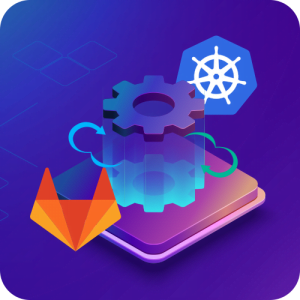
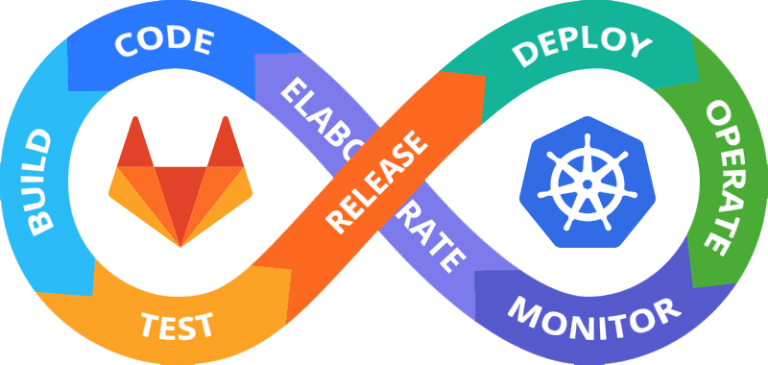
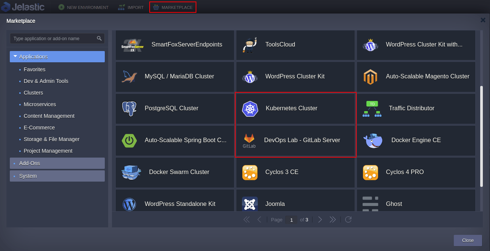
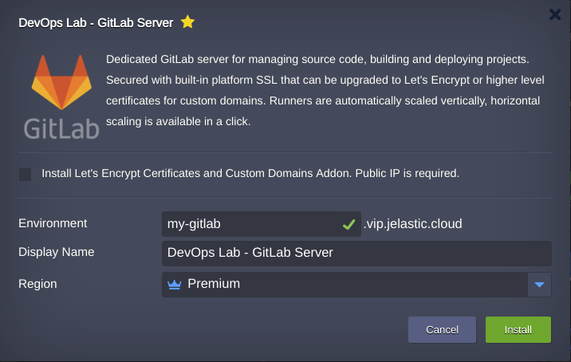
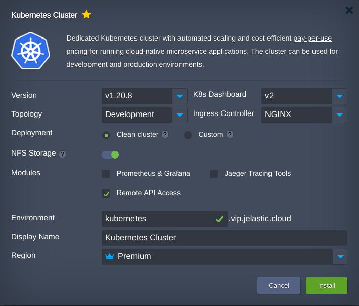
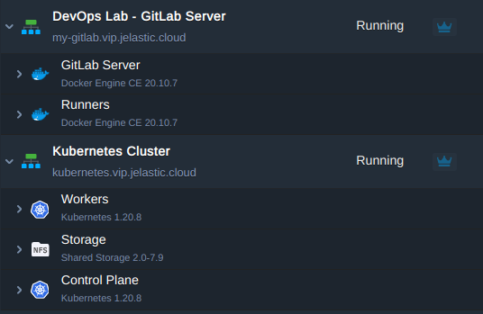
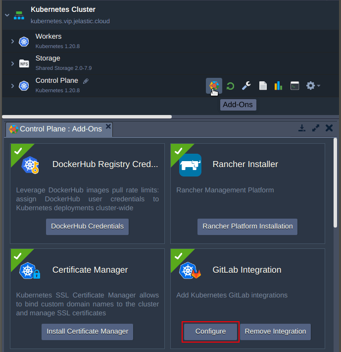
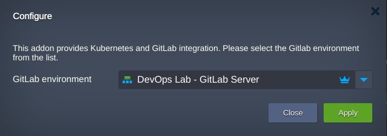
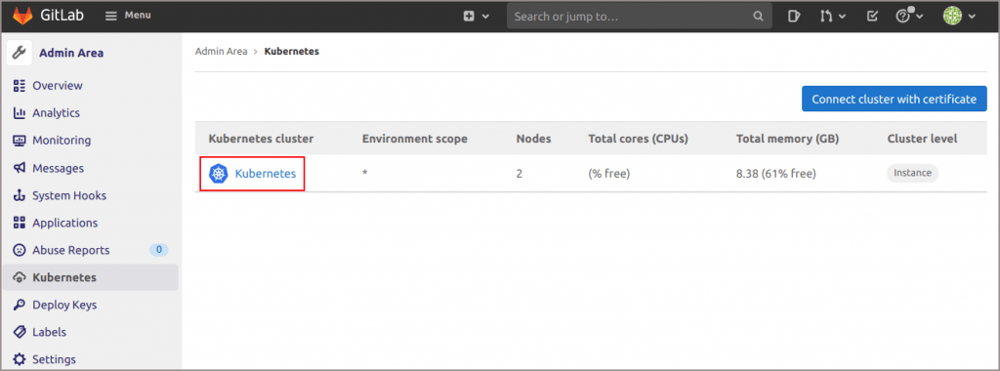
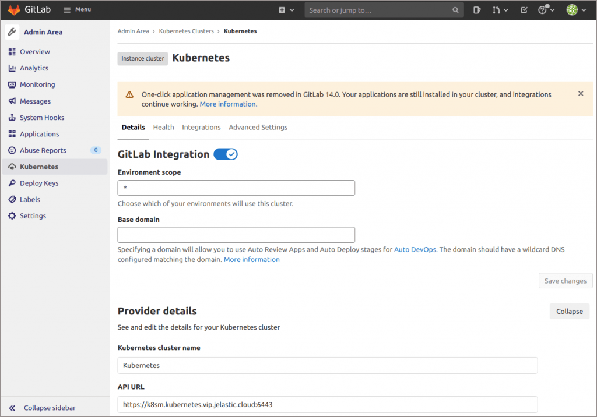

In the article “Private GitLab Server Automatic Installation with Jelastic PaaS” we looked at the GitLab installation, its initial setup, and the basics required for the project’s lifecycle (git project importing and docker registry accessing). And today we’ll move forward to the integration of GitLab with Kubernetes, as well as describe how to set up continuous integration and continuous deployment pipeline for your projects based on Java application sample.

## Prerequisites for Kubernetes Integration

GitLab's ecosystem is enriched with a large number of features like:

- the built-in continuous integration system (CI/CD) allows you to create a pipeline and control the lifecycle of the application’s deployment, from downloading the code to the repository, until it is uploaded to the production environment
- with AutoDevOps, you can establish a CI/CD pipeline that automatically detects, builds, tests, and deploys your projects. Integrated with a Kubernetes (K8S) cluster, it allows you to deploy applications with no provisioning of extra CI/CD resources or configurations required.

## Kubernetes Integration Details

Below we will cover the Kubernetes integration with GitLab in Jelastic PaaS as an endpoint of the pipeline. You will see how to get rid of boring integration routines required to add the K8S manually entering a lot of data:

- Proper API URL. To identify access and permissions issues when adding a cluster, Kubernetes integration checks the availability of the API URL
- Correct access token
- Valid CA certificate
- Project namespaces
- Local network access, etc.

All of them may be done with platform automation. Also, we will go through the steps on how to create a project, build a pipeline and deploy Java applications to the Kubernetes cluster integrated with the Gitlab server.

## Kubernetes and GitLab Installation

Sign in to the Jelastic platform dashboard, go to the [Marketplace](/deployment-tools/cloud-scripting-&-jps/marketplace), find and install **DevOps Lab - GitLab Server** and **Kubernetes Cluster** applications one by one. The installation sequence is arbitrary. Note that the solution from this guide is available only for billing customers.

- If you are going to use a custom domain, activate the Install Let’s Encrypt Certificates and Custom Domain Addon option while installing the GitLab server.

- Kubernetes application can be installed with default parameters or based on your needs.

When you finish both installations, the topologies should look as follows.

## Kubernetes Integration with GitLab

You can integrate Kubernetes with GitLab using "**Kubernetes GitLab Integration Add-On**".

1. Open Add-Ons list next to the **Control Plane** node, find the required one and press the Configure button.

2. In the open dialogue find the GitLab DevOps environment and press **Apply**.

3. Congratulations! The Kubernetes integration with the GitLab server is completed.

4. Click on Kubernetes to get integration details.

Now you may use GitLab pipelines to build and deploy projects to the Kubernetes cluster.

In the next article, we'll cover how to test Kubernetes and GitLab integration, as well as how to bind custom domain to the application running within this setup.

Automate continuous integration and delivery of your applications using state-of-the-art solutions. Get your Kubernetes with GitLab CI/CD pipeline setup at one of Jelastic cloud service providers.
