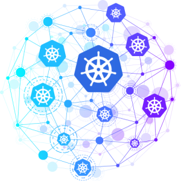
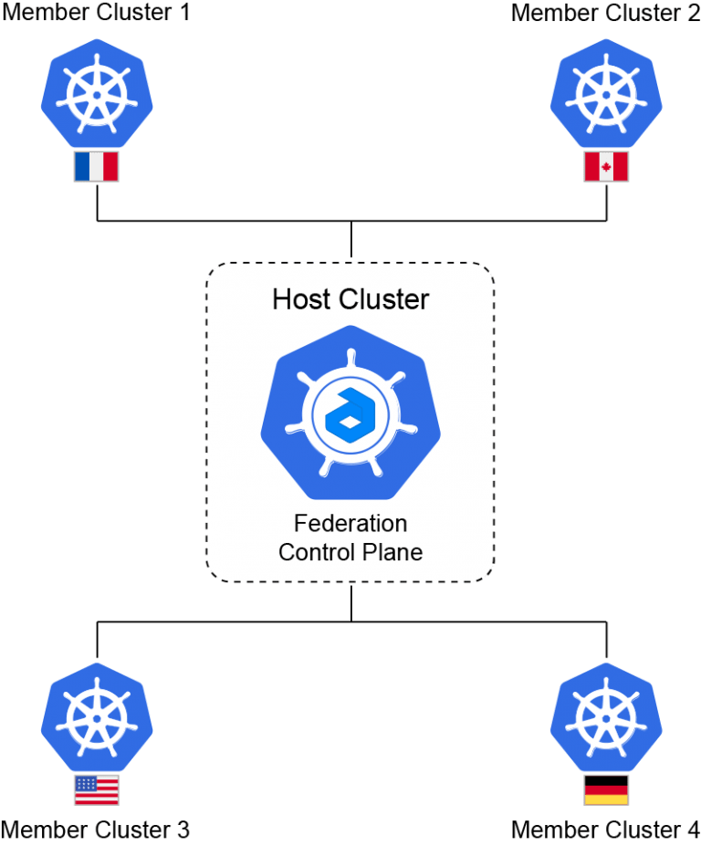
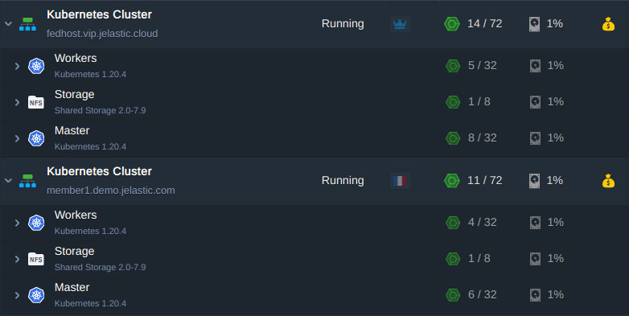
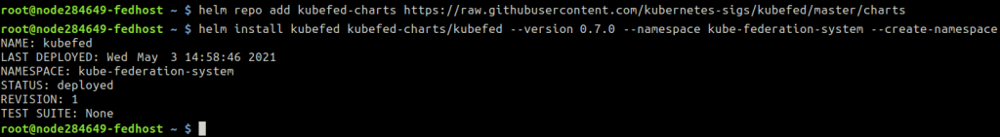
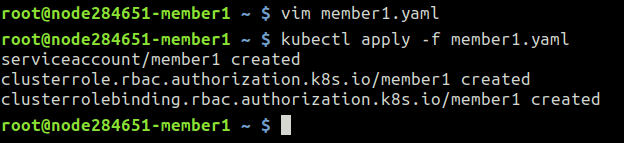
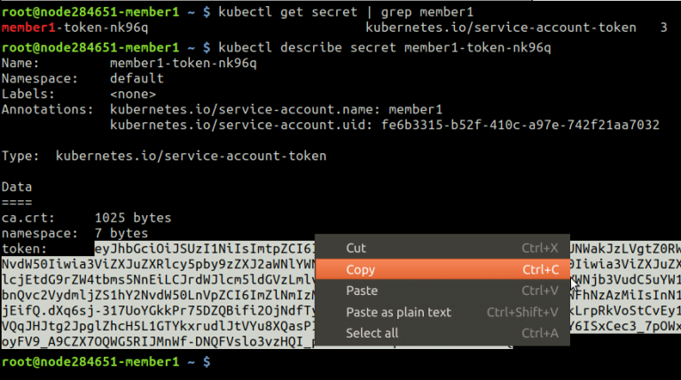
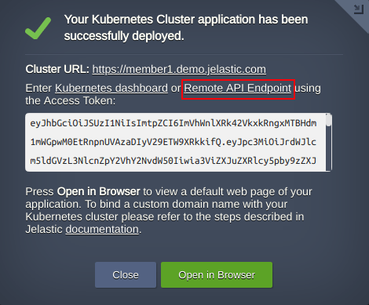
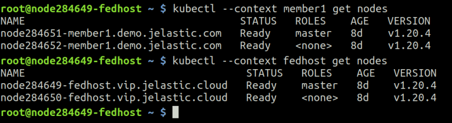
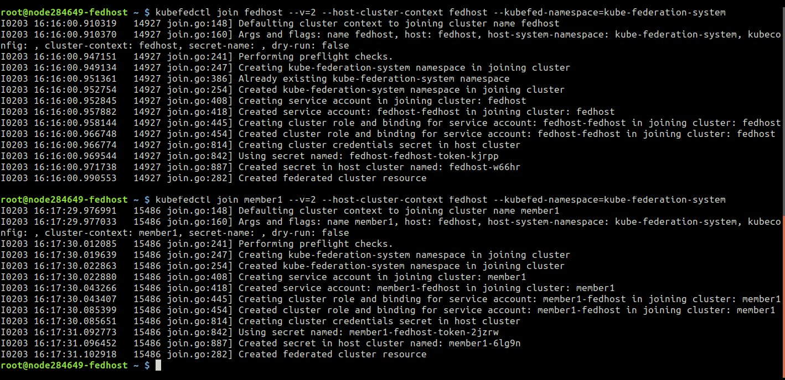
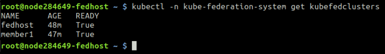

<div style={{
    display: 'grid',
    gridTemplateColumns: '0.55fr 1fr',
    gap: '10px'
}}>
<div>
<div style={{
    display: 'flex',
    alignItems: 'center',
    justifyContent: 'cetner',
}}>



</div>
</div>
<div>

If you have multiple Kubernetes (K8s) clusters in different regions and need to run the same application across all of them, it is reasonable to use the so-called Kubernetes Cluster Federation or [KubeFed](https://github.com/kubernetes-retired/kubefed/blob/master/README.md).

Kubernetes Federation is a multi-cloud or multi-region implementation for centralized deployment and management of applications and services across multiple Kubernetes clusters.

Federation allows to create a set of interconnected clusters, into which you can deploy applications according to specific rules. The most demanded use case for Federation is scaling applications across different clusters located in different regions.

</div>
</div>

You can bundle components of your application to federated resources and distribute the specified number of replicas across all member clusters.

In this article we’ll demonstrate how to set up Jelastic Kubernetes Services (JK8s) as a Federation located across different regions.

## Federation Prerequisites

Supposedly within one Jelastic PaaS we have five clusters in different regions and we'd like to deploy applications to any of these clusters. One of them is a Host Cluster that acts as a Federation [Control Plane](https://kubernetes.io/docs/reference/glossary/?all=true#term-control-plane), it propagates and pushes configurations to the

<div style={{
    display:'flex',
    justifyContent: 'center',
    margin: '0 0 1rem 0'
}}>



</div>

Thus we need to decide which payload we want to distribute, and which member clusters should handle it.

So, let’s get down to business and create a Federation in Jelastic PaaS.

Sing in your account and create two Kubernetes clusters in different [regions](/docs/environment-management/environment-regions/choosing-a-region). Actually you may create as many as you need though, but here we create a **Host Cluster** and **Member Cluster 1** only. All of the actions below can be applied to any number of Member Clusters. So, deploy:

- Federation Host Cluster: **_fedhost.vip.jelastic.cloud_**
- Federation Member Cluster: **_member1.demo.jelastic.com_**

<div style={{
    display:'flex',
    justifyContent: 'center',
    margin: '0 0 1rem 0'
}}>



</div>

## Remote Access to the Clusters

The next step is to establish [remote access to the clusters](https://kubernetes.io/docs/tasks/access-application-cluster/configure-access-multiple-clusters/).

Log in the master node of the **Host Cluster** via [SSH](/docs/deployment-tools/ssh/ssh-access/ssh-gate) and start with the configuration. Some commands output will be shown to let you be sure you are doing right:

1. First, install the KubeFed chart with [helm](https://kubernetes.io/blog/2016/10/helm-charts-making-it-simple-to-package-and-deploy-apps-on-kubernetes/) in **kube-federation-system** namespace :
   Add repository:

```bash
fedhost~$ helm repo add kubefed-charts
```

***https://raw.githubusercontent.com/kubernetes-sigs/kubefed/master/charts***

Install the [latest version](https://github.com/kubernetes-retired/kubefed/branches/active) available of **kubefed**. Here and below, we use 0.7.0 as the current version:

```bash
fedhost~$ helm install kubefed kubefed-charts/kubefed --version 0.7.0 --namespace kube-federation-system --create-namespace
```

<div style={{
    display:'flex',
    justifyContent: 'center',
    margin: '0 0 1rem 0'
}}>



</div>

2. Download the latest version of [kubefedctl](https://github.com/kubernetes-retired/kubefed/releases) command line tool as well and copy it to /usr/local/bin directory:

```bash
fedhost~$ wget
```

***https://github.com/kubernetes-sigs/kubefed/releases/download/v0.7.0/kubefedctl-0.7.0-linux-amd64.tgz***

```bash
fedhost~$ tar xvf kubefedctl-0.7.0-linux-amd64.tgz
fedhost~$ mv kubefedctl /usr/local/bin
```

3. To let KubeFed federating deployments, it must be able to interact with all of selected **Member Clusters**. To get this, you can use the following [RBAC](/docs/kubernetes-hosting/managing-kubernetes/access-control) config file to create the necessary role to ensure connection from the **Host Cluster**. Log in the master node of the **Member Cluster** via SSH and create a configuration file for example **member1.yaml** and paste the content below into it.

```bash
apiVersion: v1
kind: ServiceAccount
metadata:
 labels:
   name: member1
 name: member1
---
apiVersion: rbac.authorization.k8s.io/v1
kind: ClusterRole
metadata:
 labels:
   name: member1
 name: member1
rules:
 - apiGroups: ['*']
   resources: ['*']
   verbs: ['*']
 - nonResourceURLs: ['*']
   verbs: ['*']
---
apiVersion: rbac.authorization.k8s.io/v1
kind: ClusterRoleBinding
metadata:
 labels:
   name: member1
 name: member1
roleRef:
 apiGroup: rbac.authorization.k8s.io
 kind: ClusterRole
 name: member1
subjects:
 - kind: ServiceAccount
   name: member1
   namespace: default
```

Apply the configuration file:

```bash
member1~$ kubectl apply -f member1.yaml
```

<div style={{
    display:'flex',
    justifyContent: 'center',
    margin: '0 0 1rem 0'
}}>



</div>

4. In order to gain access to all members you have to create a context for each of them. Each context contains a K8s cluster name, a cluster endpoint, username with credentials and the namespace.

Where the credentials are:

- RBAC token
- certificate

Get token name of the newly created service account **member1**

```bash
member1~$ kubectl get secret | grep member1
```

Retrieve its content and copy into the clipboard:

```bash
member1~$ kubectl describe secret member1-token-zkctp
```

<div style={{
    display:'flex',
    justifyContent: 'center',
    margin: '0 0 1rem 0'
}}>



</div>

5. Create user **kubefed-member1** and provide token for it from the clipboard:

```bash
fedhost~$ kubectl config set-credentials kubefed-member1
--token='eyJhbGciOiJSUzI1Ni…….JYNCzwS4F57w'
```

6. Retrieve Member Cluster endpoint the Host Cluster will be connecting to:

```bash
member1~$ cat /root/.kube/config | grep server
```

Set up the cluster name **_kubefed-remote-member1_** and add Member Cluster endpoint:

```bash
fedhost~$ kubectl config set-cluster kubefed-remote-member1
--server='https://k8sm.member1.demo.jelastic.com:6443'
```

:::tip Note

In case Member Cluster is located on the different Jelastic platform, the endpoint is different as well. Use an **API Endpoint** from a successful installation window. For example:

```bash
fedhost~$ kubectl config set-cluster kubefed-remote-member1
--server='https://member1.demo.jelastic.com/api/'
```

<div style={{
    display:'flex',
    justifyContent: 'center',
    margin: '0 0 1rem 0'
}}>



</div>

:::

7. Retrieve the certificate and copy its content into the clipboard.

```bash
member1~$ cat /root/.kube/config | grep certificate-authority-data
```

Substitute the <b>certificate</b> with value from the clipboard and add to the context:

```bash
fedhost~$ kubectl config set clusters.kubefed-remote-member1.certificate-authority-data '<certificate>'
```

:::tip Note

When the Member Cluster is located on the different Jelastic platform the certificate will be invalid because the [Shared Load Balancer](/docs/application-setting/external-access-to-applications/shared-load-balancer) with its own certificate is in front of the cluster. This certificate should be ignored during negotiation phase between Host Cluster and Member with a command for example:

```bash
fedhost~$ kubectl config set clusters.kubefed-remote-member1.insecure-skip-tls-verify true
```

:::

8. Finally, describe the context itself for the **Member Cluster** using the proper cluster name, context name and user name:

```bash
fedhost~$ kubectl config set-context member1 --cluster=kubefed-remote-member1 --user=kubefed-member1 --namespace=default
```

Repeat steps 3-8 for each **Member Cluster** in Federation.

:::tip Note

In general the default context name is **kubernetes-admin@kubernetes** in fresh K8s clusters. We recommend you to replace all those occurrences for example with “**fedhost**” or any other you prefer because the KubeFed can be confused with special characters in context names like ‘@’ and in the future you will get an error joining the clusters:

```bash
fedhost~$ kubectl config rename-context kubernetes-admin@kubernetes fedhost
```

:::

## Cluster Remote Access Testing

Now the **Member Clusters** are described in the **Host Cluster** configuration file **/root/.kube/config**. In case everything was done properly, you may interact with any cluster configured, simply selecting the context. Let’s see the list of nodes on both clusters **_kubefed-remote-member1_** and **_fedhost_**:

```bash
fedhost~$ kubectl --context member1 get nodes
fedhost~$ kubectl --context fedhost get nodes
```

<div style={{
    display:'flex',
    justifyContent: 'center',
    margin: '0 0 1rem 0'
}}>



</div>

## Joining the Federation

Now that the communication is available between two clusters located in different regions, we can use the kubefedctl tool to let them both join the Federation.

Add **Host Cluster** to Federation:

```bash
fedhost~$ kubefedctl join fedhost --v=2 --host-cluster-context fedhost
--kubefed-namespace=kube-federation-system
```

Add Member Cluster to Federation:

```bash
fedhost~$ kubefedctl join member1 --v=2 --host-cluster-context fedhost
--kubefed-namespace=kube-federation-system
```

If everything passed smoothly with no errors you should have similar output:

<div style={{
    display:'flex',
    justifyContent: 'center',
    margin: '0 0 1rem 0'
}}>



</div>

In order to make sure that the join is working you can check the status of the Federation with the command:

```bash
fedhost~$ kubectl -n kube-federation-system get kubefedclusters
```

<div style={{
    display:'flex',
    justifyContent: 'center',
    margin: '0 0 1rem 0'
}}>



</div>

Congratulations! Now you are aware how to build Kubernetes Federation across multiple regions of Jelastic PaaS service providers. The next step is to start federating the resources and we’ll cover this in more detail within our upcoming publication.
