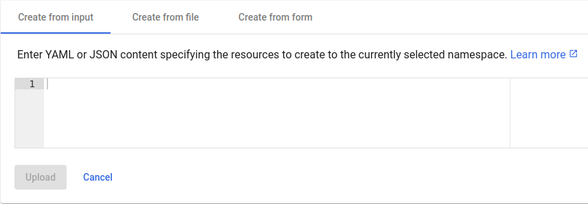

## Kubernetes Cluster: YAML Deployments

Kubernetes natively supports deployments from both JSON and YAML files. However, among the community, YAML is a more frequent option and can be considered a standard.

Deployment from YAMLs is somewhat similar to the [Helm](/docs/kubernetes-hosting/application-deployment/helm-integration) charts - the **_.yaml_** or **_.yml_** file provides object definition or a list of objects. Herewith, it can be directly applied in Kubernetes Dashboard or with the kubectl command-line tool without any additional software installation.

<div style={{
    display:'flex',
    justifyContent: 'center',
    margin: '0 0 1rem 0'
}}>



</div>

When working over kubectl, use the **_[apply](https://kubernetes.io/docs/reference/kubectl/cheatsheet/#apply)_** command with the correct path to your deployment YAML file:

```bash
kubectl apply -f /path/to/deployment.yaml
```

On the other hand, the benefit of the [Helm](/docs/kubernetes-hosting/application-deployment/helm-integration) charts is advanced flexibility (support of the conditions, replacements, parameters, etc.).
