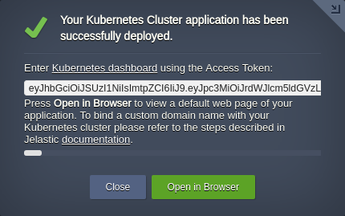
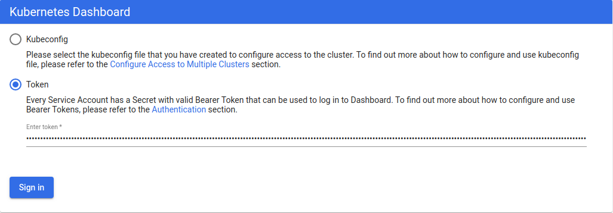
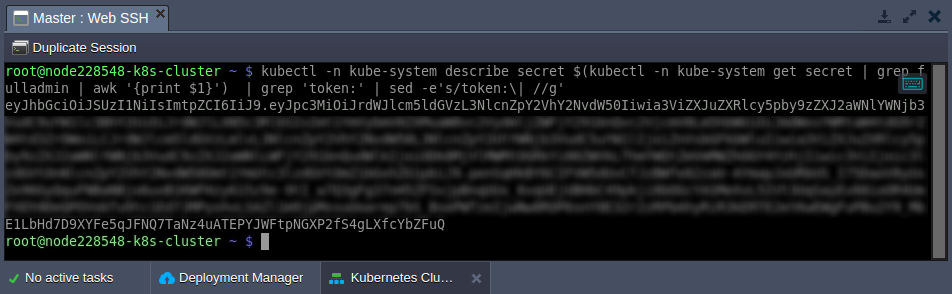
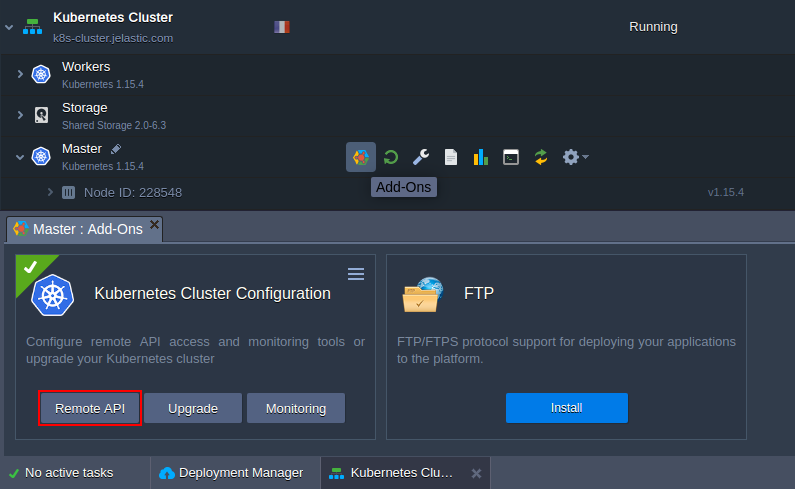
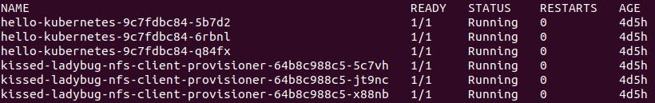

## Kubernetes Cluster Access

After the successful [installation of a cluster](/docs/kubernetes-hosting/kubernetes-cluster/cluster-installation), there are multiple ways to access it to start management:

- [Kubernetes Dashboard](/docs/kubernetes-hosting/managing-kubernetes/cluster-access#kubernetes-dashboard)
- [kubectl client](/docs/kubernetes-hosting/managing-kubernetes/cluster-access#kubectl-client)

## Kubernetes Dashboard

1. The after installation pop-up provides all the necessary data to connect to the Kubernetes Dashboard - link and access token.

<div style={{
    display:'flex',
    justifyContent: 'center',
    margin: '0 0 1rem 0'
}}>



</div>

The same information is also provided via the appropriate email notification.

2. Follow the link, select the **Token** option, and paste the required value.

<div style={{
    display:'flex',
    justifyContent: 'center',
    margin: '0 0 1rem 0'
}}>



</div>

:::tip Tip

It is also possible to log in with the **_kubeconfig_** file; however, you’ll need to install kubectl and set the right context (see the [section](/docs/kubernetes-hosting/managing-kubernetes/cluster-access#kubectl-client) below).

:::

3. If you’ve lost an email with the Kubernetes cluster access token, it can be viewed by executing the following command on the master node (e.g. via [Web SSH](/docs/deployment-tools/ssh/ssh-access/web-ssh)):

```bash
kubectl -n kube-system describe secret $(kubectl -n kube-system get secret | grep fulladmin | awk '{print $1}') | grep 'token:' | sed -e's/token:\| //g'
```

<div style={{
    display:'flex',
    justifyContent: 'center',
    margin: '0 0 1rem 0'
}}>



</div>

Now, you can access the Kubernetes Dashboard once again.

## Kubectl Client

**[Kubectl](https://kubernetes.io/docs/tasks/tools/)** is a command-line tool to control a Kubernetes cluster. The platform automatically installs it on all master nodes during the environment creation. You can start working with your cluster using kubectl right away, just connect to the required node [over SSH](/docs/deployment-tools/ssh/ssh-access/overview).

1. Follow the [installation steps](https://kubernetes.io/docs/tasks/tools/) to use a local kubectl. Next, run a command to establish remote connection:

```bash
kubectl config set-cluster jelastic --server={api-endpoint} && \
kubectl config set-context jelastic --cluster=jelastic && \
kubectl config set-credentials user --token={token} && \
kubectl config set-context jelastic --user=user && \
kubectl config use-context jelastic
```

Replace the **_{api-endpoint}_** and **_{token}_** placeholders with the Remote API URL and access token respectively.

:::tip Tip

If you haven’t enabled **Remote API** during installation, it can be done via the in-built add-on available for the master nodes in the platform dashboard.

<div style={{
    display:'flex',
    justifyContent: 'center',
    margin: '0 0 1rem 0'
}}>



</div>

:::

2. You can check if kubectl has access to the cluster with the following command:

```bash
kubectl get pods
```

<div style={{
    display:'flex',
    justifyContent: 'center',
    margin: '0 0 1rem 0'
}}>



</div>

You should see information about pods in the default namespace.
