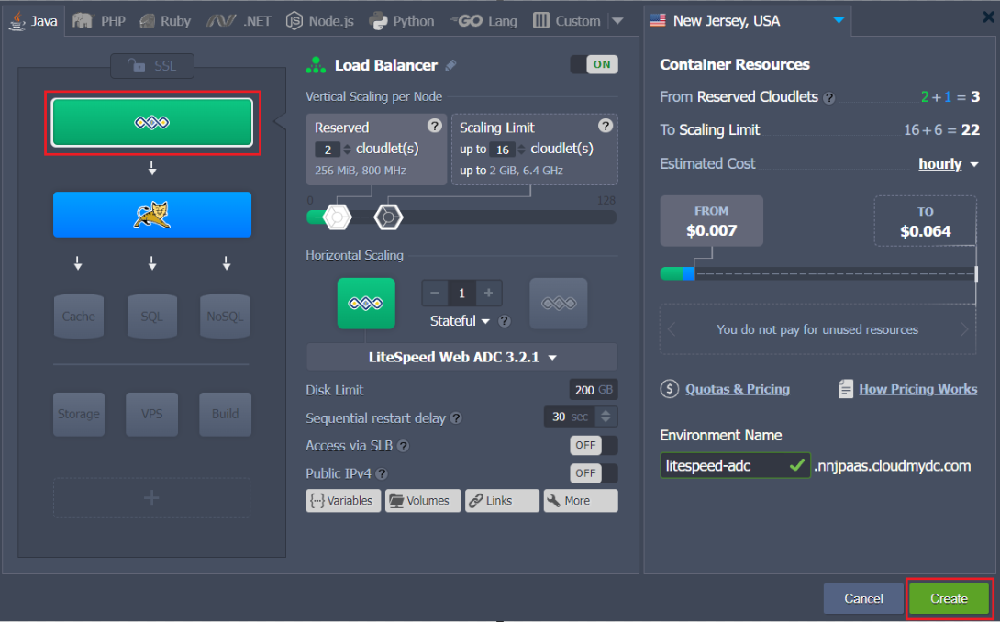
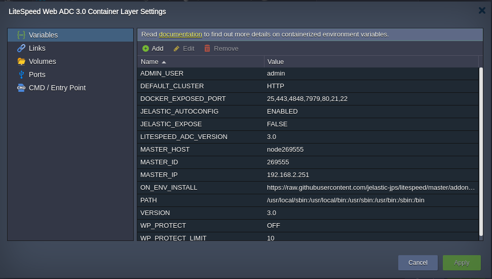
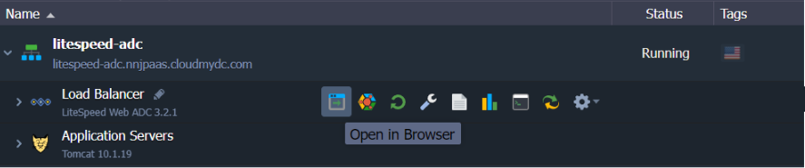
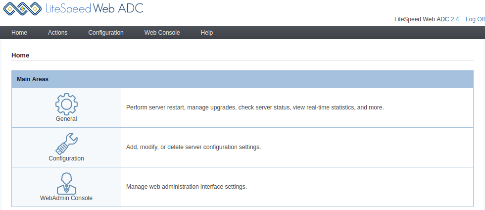
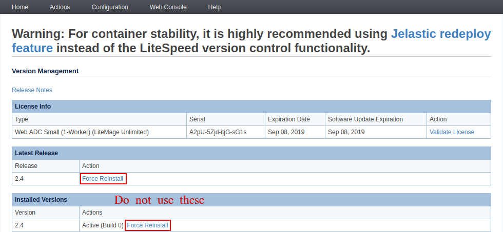
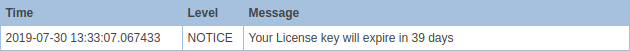
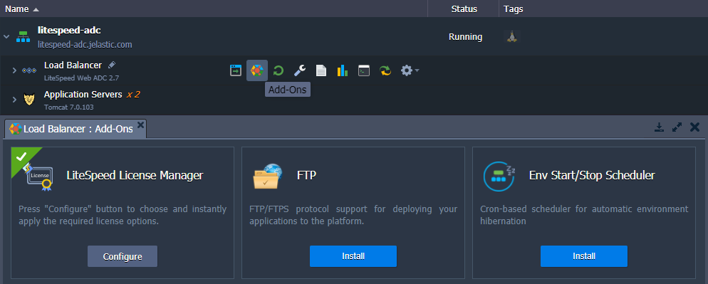
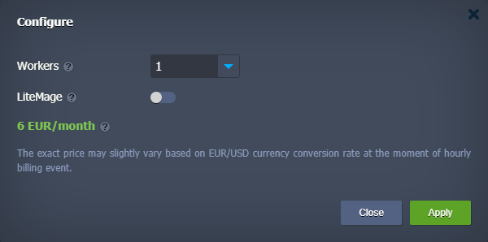
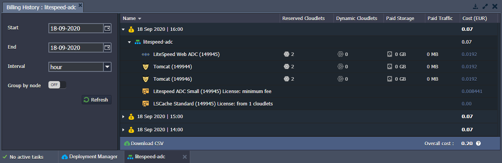

import obj from './LiteSpeedWebADC.json'

## LiteSpeed Web ADC

:::tip Tip

The **LiteSpeed Web ADC** stack is [HTTP/3](http://localhost:3000/docs/application-setting/external-access-to-applications/http3-support) ready with the feature support enabled by default. However, a [public IP address](/docs/application-setting/external-access-to-applications/public-ip) is required to bypass the Shared Load Balancer and work directly with the server over HTTP/3.

:::

The **[LiteSpeed Web ADC](https://www.litespeedtech.com/products/litespeed-web-adc)** (Application Delivery Controller) is a high-performance HTTP load balancing solution. It not just distributes traffic but also improves the speed and reliability of the services on the backend.

Such benefits are achieved through the implementation and support of the most innovative and efficient technologies required for load balancing, e.g. next-generation HTTP/3 (QUIC) transport protocol.

LiteSpeed Web ADC is suitable for the projects of any scale, being able to handle everyday traffic and seasonal spikes alike. This balancer will surely get the most of your application due to its [numerous features](https://www.litespeedtech.com/products/litespeed-web-adc/features).

:::danger Note

Being a commercial software, LiteSpeed Web Server cannot be distributed freely, i.e. requires the license to be applied to the platform. If working with this application server, you’ll be charged an [additional fee](/docs/Load%20Balancers/LiteSpeed%20Web%20ADC#license-pricing) for usage of the license mentioned above.

:::

Get your own LiteSpeed Web ADC load balancer server at the platform by following the steps below.

1. Log in and click the **New Environment** button at the top of the dashboard.

2. Configure the preferred topology via the opened wizard and choose **LiteSpeed Web ADC** as your load balancer.

:::tip Tip

You can apply some customization to your LiteSpeed ADC by adjusting some of the [dedicated environment variables](http://localhost:3000/docs/environment-management/environment-variables/environment-variables):

- **JELASTIC_AUTOCONFIG** - enables (enabled, by default) or disables (disabled) autoconfiguration of the LiteSpeed worker processes count based on the allocated RAM and number of CPU cores
- **DEFAULT_CLUSTER** - selects the load balancing type for requests' proxying (HTTP, AJP, FCGI, LSAPI). If working with some custom backends, this logic can be disabled (0, disabled, false)
- **WP_PROTECT** - configures an action for the [WordPress Brute Force Attack Protection](https://www.litespeedtech.com/support/wiki/doku.php/litespeed_wiki:config:wordpress-protection) feature (off|on|drop|deny|throttle|captcha; off by default)
- **WP_PROTECT_LIMIT** - sets a limit for the [WordPress Brute Force Attack Protection](https://www.litespeedtech.com/support/wiki/doku.php/litespeed_wiki:config:wordpress-protection) feature (0|1|2-1000; 10 by default)

:::

Click **Create** to proceed.

3. If you click the **Open in Browser** button for the LiteSpeed balancer, one of the backend application servers will be automatically accessed.

4. To manage your load balancer, you can access its **Admin Panel**. Click the appropriate button in the **_Additionally_** list next to the layer (access credentials are sent via email after the node creation).

:::danger Note

There are some specifics while working with the platform implementation of the LiteSpeed via the admin panel:

- to ensure container stability, the [platform-native redeploy feature](/docs/category/container-deployment) should be used instead of the **Actions > Version Manager** functionality

- the notification about the license key expiration in the **Actions > Server Log Viewer** should be ignored as the leasing is automatically managed by the platform

:::

In case you need to adjust any of the configuration files, you can work over the [dashboard file manager](/docs/application-setting/configuration-file-manager) or establish an [SSH connection](http://localhost:3000/docs/deployment-tools/ssh/ssh-access/overview).

## License Pricing

The platform seamlessly integrates the cost of the LiteSpeed license in accordance with the fair **pay-as-you-go** principles. Namely, the license is billed only for active containers on an hourly basis for 730 hours per month. In addition, license lifecycle management is fully automated:

- new licenses are issued for every newly-created container (e.g. during environment provisioning or horizontal scaling)
- updated while changing available resource limits within each container
- decommissioned while stopping the environment or scaling in
  Based on your needs, you can select the required plan using a dedicated **_LiteSpeed License Manager_** add-on that is automatically installed on all the LiteSpeed-based nodes ([LS Web Server](/docs/PHP/PHP%20App%20Servers/LiteSpeed%20Web%20Server), LS ADC, [LLSMP](/docs/PHP/PHP%20App%20Servers/LEMP%20&%20LLSMP)).

The add-on allows switching between plans by adjusting the number of **_Workers_** (processes to do general server work). Also, the **_LiteMage_** caching solution (with unlimited [publicly cached objects](https://www.litespeedtech.com/products/litespeed-web-server/lsws-pricing/lsws-litemage-pricing#objects)) can be automatically configured for LiteSpeed ADC for an additional price of **149$** per month.

    

        

            

          License Type	
            

            

               Workers	
            

            

                Pricing (USD) per 1 GB per Hour
            
 
            

                Pricing (USD) Min (Max) per Month
            
 
        

        {obj.data1.map((item, idx) => {
          return 

            

                {item.LicenseType}
            

            

                {item.Workers}
            

            

                {item.PricingHour}
            

            

                {item.PricingMonth}
            

        
 
        })}
    
 

The license price is calculated dynamically based on the network traffic processed by the node at the rate specified via the **per 1 GB per Hour** column. Note that active environments are charged for at least 1GB, even if there was no traffic at all during an hour (a minimum fee for the license usage). Also, the license cost per month cannot go above the maximum value specified in the table. For example, for the default Web ADC Small plan, any traffic over 6500GB is free of charge until the end of the month (the first charge defines the starting date).

:::danger Note

The exact cost may vary slightly for the platforms with a currency other than USD; it depends on the conversion rate at the moment of the hourly billing event. All the account charges can be viewed via the **[Billing History](/docs/account-and-pricing/resource-charging/monitoring-consumed-resources#billing-history)** in the dashboard.

:::

## LiteSpeed ADC Testing

When performing testing of the LiteSpeed Web ADC load balancer, you should take into consideration the following peculiarities:

1. By default, the load balancer operates in the **Stateful** mode, which tracks sessions associated with each back-end server (also called “Session Affinity”). It means that requests from a single source will always go to the same back-end server (unless it’s not working).

2. If LiteSpeed ADC does not have its own [public IP](/docs/application-setting/external-access-to-applications/public-ip), all the requests go through the platform’s [Shared Load Balancer](http://localhost:3000/docs/application-setting/external-access-to-applications/shared-load-balancer). In such a case, ADC considers that the load comes from a single IP address (of the Shared Load Balancer).

As a result, for the proper testing of the <u>production cluster</u> with LiteSpeed ADC as a load balancer, you need to attach public IP and send requests from multiple sources. Alternatively, you can temporarily switch to the **Stateless** mode, which does not care about sessions (recommended during the <u>development/testing stages</u> only). Check out more about [LiteSpeed ADC testing](https://docs.litespeedtech.com/lsadc/settings/#testing) at the official documentation.
