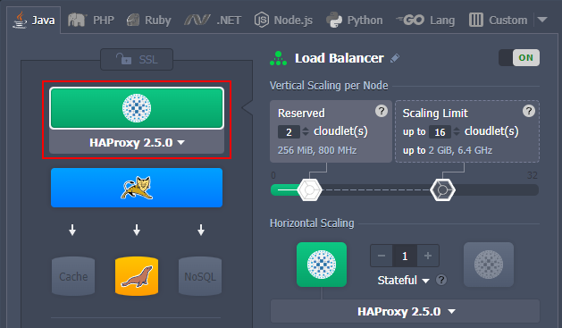

<!-- ## Load Balancing -->

Load balancing is a process of traffic navigation and workload distribution across multiple components, performed by the dedicated type of nodes called **load balancers**. In the platform, such a node is added automatically upon [application server scaling](/application-setting/scaling-and-clustering/horizontal-scaling) to distribute requests between backends. Also, if needed, you can manually add and scale load balancer instances within environment topology.

<div style={{
    display:'flex',
    justifyContent: 'center',
    margin: '0 0 1rem 0'
}}>



</div>

:::danger Note

The platform provides load balancing on application (this document) and infrastructure layers (described in the **_[Shared Load Balancer](/application-setting/external-access-to-applications/shared-load-balancer)_** document). The former handles requests inside environments and the latter - from outside the platform to environments (except the direct connections via _[public IP](/application-setting/external-access-to-applications/public-ip)_).

:::

Currently, the platform provides out-of-box support of the five managed load balancer stacks to choose from:

- **_NGINX_** is one of the most popular open-source servers in the world, which provides customers with great performance, ensuring the efficiency of their applications. Using NGINX requires no extra steps or pre-configuration. It offers a built-in Layer 7 load balancing and content caching to provide a cost-effective and highly available platform for application hosting due to its scalability, security, and high resource usage efficiency.
- **_HAProxy_** (High Availability Proxy) is a fast and reliable open-source solution that can handle huge traffic and offers high availability, load balancing, and proxying for TCP and HTTP-based applications. Similar to the NGINX balancer, it uses a single-process, event-driven request handling model. It consumes a low (and stable) amount of memory, enabling HAProxy to process many concurrent requests simultaneously, ensuring smooth load balancing with smart persistence and DDOS mitigation.
- **_Varnish_** is a web application accelerator also known as a caching HTTP reverse proxy for dynamic websites with high traffic. Unlike other proxy servers, it was initially designed to be focused exclusively on HTTP. Nevertheless, within the platform implementation, it is delivered in a bundle with the NGINX server (run as an HTTPS proxy), which gives the ability to work with the secure data and the Custom SSL option in particular. The emphasis is made on speed, which is mainly achieved through caching, making the website faster by offloading the delivery of the static objects.
- **_Apache_** load balancer is an open-source traffic distribution server, which provides high customization options through its modular structure. Apache balancer can be configured to meet the unique requirements of each given environment while simultaneously ensuring such benefits as security, high availability, speed, reliability, and centralized authentication/authorization.
- **_LiteSpeed Web ADC_** (Application Delivery Controller) is a commercial high-performance HTTP load balancing solution. It implements all of the cutting edge technologies (e.g. [HTTP/3 or QUIC](/application-setting/external-access-to-applications/http3-support) transport protocol support), provides advanced security (web application firewall protection, layer-7 anti-DDOS filtering, etc.), enterprise-level performance (caching, acceleration, optimization, offloading, etc.), and more.

Using multiple compute nodes with a load balancer is the preferable approach for production purposes, as it ensures redundancy and system high availability.

## Backend Health Checks

Each environment-level load balancer provides a default health check implementation to ensure backends are accessible and work correctly. Find the exact details in the list below:

- **NGINX** - a simple TCP check (i.e. verifies the required server port availability) right before routing a user request to it; if the check fails, the next node within a layer will be tried
- **HAProxy** - regular TCP checks (every 2 seconds by default), storing the results in a table of backends state and keeping it constantly up-to-date
- **Apache Balancer** - no implemented health check procedure by default
- **Varnish** - all backends are assigned with the following parameters in balancer configs (so that the health checks are performed once per minute with a 30 seconds timeout):

```bash
probe = { .url = "/"; .timeout = 30s; .interval = 60s; .window = 5; .threshold = 2; } }
```

- **LiteSpeed ADC** - a TCP check is done by the internal IP every second with a one-second timeout (health check is implemented as a default functionality on the Worker Group level)

Obviously, the default health check settings can be manually adjusted up to your needs (through either [file manager](/application-setting/configuration-file-manager) GUI or via [SSH](/deployment-tools/ssh/ssh-access/overview)). Use the official documentation as a reference - _[NGINX](https://docs.nginx.com/nginx/admin-guide/load-balancer/http-health-check/)_, _[HAProxy](https://www.haproxy.com/documentation/hapee/2-0r1/load-balancing/health-checking/active-health-checks)_, _[Apache Balancer](https://httpd.apache.org/docs/2.4/mod/mod_proxy_hcheck.html)_, _[Varnish](https://varnish-cache.org/docs/7.0/users-guide/vcl-backends.html#health-checks)_, and _[LiteSpeed](https://docs.litespeedtech.com/lsadc/settings/)_.
