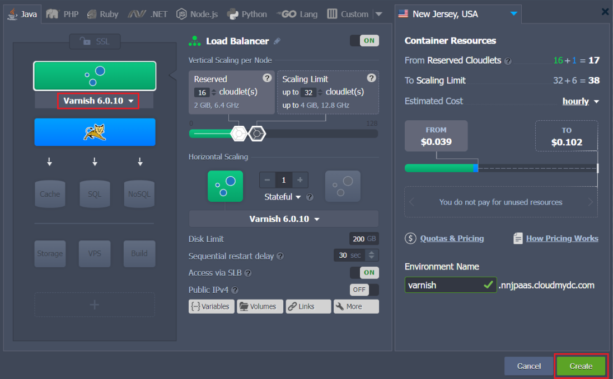
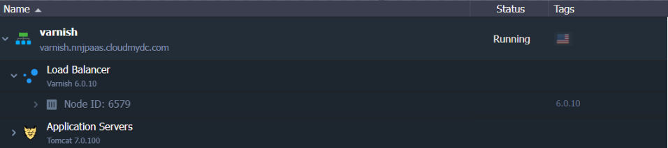
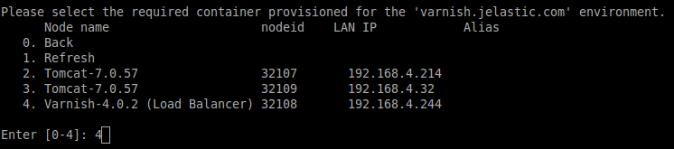
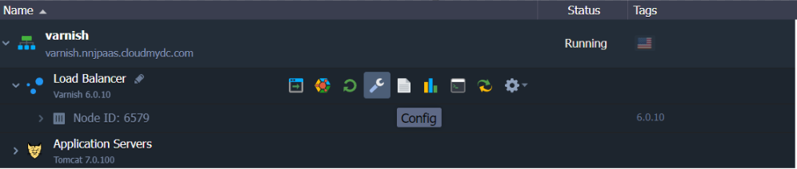
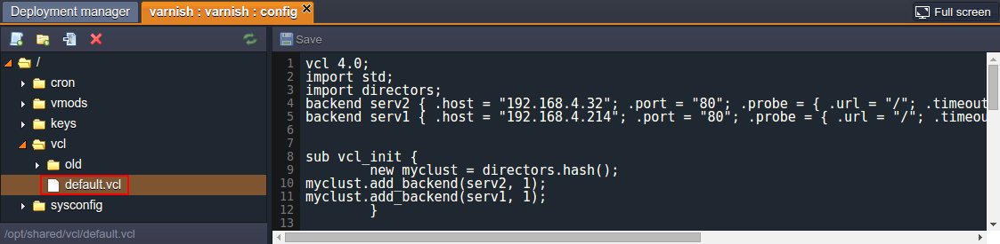
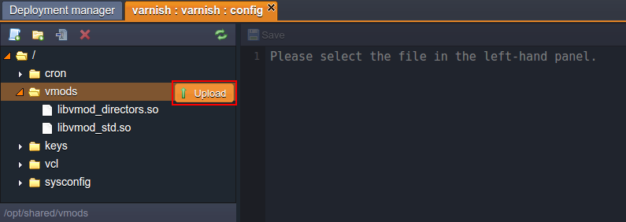
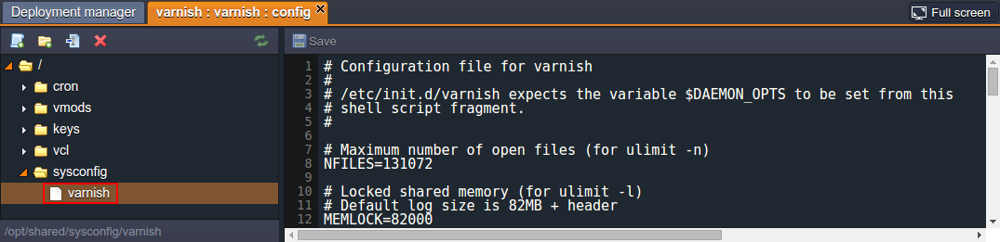

## Varnish

:::tip Tip

The _Varnish_ stack is [HTTP/3](/docs/application-setting/external-access-to-applications/http3-support) ready with the feature support enabled by default since the _5.2.x_ and _6.x.x_ versions. However, a [public IP address](/docs/application-setting/external-access-to-applications/public-ip) is required to bypass the Shared Load Balancer and work directly with the server over HTTP/3.

:::

**Varnish** is a web-application accelerator also known as a caching HTTP reverse proxy for dynamic web-sites with high traffic. Unlike other proxy servers, it was initially designed to be focused exclusively on HTTP. Nevertheless, within the platform implementation, it is delivered in a bundle with the NGINX server (run on the _443rd_ port as a HTTPS proxy), that gives the ability to work with the secured data and the [Custom SSL](/docs/application-setting/ssl/custom-ssl) option in particular. In this case, after the incoming traffic decryption, NGINX redirects it directly to Varnish (run on the port _80_) to be further processed.

As an accelerator, Varnish only has basic load balancing support, which, however, still includes _round robin_ and _random redirector_ options, backend _health-checking_ and more. But the emphasis is made on the speed, which is mainly achieved through the caching, that makes the web-site faster by offloading the static objects' delivery.

Besides that, Varnish is a modular software with a variety of modules available, including tools for statistics (like _varnishstat_, _varnishhist_), a powerful live traffic analyzer (_varnishlog_) and many others. Furthermore, this server is heavily threaded, with each client connection being handled by a separate worker thread. When the number of active worker threads reaches the configured limit, the incoming connections are put in an overflow queue. In case this queue grows to its stated limit, further incoming connections will be rejected.

:::tip Note

This template utilizes a modern **_systemd_** initialization daemon.

:::

So, if you want to get Varnish as a load balancer for your environment, just complete a few simple steps described below.

## Varnish Load Balancer Installation

1. Log in to the PaaS dashboard with your credentials.
2. Click the **New environment** button, located in the upper left corner.

<div style={{
    display:'flex',
    justifyContent: 'center',
    margin: '0 0 1rem 0'
}}>


</div>

3. Within any programming language tab you need, activate the Balancing wizard section and choose **Varnish** using the corresponding drop-down list.

<div style={{
    display:'flex',
    justifyContent: 'center',
    margin: '0 0 1rem 0'
}}>



</div>

Set any other required configurations (add app server(s) and other instances, state resources limits by means of cloudlets sliders, enable [external IP](/docs/application-setting/external-access-to-applications/public-ip) for nodes, etc.). Then name your new environment (e.g. varnish) and proceed with the **Create** button.

4. In a couple of minutes your environment will be created.

<div style={{
    display:'flex',
    justifyContent: 'center',
    margin: '0 0 1rem 0'
}}>



</div>

That’s all about Varnish installation! Now you can proceed to its configuration.

## Varnish Server Configurations

The Varnish load-balancer can be adjusted according to your needs in one of the following ways:

- through accessing the required server via the platform [SSH Gateway](/docs/deployment-tools/ssh/ssh-access/overview):

<div style={{
    display:'flex',
    justifyContent: 'center',
    margin: '0 0 1rem 0'
}}>



</div>

- or by using the embedded file manager for editing the configuration files:Varnish config button

<div style={{
    display:'flex',
    justifyContent: 'center',
    margin: '0 0 1rem 0'
}}>



</div>

Here are several examples of configurations that could be performed directly through the dashboard:

1. Link servers (even from other environments), which will be placed as backends of this load-balancer. For that, add a new record at the beginning of the **vcl > default.vcl** file, similar to the one below:

```bash
backend server_identifier { .host = "server_intenal_ip"; .port = "80"; }
```

where the following values should be substituted with your custom ones:

- _server_identifier_ - any preferred name of the linking server
- _server_internal_ip_ - address of the required server, which can be found through selecting the **Additionally** button next to it

<div style={{
    display:'flex',
    justifyContent: 'center',
    margin: '0 0 1rem 0'
}}>



</div>

After that, add another string a bit lower in the **_sub vcl_init_** section under the _new myclust = directors.hash();_ line in the following format:

```bash
myclust.add_backend(server_identifier, 1);
```

where, obviously, the server_identifier value should be specified, the same as it was used in the previously added string. Use the image above as an example.

Once these configurations are done, **Save** the made changes and **Restart** the load-balancer server to apply them.

2. Apply custom Varnish modules to your server by means of uploading them into the **vmods** folder.

<div style={{
    display:'flex',
    justifyContent: 'center',
    margin: '0 0 1rem 0'
}}>



</div>

3. Adjust the initial Varnish daemon’s parameters, that are read from the **sysconfig > varnish** configuration file on every balancer start up.

<div style={{
    display:'flex',
    justifyContent: 'center',
    margin: '0 0 1rem 0'
}}>



</div>

We hope that this instruction will help you to configure your Varnish load-balancer according to your needs.
