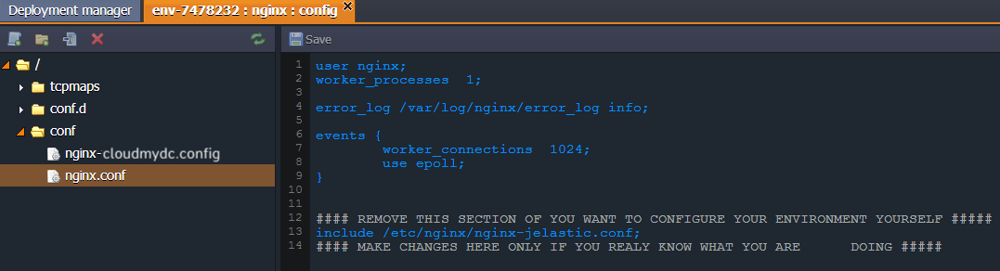
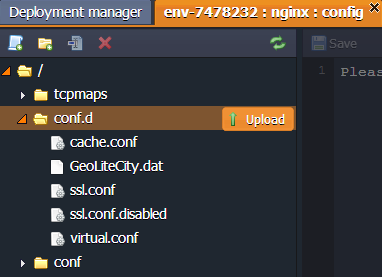
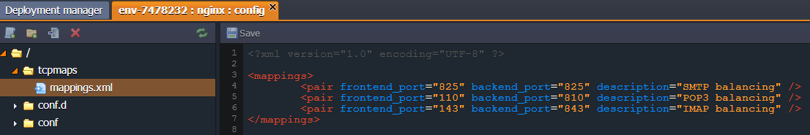

<!-- ## NGINX Balancer Configuration     -->

The following NGINX configuration files are available:

Folder File Path
conf nginx.conf /etc/nginx
conf.d /etc/nginx/conf.d
tcpmaps mappings.xmlf /etc/nginx/tcpmaps

NGINX balancer is automatically added if you choose several app servers.

##CONF
For performing necessary configurations for NGINX balancer the **_nginx.conf_** file, located in **conf** folder, is used.

    <a href="/platform-overview/release-notes/release-notes-8.3">
Back to the list
    </a>

## CONF.D

With access to NGINX configs you can not only edit the existing files but also upload your own config files with custom settings to the **conf.d** folder.

    <a href="/platform-overview/release-notes/release-notes-8.3">
Back to the list
    </a>

## TCPMAPS

The **tcpmaps** folder contains the **_mappings.xml_** file where you can set the redirection of the TCP balancing ports. There you need to specify the pair of ports: one to listen to and the other to redirect to.

You can find more information in the [NGINX Load Balancing](/load-balancers/nginx/nginx-balancer/) and [TCP Load Balancing](/load-balancers/nginx/tcp-load-balancing) documents.

To set [caching in NGINX](/load-balancers/nginx/caching-in-nginx-balancer) click on the link and follow the instruction.

    <a href="/platform-overview/release-notes/release-notes-8.3">
Back to the list
    </a>

