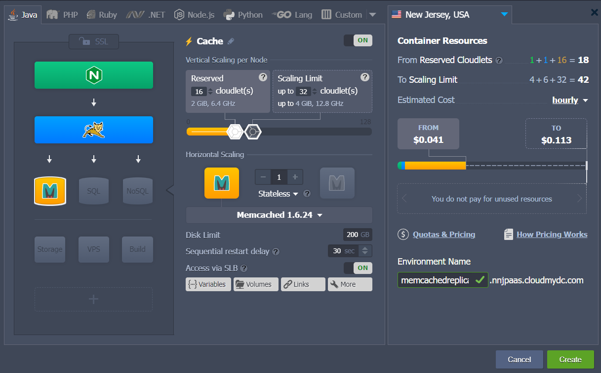

## anchor 42

The platform provides [Session Replication](http://localhost:3000/docs/application-setting/scaling-and-clustering/session-replication-for-ha) between instances of web-servers with a help of multicast. But also you can use **Session Replication via Memcached**.

To use memcached for session replication follow this instruction.

## Create Environment

1. Log into the PaaS account.
2. Click **Create environment**.
3. In the **Environment topology** window choose two or more servers you want to use (for example, two instances of **Tomcat**) and **Memcached** node. Type the name of the environment (for example, memcachedreplication) and click **Create**.

<div style={{
    display:'flex',
    justifyContent: 'center',
    margin: '0 0 1rem 0'
}}>



</div>

4. In a minute your environment will be created.

<div style={{
    display:'flex',
    justifyContent: 'center',
    margin: '0 0 1rem 0'
}}>


</div>

## Configure application server

1. Download .jar file of [Memcached session manager](https://code.google.com/archive/p/memcached-session-manager/). As the example we used [memcached-session-manager-1.6.2](https://code.google.com/archive/p/memcached-session-manager/) .

Also download [memcached-session-manager-tc7-1.6.2.jar](https://code.google.com/archive/p/memcached-session-manager/downloads), [spymemcached-2.8.4.jar](https://code.google.com/archive/p/spymemcached/downloads), [msm-kryo-serializer-1.6.1.jar](https://code.google.com/archive/p/memcached-session-manager/downloads), [kryo-1.03.jar](https://code.google.com/archive/p/memcached-session-manager/downloads), [reflectasm-0.9.jar](https://code.google.com/archive/p/memcached-session-manager/downloads), [kryo-serializers.jar](https://mvnrepository.com/artifact/de.javakaffee/kryo-serializers), <a href="https://repo1.maven.org/maven2/joda-time/joda-time/1.5.2/joda-time-1.5.2.jar" target="_blank" rel="nofollow noopener">joda-time.jar</a>
and [minlog-1.2.jar](https://code.google.com/archive/p/memcached-session-manager/downloads).

2. Click **Config** for Tomcat.

<div style={{
    display:'flex',
    justifyContent: 'center',
    margin: '0 0 1rem 0'
}}>


</div>

3. In the opened window choose **lib** folder and upload the **.jar** file you’ve just downloaded.

<div style={{
    display:'flex',
    justifyContent: 'center',
    margin: '0 0 1rem 0'
}}>


</div>

4. Choose **server** folder and open **context.xml** file.

5. Update **context.xml** so that it contains the Manager configuration for the memcached-session-manager, like this:

```bash
<Context path="" docBase="ROOT">
 <Manager className="de.javakaffee.web.msm.MemcachedBackupSessionManager"
   memcachedNodes="n1:host:11211"
   requestUriIgnorePattern=".*\.(png|gif|jpg|css|js)$"
   sessionBackupAsync="false"
   sessionBackupTimeout="100"
   copyCollectionsForSerialization="false"
   transcoderFactoryClass="de.javakaffee.web.msm.serializer.kryo.KryoTranscoderFactory"
   customConverter="de.javakaffee.web.msm.serializer.kryo.JodaDateTimeRegistration"
   />
</Context>
```

You can use any other [serialization strategy](https://code.google.com/archive/p/memcached-session-manager/wikis/SerializationStrategies.wiki) according to your needs, in our case we use [Kryo](https://code.google.com/archive/p/kryo/), an extremely fast binary serialization library.

<div style={{
    display:'flex',
    justifyContent: 'center',
    margin: '0 0 1rem 0'
}}>


</div>

6. In the string **_memcachedNodes_** add your memcached **host** and default **port** (11211). In our case we have:

_n1:memcached-memcachedreplication.jelastic.com:11211_

In order to get your memcached host, simply add the ‘memcached-’ prefix to your environment hostname (which is displayed in a string just under the name of your environment).

<div style={{
    display:'flex',
    justifyContent: 'center',
    margin: '0 0 1rem 0'
}}>


</div>

7. **Save** the changes and **Restart** your server node (in our case Tomcat).

That’s all. Now your have a high available cluster with all the advantages of **Memcached**.
