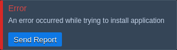

If you encounter an error during the installation of NetBox, follow these steps to diagnose and resolve common issues.

## Step 1: Error Reporting

Upon installation failure, an error message will appear. You can report this by clicking the **Send Report** button to provide the error details to the support team.

## Step 2: Reattempt Installation

Occasionally, issues can be fleeting and may be resolved by simply trying the installation process once more.

## Step 3: Check Container Logs

Logs provide valuable error messages and can be accessed via the dashboard:

1. Select the NetBox environment.
2. Click on the **Log** button for the relevant container.
3. Look for error messages that indicate the problem.

## Step 4: Review NetBox Documentation

Consult the [NetBox Documentation](https://docs.netbox.dev).

## Step 5: Consult Built-in Monitoring

Our built-in monitoring tools can offer insights and are detailed in the [documentation](https://github.com/application-setting/built-in-monitoring/log-files).

## Step 6: Contact Support

If issues persist after the above steps, contact our support with:

- A description of the problem.
- Troubleshooting steps undertaken.
- Relevant logs or error messages.

Troubleshooting NetBox on CloudMyDC requires a systematic approach. If you're unable to resolve the issue, make use of available resources including community forums, NetBox issue tracker, and CloudMyDC's support.
