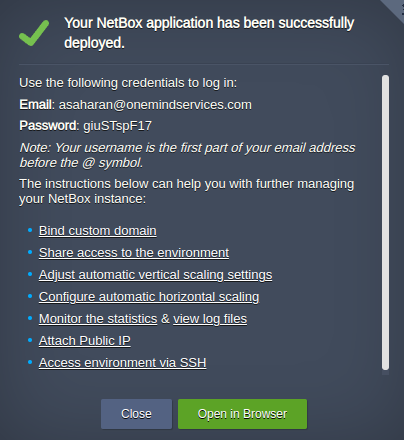
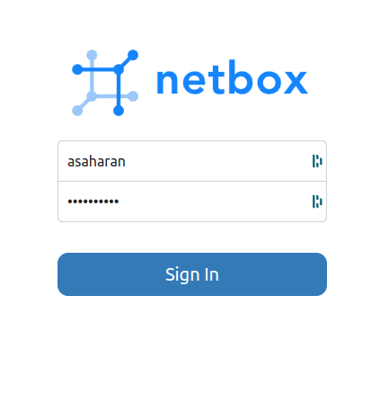

After the successful installation of your NetBox cluster on CloudMyDC, you can access the NetBox Web GUI to manage and document your network. Here's how to get started:

## Accessing NetBox Dashboard

1. Once installation is complete, a confirmation pop-up will provide the URL to your NetBox environment, along with the credentials needed for the first login. You'll also receive this information via an email notification.

2. To log in to the NetBox Dashboard, follow the provided URL. Click on the 'Login' button and enter your provided username and password.

Remember, the username is typically the first part of your email address before the '@' symbol. Once logged in, you can start using NetBox to model and document your network infrastructure.

## Navigating the NetBox Dashboard

- The Dashboard provides an overview of your network's organization, devices, connections, and more, with a clean and user-friendly interface.
- Easily manage IP addresses, VLANs, racks, and other critical elements of your network infrastructure through the Web UI.

For further management tasks and customization, refer to the NetBox documentation or use the provided API for automation and integration with other systems.