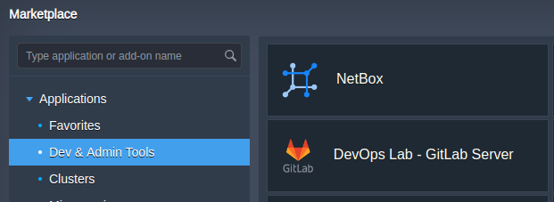
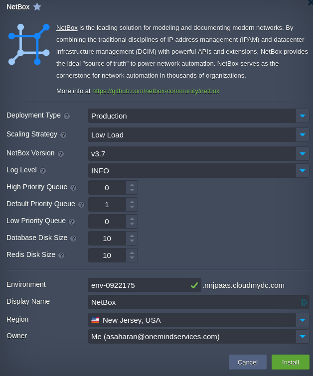

The **NetBox** application is available for automatic installation via the platform Marketplace under the **Dev and Admin Tools** section (or use the Search function to locate it). Note that this application is available for billing customers only.

Within the opened installation frame, customize the available options to get a cluster specifically tailored for your needs:

- **Deployment Type:** Select `Development` for a non-critical testing environment or `Production` for a stable, live deployment.
- **NetBox Version:** By default, the installation is set to the latest release version.
- **Log Level:** Preconfigured to `INFO` to capture routine operational data. Modify as needed to increase or decrease the detail in logs.
- **Queue Configuration:** Determine the number of tasks for the `High Priority Queue`, `Default Priority Queue`, and `Low Priority Queue`. The system defaults to a minimum of `1` for the `Default Priority Queue`.
- **Database Disk Size:** Initially allocated `10 GB` for database storage. Consider expanding for larger datasets.
- **Redis Disk Size:** Set at `10 GB` by default for caching and queuing. Adjust according to your caching needs.
- **Environment Name:** Designate a unique name for your environment to distinguish it within CloudMyDC.
- **Display Name:** Choose an alias for your NetBox deployment for easier identification.
- **Region:** Opt for a deployment region that aligns with your user base or specific geographic requirements.
- **Scaling Strategy:** (Only applicable for `Production` deployment type) Configure how the system scales in response - load changes:
   - **Low Load:** Adds 1 NetBox node when CPU usage exceeds 70% and removes it when CPU falls below 20%.
   - **Medium Load:** Increases nodes when CPU usage goes over 50% and scales down when it drops below 20%.
   - **High Load:** Scales up with a CPU usage over 30% and decreases when CPU is under 10%.

The default scaling strategy is set to `Low Load`, providing a conservative approach to scaling that suits most environments with regular traffic patterns.

``Production Type``

Click the **Install** button and wait a few minutes for the platform to automatically configure your NetBox cluster.