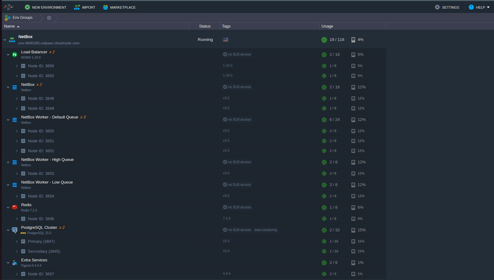

NetBox is a comprehensive solution for network automation, blending traditional IP address management (IPAM) and datacenter infrastructure management (DCIM) with robust APIs and extensions. As an open-source tool under the Apache 2.0 license, NetBox is essential for network automation in many organizations.

## Key Features:

- **Physical Infrastructure:** Model everything from global regions to individual racks.
- **Modern IPAM:** Standard IPAM functionality plus advanced features like VRF tracking.
- **Data Circuits:** Seamlessly manage circuits alongside your infrastructure.
- **Power Tracking:** Detailed mapping of power distribution.
- **Organization:** Native management of tenant and contact assignments.
- **Powerful Search:** A global search function for quick access to resources.
- **Comprehensive Logging:** Track network changes and growth.
- **Endless Customization:** Custom fields, links, tags, and more.
- **Flexible Permissions:** Advanced, delegable permissions system.
- **Integrations:** REST & GraphQL APIs for easy connection to other tools.
- **Plugins:** Extend functionality with community or Onemind Services plugins.

## Installation Components
The installation of NetBox on CloudMyDC includes:

### NetBox Container
This is the core component where the NetBox application runs. It's packaged as a container, meaning all the necessary dependencies and the application code are bundled together to run in an isolated environment. This container interacts with other services to manage and document network setups.

### NetBox Worker Containers
These are additional containers running services that handle background processing tasks for NetBox. They ensure that tasks such as handling webhooks, running custom scripts, and generating reports don't interfere with the main application's responsiveness by processing these tasks asynchronously.

### PostgreSQL
PostgreSQL is the relational database system used by NetBox to store all its data. It is known for its robustness, performance, and compliance with SQL standards. Within the NetBox context, PostgreSQL stores information about network infrastructure, IP addresses, and all other data NetBox manages.

### Redis
Redis is an in-memory data store used by NetBox as a cache and for queuing operations. It helps in speeding up the application by storing frequently accessed data in memory and by managing background tasks (which are handled by the worker containers).

### NGINX Load Balancer
NGINX acts as a reverse proxy and load balancer. In a CloudMyDC environment, it can be used to distribute incoming network traffic across multiple NetBox instances, improving the application's scalability and reliability. It can also handle SSL termination, offloading the encryption/decryption workload from the application containers.

These components together form the infrastructure needed to deploy NetBox on a platform like CloudMyDC efficiently. Each plays a specific role in ensuring the application is scalable, reliable, and responsive.
