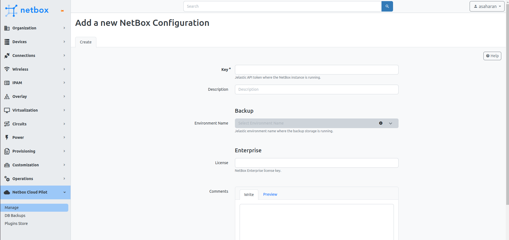

# 

# Configure NetBox Cloud Pilot

After installing the NetBox Cloud Pilot plugin, you need to configure it to manage NetBox within the VAP (Virtual Application Platform).

## Prerequisites

Before you begin, create a personal access token in VAP with full API access. This token will allow NetBox Cloud Pilot to interact with your NetBox instance. Learn how to create one [here](/account-and-pricing/personal-access-tokens).

## Configuration Process

1. Navigate to the **NetBox Cloud Pilot** section on the sidebar menu and click on "Manage." This action opens the configuration form.

2. In the configuration form:
   - Enter your VAP access token in the **Key** field. This token is essential for the NetBox Cloud Pilot plugin to communicate with the VAP API.
   - Provide a **Description** for your configuration to help identify the purpose or scope of the access.
   - For Enterprise customers, input your **License** key in the designated field to unlock access to paid plugins.

3. Optionally, you can add any comments in the **Comments** section to record notes or additional information regarding the configuration.

4. **Environment Name** under **Backup** can only be accessed after submitting the initial configuration. You can read more about it in the [Database Backups/Restores](https://github.com/Onemind-Services-LLC/cloudmydc-docs/issues/add-link-here) section.

By completing these steps, you'll enable the NetBox Cloud Pilot plugin to manage and automate tasks within your NetBox instance, enhancing your overall efficiency.

:::tip Note

For optimal operation of the plugin, we recommend configuring the following settings:
- **DB Disable Server Side Cursors:** Change this to `Yes` to enhance database performance, a requirement for production setups on NetBox v3.6 or newer. Prior to upgrading from v3.5, ensure this option is enabled to facilitate a smooth transition.
- **RQ Default Timeout:** Increase the timeout to 3600 seconds to ensure longer tasks do not time out prematurely.

:::

For detailed instructions on applying these configurations, please refer to the [Configuration Guide](/netbox-hosting/netbox-plugins/netbox-cloud-pilot/manage-netbox-settings).