Ensure your NetBox instance's data is secure by setting up regular database backups.

## Prerequisites

A backup storage must be connected to your NetBox environment. You can do this in one of two ways:

- [Connect Existing](https://github.com/option1) backup storage
- [Add new](https://github.com/option2) backup storage

## Connecting Existing Backup Storage

1. Navigate to **NetBox Cloud Pilot > Manage** and select **Edit**.

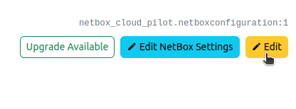

2. In the "Backup" section, choose an existing **Environment Name** from the dropdown.

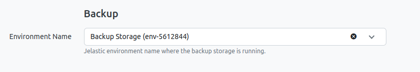

3. Click **Save** to apply the changes.

## Creating New Backup Storage

1. Go to **NetBox Cloud Pilot > Manage**.
2. Click on **+ Add Backup Storage** in the "Overview" section.

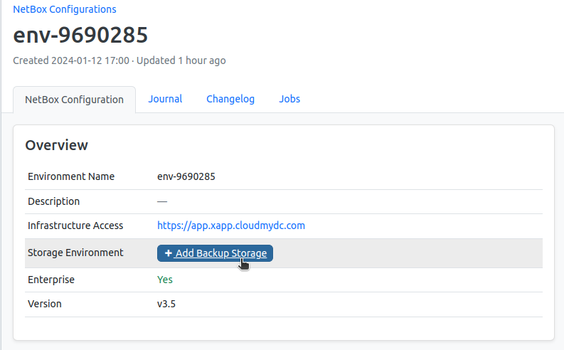

3. Complete the form with the following details:

- **Display Name:** Enter a name for the backup storage.
- **Storage Size:** Specify the size in GB.
- **Region:** Select a region, preferably different from the NetBox region for redundancy.
- **Deployment Type:** Choose between Standalone (1 node) or Cluster (3, 5, 7 nodes). A cluster offers fault tolerance but at a higher cost.

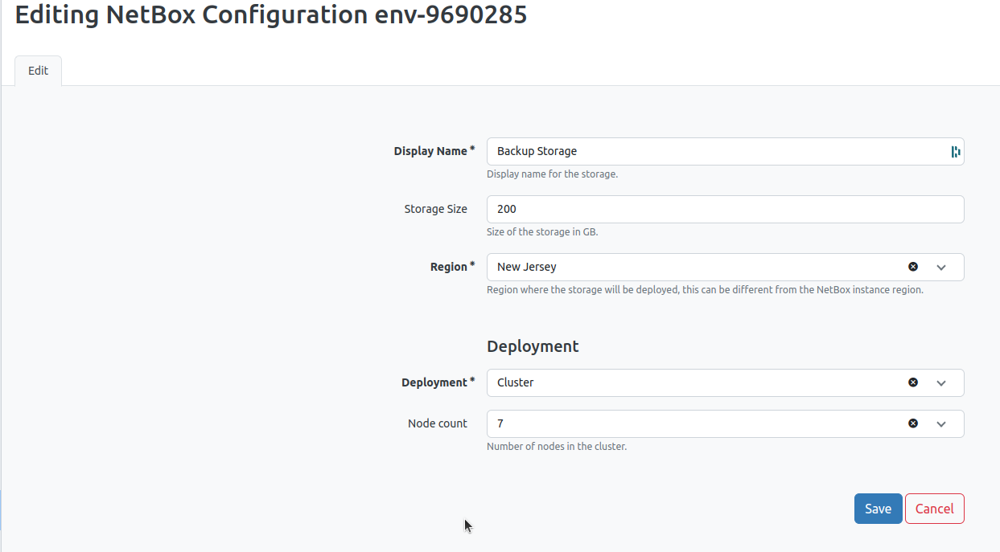

4. Click **Save** to initiate the storage deployment. It may take a few minutes to complete, depending on the configuration.

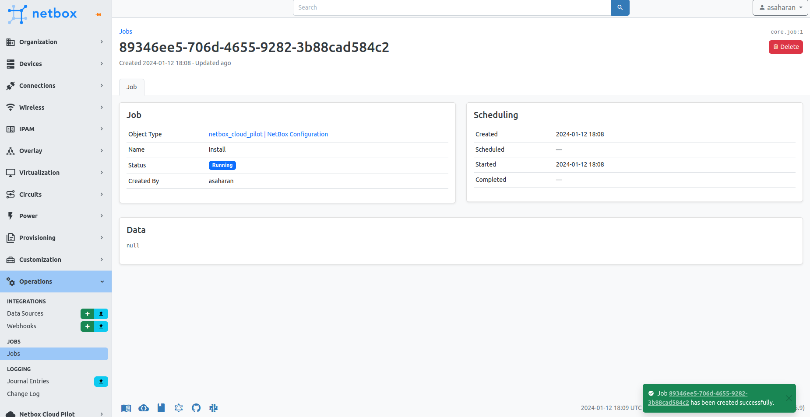

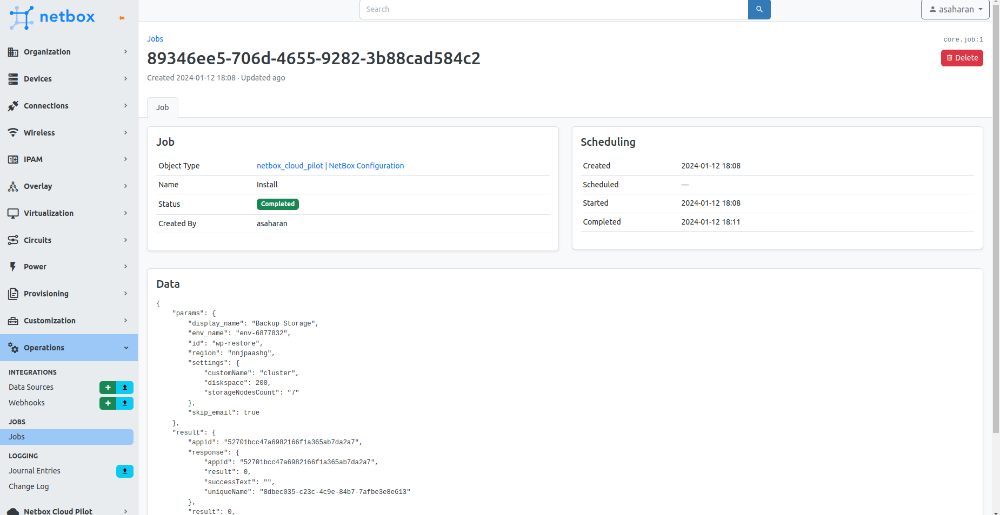

Once set up, the storage overview will be visible under "Manage."

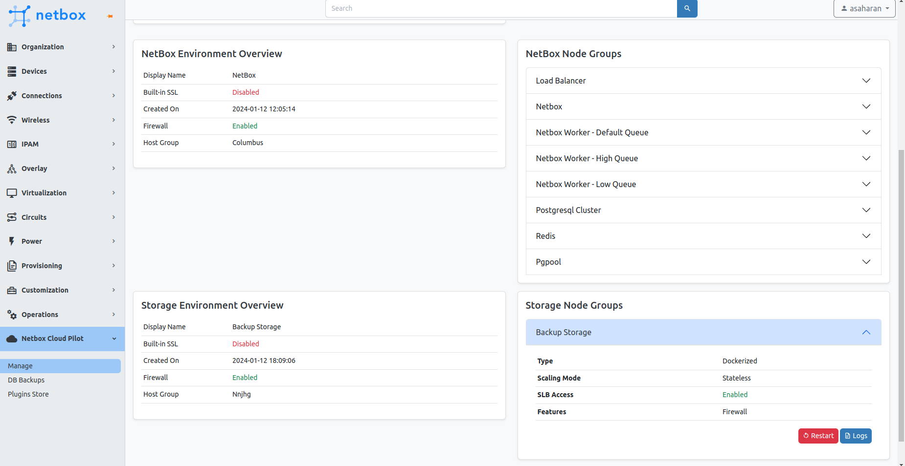

## Backup Process

1. Navigate to **NetBox Cloud Pilot > DB Backups** to open the backup form.
2. Select your environment from the dropdown.
3. Enter the **webadmin** password, which was sent to your email.
4. Set the cron schedule for backups using [crontab.guru](https://crontab.guru/) for guidance on cron expressions.
5. Decide on the number of backups to retain.

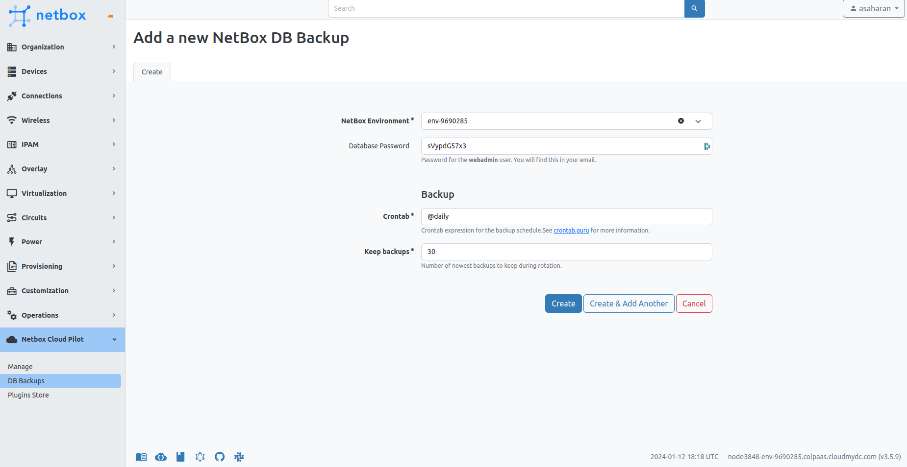

6. Click **Create** to establish the backup job.

This process installs a backup plugin and configures scheduled backups in your environment. Additional details can be found [here](/database/postgresql/backup-restore-add-on).

## Database Backups

NetBox Cloud Pilot provides two modes of database backup:

### 1. Manual Backup
Manual backups can be initiated at any time through the UI:

- Navigate to **NetBox Cloud Pilot > DB Backups**.
- Click on the **Backup Now** button to start the backup process immediately.

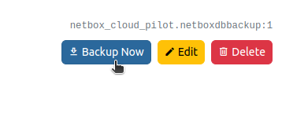

A background job will be initiated, and the duration will depend on your database size, ranging from a few seconds to several hours.

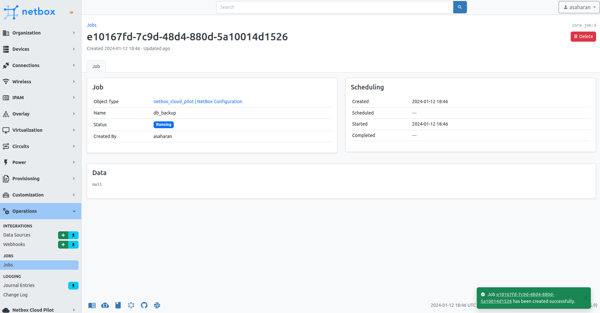

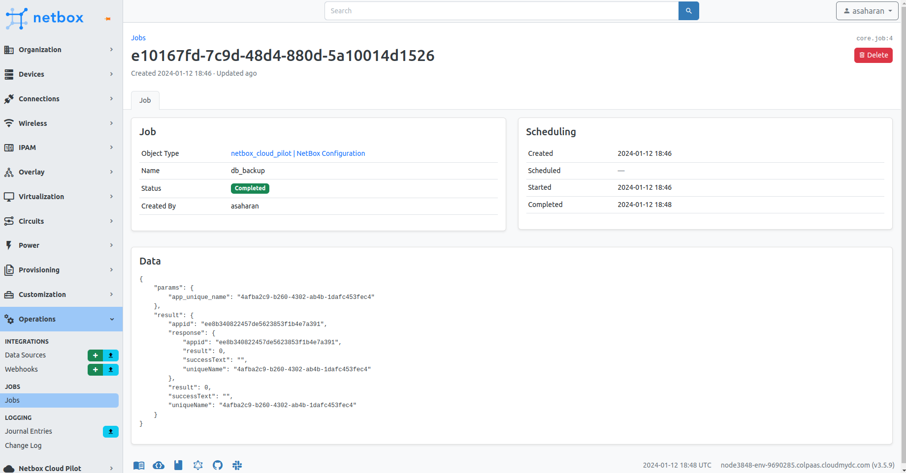

### 2. Automated Backup

Automated backups run according to a schedule you define using a cron expression:

- The automatic backup schedule is set up during the backup configuration process.
- The job will run at the scheduled times, ensuring regular, unattended backups of your NetBox database.

Only manually triggered create a job entry that you can monitor in the **Jobs** section of NetBox Cloud Pilot. Successful completion will be indicated in the job's status.

## List Backups

You can view all backups listed under **NetBox Cloud Pilot > DB Backups**

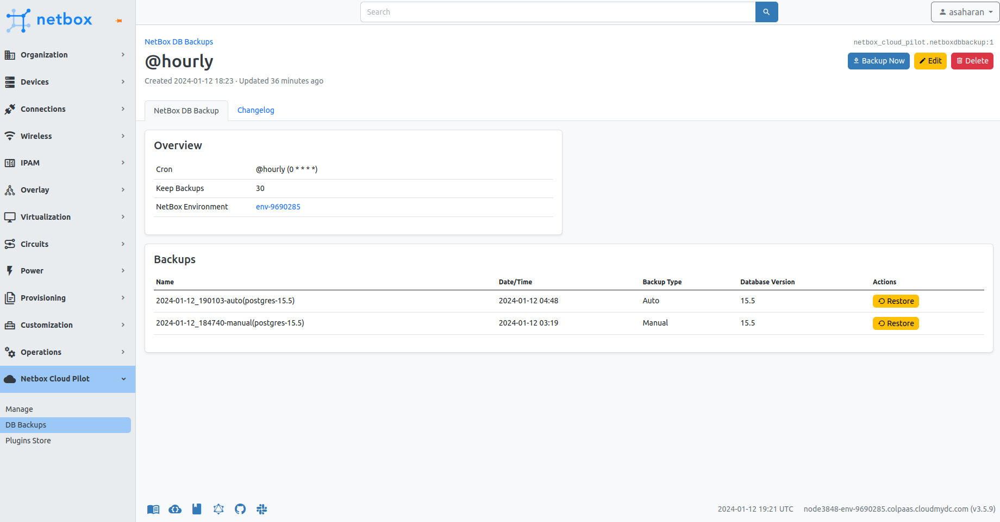

To ensure data integrity, consider scheduling frequent automated backups and supplementing them with manual backups as needed, especially before major changes or updates.

## Restore Backups

If you need to roll back your NetBox instance to a previous state, you can easily restore from a backup.

1. In the NetBox dashboard, go to **NetBox Cloud Pilot > DB Backups**.
2. You'll see a list of available backups, each with a corresponding **Restore** button.
3. Identify the desired backup you wish to restore from. This can be based on the date, time, and whether it was an auto or manual backup.
4. Click the **Restore** button next to the backup you want to use as the restore point.

:::warning Note

- It is recommended to perform a restore during a maintenance window or when there is minimal activity on your NetBox instance. Restoring during peak usage times can lead to data inconsistencies or loss as current transactions may be interrupted.

:::

Make sure you have communicated with all relevant stakeholders and have confirmed that the system is in an appropriate state to undergo a restore operation.