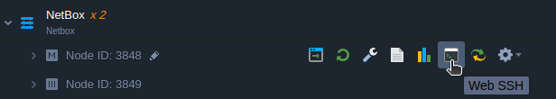
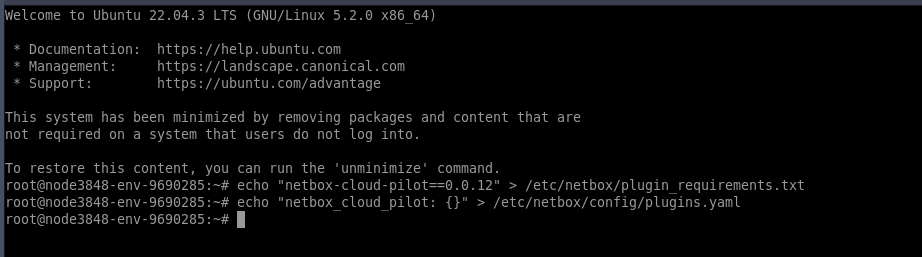
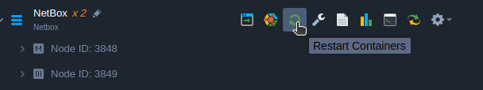
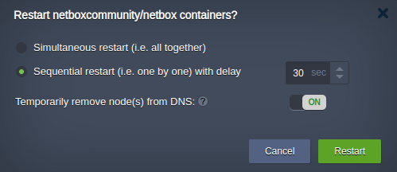
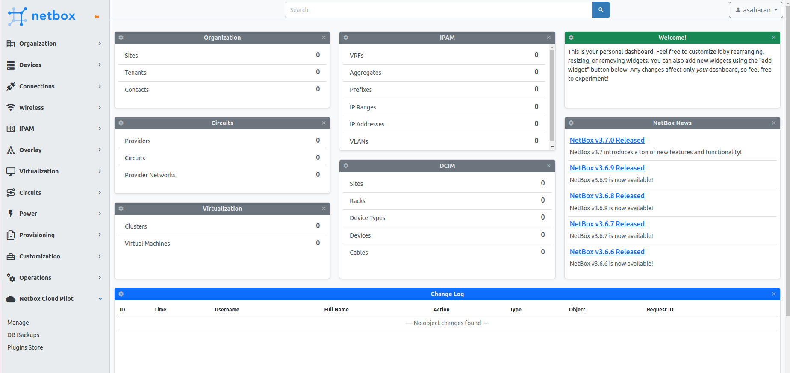

# 

# Install NetBox Cloud Pilot

Ensure your NetBox version is compatible with the NetBox Cloud Pilot plugin before proceeding with the installation.

## Prerequisites

1. Verify the compatible release for your NetBox version at the [Onemind-Services-LLC/netbox-cloud-pilot](https://github.com/Onemind-Services-LLC/netbox-cloud-pilot?tab=readme-ov-file#compatibility).

2. Ensure you have access to the NetBox infrastructure on the Virtual Application Platform (VAP) to execute commands inside the containers.

## Installation Process

1. Locate the Web SSH icon on the NetBox container dashboard for the first node in your environment (for example, node ID: 3848 as shown below). Click on the Web SSH icon to open a terminal window within your web browser.

<div style={{
    display:'flex',
    justifyContent: 'center',
    margin: '0 0 1rem 0'
}}>



</div>

2. In the Web SSH terminal, enter the following commands, replacing `<VERSION>` with the compatible version number for your NetBox:

```bash
echo "netbox-cloud-pilot==<VERSION>" >> /etc/netbox/plugin_requirements.txt
echo "netbox_cloud_pilot: {}" >> /etc/netbox/config/plugins.yaml
```

This will update the plugin requirements and configuration files, making them accessible to other NetBox containers in the environment.

<div style={{
    display:'flex',
    justifyContent: 'center',
    margin: '0 0 1rem 0'
}}>



</div>

3. Run the following commands on each NetBox container node in your environment.

```bash
source /opt/netbox/venv/bin/activate
pip install -r /etc/netbox/plugin_requirements.txt
```

<div style={{
    display:'flex',
    justifyContent: 'center',
    margin: '0 0 1rem 0'
}}>


</div>

4. When you have more than one node in a layer, it is crucial to manage restarts carefully to minimize service disruption:
- **Temporary DNS Removal:** During the restart process, temporarily remove the nodes from DNS. This step ensures that traffic does not get directed to nodes that are in the process of restarting.
- **Configurable Delay:** Set a delay between the restarts of individual nodes. This allows you to control the time interval, accommodating your specific operational requirements and reducing the potential for service impact.

The options to remove nodes from DNS and to set a restart delay will only appear if your layer consists of multiple nodes. Single-node layers will restart directly without these additional options.

By following these guidelines, you can maintain service availability even as you perform necessary system updates or maintenance.

<div style={{
    display:'flex',
    justifyContent: 'center',
    margin: '0 0 1rem 0'
}}>



</div>

<div style={{
    display:'flex',
    justifyContent: 'center',
    margin: '0 0 1rem 0'
}}>



</div>

5. Once you have logged back into NetBox, you should see the **NetBox Cloud Pilot** section in the bottom left corner of the sidebar, confirming the successful installation of the plugin.

<div style={{
    display:'flex',
    justifyContent: 'center',
    margin: '0 0 1rem 0'
}}>



</div>

After completing these steps, the NetBox Cloud Pilot plugin will be installed and ready for use on your NetBox installation.
