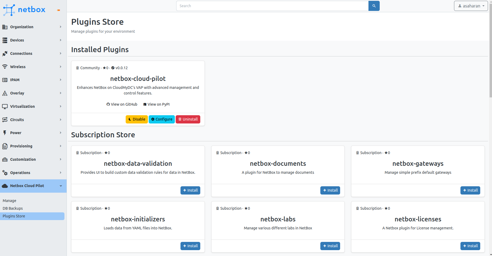
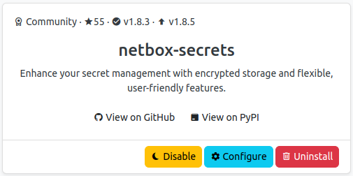
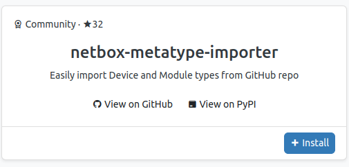
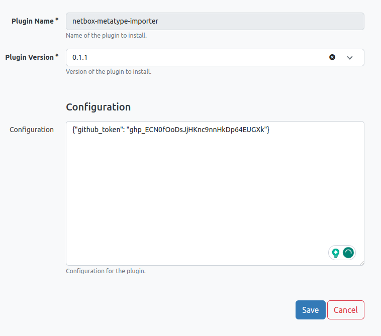
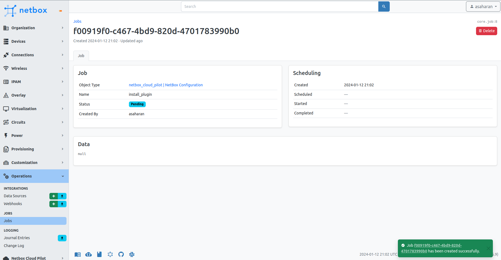
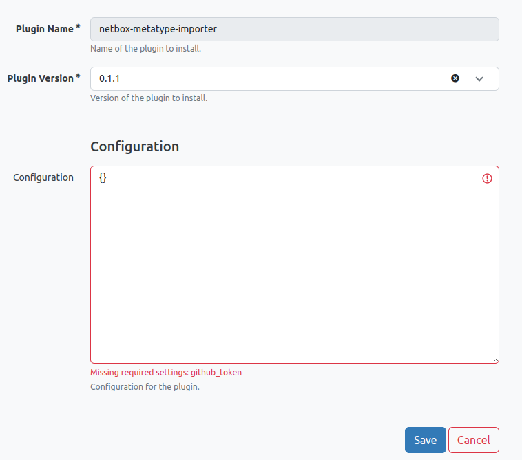
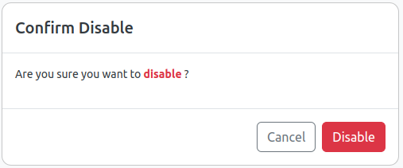
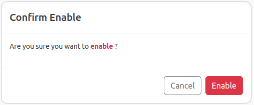
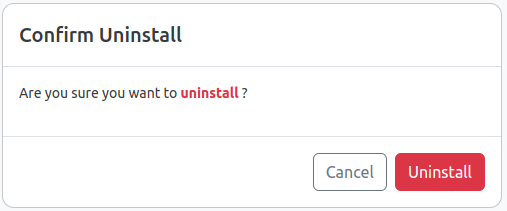

In the NetBox Cloud Pilot, the `Plugins Store` is your central hub for managing plugins.

## Overview of the Store

When accessing the `Plugins Store` for the first time, the `netbox-cloud-pilot` plugin will be listed under installed plugins. The store is categorized into three main sections:

1. **Installed Plugins:** Displays plugins that are currently installed and active within your environment.
2. **Subscription Store:** Reserved for paid or enterprise plugins. All users can view these plugins, but installation is exclusive to users with a valid license.
3. **Community Store:** A curated collection of popular open-source plugins that are actively maintained by the community.

## Understanding Plugin Cards

Each plugin card in the installed section provides essential information:

- **Plugin Type:** Indicated by an icon for community or subscription.
- **GitHub Stars:** Reflects the popularity and community support of the plugin.
- **Installed Version:** Shows the currently installed version of the plugin.
- **Available Upgrade:** Notifies if there is an upgrade available for the plugin.

Below the plugin details, a brief description offers insights into the plugin's functionality. Community plugins include links to their GitHub and PyPI pages.

## Actions Available

Each card includes actionable buttons:

- **Disable:** Temporarily deactivates the plugin without removing configurations.
- **Configure:** Access settings to reconfigure or manage version upgrades/downgrades.
- **Uninstall:** Permanently removes the plugin and its configurations from the environment.

For plugins that are not yet installed, an **Install** button will be displayed.

Use the Plugin Store to enhance your NetBox instance with new features, ensuring that your setup is customized to your specific needs and workflows.

## Install Plugin

Enhance your NetBox instance by adding new functionalities through plugins.

1. Navigate to **NetBox Cloud Pilot > Plugins Store**.
2. Select the plugin you wish to install and click on **Install**.
3. On the installation page, choose the desired version from the dropdown menu.
4. Enter any required configurations in the provided field. Refer to the plugin documentation for specific configuration requirements.
5. Click **Save** to proceed with the installation.

A job will be queued to install the plugin, apply configurations, and restart the necessary NetBox nodes. The duration of this process can vary based on the size of your environment. For production environments, the installation aims to minimize downtime and maintain service availability.

Once the installation is complete and master NetBox node is restarted, the plugin will be accessible for use and listed under the installed plugins in the Plugins Store.

:::warning Mandatory Configuration:

- If a plugin requires a mandatory configuration (e.g., `github_token`), an error will be displayed until the correct `key=value` pair is provided.

:::

:::tip ✅ Compatibility Check:

- Only plugin versions compatible with your current NetBox release will be displayed. This ensures that any installed plugins will be supported and should function correctly.

:::

## Configure Plugin

Customizing your installed plugins to meet your specific needs is straightforward in the NetBox Cloud Pilot.

1. Navigate to **NetBox Cloud Pilot > Plugins Store**.
2. From the list of installed plugins, select the plugin you wish to configure.
3. Click on the **Configure** button associated with the plugin.
4. Follow the same installation steps by choosing the version and specifying any required configuration parameters as per the plugin's documentation.
5. Once you've made your changes, click **Save** to apply the configuration.

The system will apply your configuration changes and, if necessary, perform a sequential restart of the NetBox nodes to ensure the plugin functions correctly with the new settings. Just as with the installation process, this may cause a short delay in plugin availability as the nodes are updated.

## Disable Plugin

If you need to temporarily turn off a plugin without uninstalling it, you can easily disable it.

1. Go to **NetBox Cloud Pilot > Plugins Store** in your NetBox dashboard.
2. Identify the plugin you want to disable from the list of installed plugins.
3. Click the **Disable** button for that plugin. A confirmation dialog box will appear asking if you are sure you want to disable the plugin.
4. Confirm by clicking **Disable** in the dialog box. This will schedule a job to disable the plugin.

After disabling a plugin, the system may sequentially restart NetBox nodes as part of the process. The plugin will remain installed but inactive until you choose to enable it again.

:::tip Note

Disabling a plugin retains its configuration, making it easy to enable it back when needed.

:::

## Enable Plugin
Reactivate a plugin that was previously disabled to bring its functionality back to your NetBox instance.

1. In your NetBox dashboard, navigate to **NetBox Cloud Pilot > Plugins Store**.
2. Locate the disabled plugin in the list of installed plugins.
3. Click the **Enable** button associated with the plugin. You may be prompted to confirm your action.
4. Confirm the action if prompted. This will schedule a job to enable the plugin.

Once enabled, the system may perform a sequential restart of the NetBox nodes to integrate the plugin back into active service. The plugin will become available for use as soon as the enablement process is complete and all necessary services have been restarted.

:::tip Note

Enabling a plugin restores its previous configuration, so you can continue using the plugin as it was set up before it was disabled.

:::

## Uninstall Plugin

Removing a plugin from your NetBox instance is straightforward and removes all associated configurations.

1. Navigate to **NetBox Cloud Pilot > Plugins Store** within the NetBox dashboard.
2. Find the plugin you wish to remove in the list of installed plugins.
3. Click on the **Uninstall** button for the targeted plugin. A confirmation prompt will appear to ensure you want to proceed with the removal.
4. Confirm the uninstallation by clicking **Uninstall** in the prompt. This action schedules a job to remove the plugin from the environment.

The system will execute the removal process, which includes the deletion of the plugin and its configurations. Note that once a plugin is uninstalled, any configurations specific to that plugin will also be permanently removed. If you need to use the plugin again in the future, you will have to reinstall and reconfigure it.
