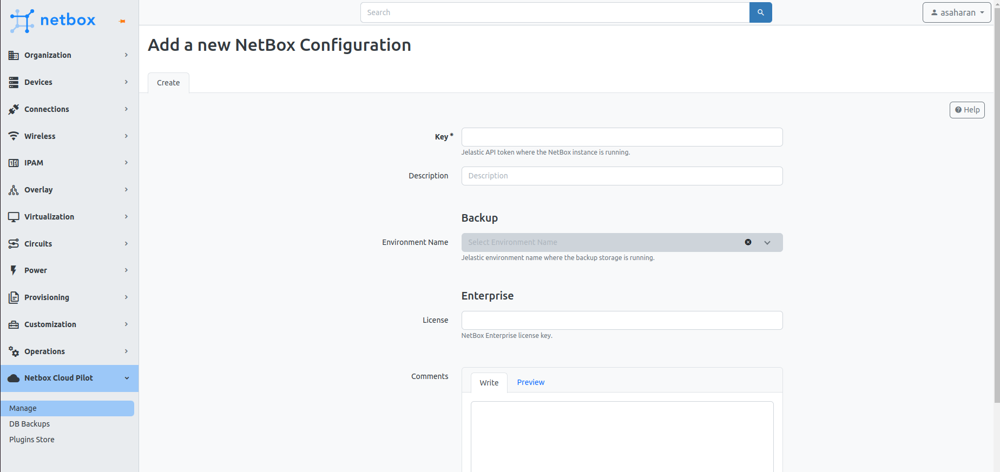

# 

# Configure NetBox PaaS

After installing the NetBox PaaS plugin, you need to configure it to manage NetBox within the PaaS.

## Prerequisites

Before setting up the NetBox PaaS, it's essential to generate an **Extended Access** token within the PaaS that has full API access. This specific type of access token is necessary for the plugin to function correctly, enabling it to communicate effectively with your NetBox instance. Follow the [provided instructions](/account-and-pricing/personal-access-tokens) to create an Extended Access token.
## Configuration Process

1. Navigate to the **NetBox PaaS** section on the sidebar menu and click on "Manage." This action opens the configuration form.

2. In the configuration form:
   - Enter your PaaS access token in the **Key** field. This token is essential for the NetBox PaaS plugin to communicate with the PaaS API.
   - Provide a **Description** for your configuration to help identify the purpose or scope of the access.
   - For Enterprise customers, input your **License** key in the designated field to unlock access to paid plugins.

3. Optionally, you can add any comments in the **Comments** section to record notes or additional information regarding the configuration.

4. **Environment Name** under **Backup** can only be accessed after submitting the initial configuration. You can read more about it in the [Database Backups/Restores](/netbox-hosting/netbox-plugins/netbox-paas/database-backups-restores) section.

By completing these steps, you'll enable the NetBox PaaS plugin to manage and automate tasks within your NetBox instance, enhancing your overall efficiency.

:::tip Note

For optimal operation of the plugin, we recommend configuring the following settings:
- **DB Disable Server Side Cursors:** Change this to `Yes` to enhance database performance, a requirement for production setups on NetBox v3.6 or newer. Prior to upgrading from v3.5, ensure this option is enabled to facilitate a smooth transition.
- **RQ Default Timeout:** Increase the timeout to 3600 seconds to ensure longer tasks do not time out prematurely.

:::

For detailed instructions on applying these configurations, please refer to the [Configuration Guide](/netbox-hosting/netbox-plugins/netbox-paas/manage-netbox-settings).
