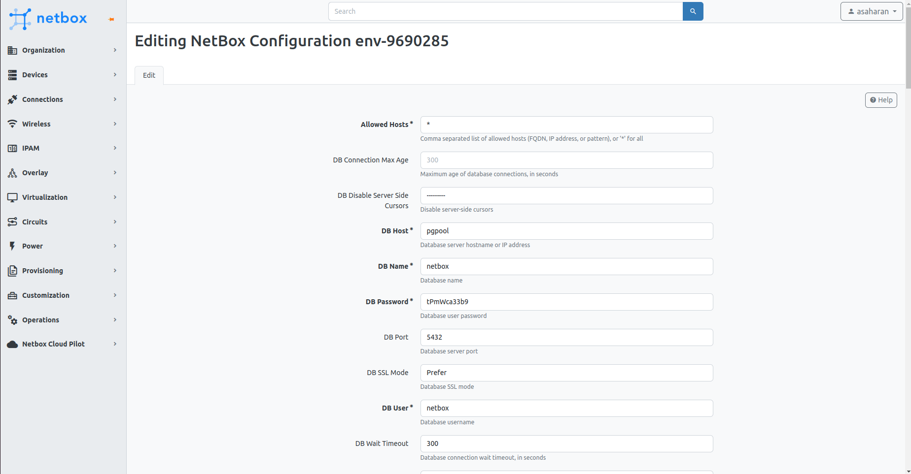

After configuring your NetBox PaaS plugin, you can manage your NetBox settings directly through the PaaS interface.

## Managing Settings

1. In your NetBox dashboard, go to the **NetBox PaaS** section.
2. Select **Manage** and click on **Edit NetBox Settings** to access the settings form.

This form allows you to configure all NetBox settings that are supported for your version. You can modify settings such as Allowed Hosts, Database, Redis, System, Security and lots more.

:::danger Important Note

- Ensure that at least one worker is running for the "default" queue before making changes. This is necessary because modifying settings will require a restart of all NetBox containers which is triggered in a background task
- Avoid executing other actions on the environment during this process to prevent task failure.

:::

By following these steps, you can effectively manage and tailor your NetBox instance settings to meet the specific needs of your environment.
