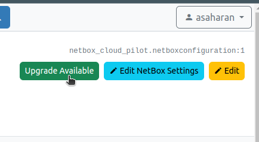
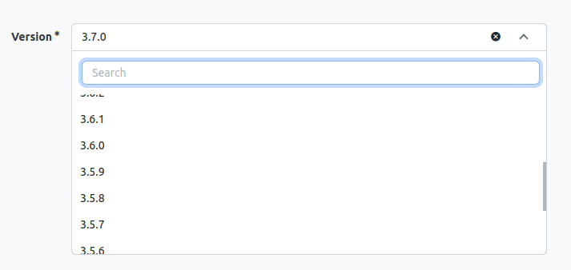
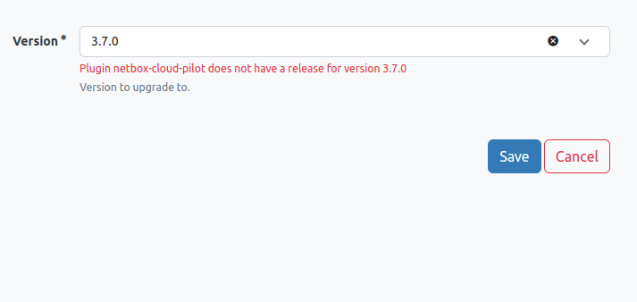

Upgrade your NetBox instance to the latest version or downgrade within the same minor release series to address any unresolved issues.

## Upgrade Process

1. Navigate to the **NetBox PaaS** section in your NetBox dashboard and select **Manage**.
2. If an upgrade is available, a button indicating this will appear in the top right corner of the management screen.

3. The upgrade interface displays a list of available versions. This includes all versions above your current version and patch versions within your current minor series (e.g., from v3.5.0 to v3.5.9).

4. Upon selecting a version, the system will verify that all installed plugins, specifically those installed via the plugin store, are compatible with the selected NetBox version.

5. After passing all compatibility checks, the upgrade will commence as a background job.

:::tip Tip

- **DB Disable Server Side Cursors:** Change this to Yes to enhance database performance, a requirement for production setups on NetBox v3.6 or newer. Prior to upgrading from v3.5, ensure this option is enabled to facilitate a smooth transition.

:::

:::danger

- The compatibility check is performed only for plugins installed through the plugin store. Plugins installed by other means will not be checked for compatibility and may affect the upgrade process.

:::

:::warning

- It is advisable to set up [database backups](/netbox-hosting/netbox-plugins/netbox-paas/database-backups-restores) for your environment. The upgrade routine looks for a backup configuration and initiates a backup before proceeding with the upgrade, ensuring a recovery point is available in case of failure.
- A successful job completion message indicates that the main NetBox container upgrade and restart were successful. Subsequent upgrades and restarts of worker containers will occur afterward and can be monitored through the PaaS dashboard.

:::
