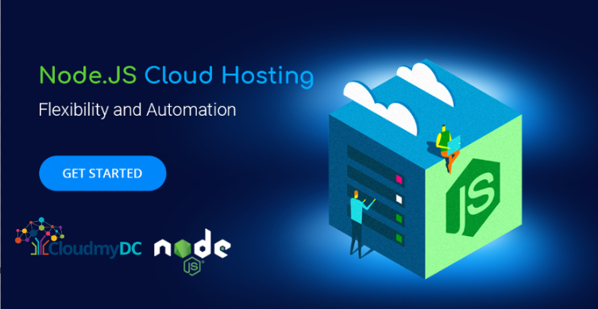
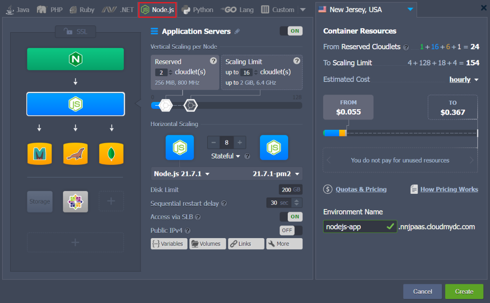
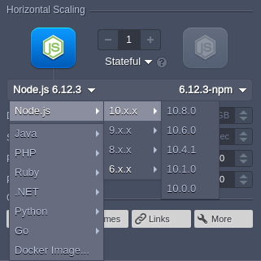
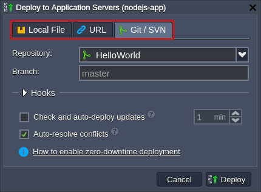
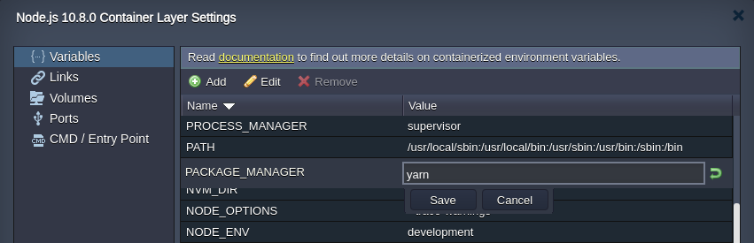
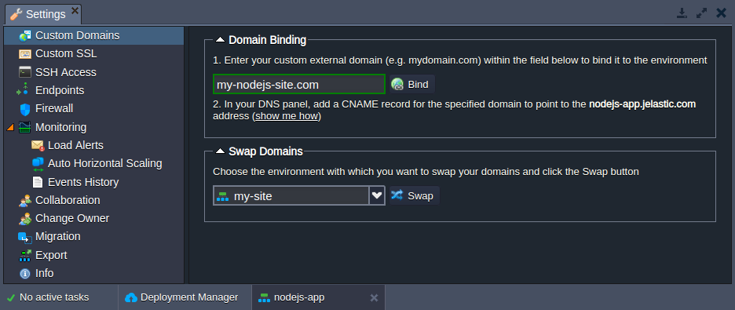
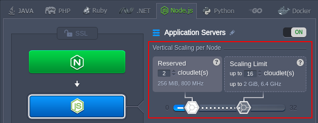
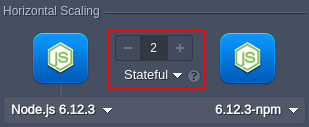
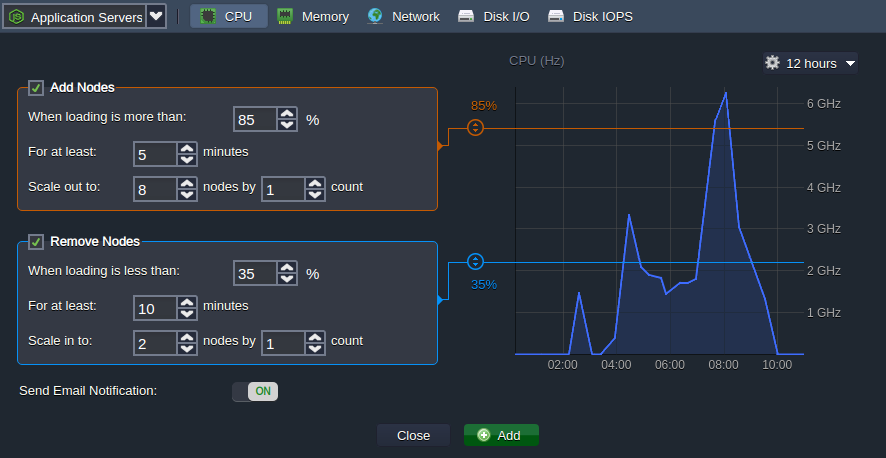

## Node.js Hosting

The platform provides an out-of-box integration of the fast, lightweight and highly scalable NodeJS application server. It is automatically supplied with numerous optimization and management tools to make the hosting process maximally convenient for developers. In this article, we’ll go through the main tools and features available on the platform to provide the required level of Node.js hosting.

Use the table of content below to find required information within the guide quicker:

- [Node.js Environment Hosting](/docs/nodejs/node.js-dev-center#nodejs-hosting)
- [Node.js Versioning](/docs/nodejs/node.js-dev-center#nodejs-versioning)
- [Node.js Application Deployment](/docs/nodejs/node.js-dev-center#nodejs-application-deployment)
- [Node.js Package Managers](/docs/nodejs/node.js-dev-center#nodejs-package-managers)
- [Node.js Process Managers](/docs/nodejs/node.js-dev-center#nodejs-process-managers)
- [Domains Management](/docs/nodejs/node.js-dev-center#domains-management)
- [Automatic Vertical Scaling](/docs/nodejs/node.js-dev-center#automatic-vertical-scaling)
- [Manual Horizontal Scaling](/docs/nodejs/node.js-dev-center#manual-horizontal-scaling)
- [Automatic Horizontal Scaling](/docs/nodejs/node.js-dev-center#automatic-horizontal-scaling)

## Node.js Environment Hosting

To run your Node.js application, you need to [set up](/docs/environment-management/setting-up-environment#choosing-programming-language-or-specific-deployment-option) the appropriate environment using the powerful and intuitive **Topology Wizard**. Switch to the **_Node.js_** tab, select the required engine version for your application server and add any other [software stack](/docs/quickstart/software-stack-versions) required. If needed, adjust other parameters, such as cloudlets and nodes count, Public IPv4 and IPv6, etc.

:::tip Note

Each instance is a completely [isolated container](/docs/platform-overview/isolated-container#isolated-containers-live-migration), fully independent and uninfluenced by other stacks. Additionally, scaled out nodes are automatically distributed across the physical servers (or VMs) ensuring [high availability](/docs/platform-overview/isolated-container#high-availability-for-applications).

:::

## Node.js Versioning

Currently (at the time of this writing), the following Node.js versions are supported:

- 14.21.3
- 16.20.0
- 18.18.0
- 20.8.0

:::tip

The up-to-date list of the releases available on the platform is provided via the dedicated, regularly (weekly) updated [Software Stack Versions](/docs/quickstart/software-stack-versions) document.

:::

You can select the required [version of Node.js](/docs/nodejs/node.js-versions#nodejs-versions) directly from the topology wizard during the creation of a new environment and adjust it for the existing one via [container redeployment](/docs/category/container-deployment).

## Node.js Application Deployment

The platform automates the deployment process for the managed NodeJS application servers using:

- application _archive_ uploaded from the local machine or via external URL
- remote _VCS_ repository (e.g. GitHub)

:::tip

Usually, due to the [ports auto-redirect](/docs/container/container-configuration/ports#ports-auto-redirect) algorithm, the deployed projects are instantly accessible without any additional manipulations. Herewith, for greater accuracy, you can manually exclude some of the services from the auto-redirect search by listing the appropriate ports via the **_REDIRECT_EXCLUDE_PORTS_** [variable](/docs/container/container-configuration/variables).

:::

You can read the appropriate documents to learn more about the deployment of the Node.js applications:

- [Deployment Manager](/docs/deployment/deployment-manager)
- [Deployment Guide](/docs/deployment/deployment-guide)
- [Auto-Deploy Overview](/docs/deployment/git-&-svn-auto-deploy/auto-deploy-overview)
- [Deployment Hooks](/docs/deployment/deployment-hooks)

## Node.js Package Managers

For greater convenience, each NodeJS application server contains a built-in development tool called [**Package Manager**](/docs/nodejs/nodejs-apps-specifications/process-managers#nodejs-package-managers), which provides standardization and automation of the installation, update, configuration, and removal processes.

The platform supports two types of package managers:

- [**_npm_**](https://www.npmjs.com/) - manages your project requirements by installing the additional modules, packages, and ready-to-use applications
- [**_yarn_**](https://classic.yarnpkg.com/en/) - operates the same requirements as in _npm_ (so no changes are required for the existing applications), while providing higher speed, reliability, and convenience

By default, the npm package manager is used for the NodeJS application servers, but, if necessary, it can be easily switched to yarn. For that, access the [container variables](/docs/container/container-configuration/variables) frame and set the appropriate **_PACKAGE_MANAGER_** value (either _npm_ or _yarn_).

## Node.js Process Managers

[**Process Managers**](/docs/nodejs/nodejs-apps-specifications/process-managers#nodejs-process-managers) provide the ability to control application lifecycle, monitor running services and maintain the project operability. The platform provides support of the following process managers for the NodeJS stack:

- [**_npm_**](https://docs.npmjs.com/cli/v8/commands/npm-run-script) - provides the ability to start the application
- [**_pm2_**](https://pm2.keymetrics.io/) - provides a huge variety of application management features, including the launched Node.js processes monitoring
- [**_forever_**](https://www.npmjs.com/package/forever) - allows running your Node.js processes continuously and automatically restarting them upon failure
- [**_supervisor_**](https://www.npmjs.com/package/supervisor) - monitors running applications for changes and automatically restarts required ones to keep them up-to-date

Users can choose the necessary process manager during container [redeployment](/docs/category/container-deployment) or by adjusting the **_PROCESS_MANAGER_** [variable](/docs/container/container-configuration/variables) (using _forever_, _npm_, _pm2_, or _supervisor_ as value, container restart is needed to apply new options).

## Domains Management

Your Node.js application can be easily supplemented with the [custom domain](/docs/application-setting/domain-name-management/custom-domain-name#custom-domain-name) name to be used instead of the default one. There are two options based on your environment topology:

- **CNAME redirect** if using Shared Load Balancer; is recommended for **_dev_** and **_test_** environments
- **DNS A Record** if using Public IP; can handle high traffic load and is suitable for **_production_** environments

Also, you can quickly switch traffic between your environments (e.g. to redirect customers to the newer application version without downtime) by utilizing the [swap domains](/docs/application-setting/domain-name-management/swap-domains#swap-domains) functionality or with the help of the **_SwapExtIps_** [API](https://docs.jelastic.com/api/#!/api/environment.Binder-method-SwapExtIps)/[CLI](/docs/deployment-tools/api-&-cli/platform-cli/swap-public-ips#cli-tutorial-public-ips-external-addresses-swap) method.

## Automatic Vertical Scaling

The platform dynamically provides the exact amount of resources (RAM and CPU) required by your nodes according to the current load with no manual intervention required. As a result, you never overpay for unused resources and save your time as the platform eliminates the need to handle the load-related adjustments or architectural changes.

You just need to set the upper [cloudlets](/docs/platform-overview/cloudlet#what-is-a-cloudlet) limit (each one equals to _128 MiB_ of RAM and _400 MHz_ of CPU) for your NodeJS application server and everything else will be handled by platform automatically.

Refer to the [automatic vertical scaling](/docs/application-setting/scaling-and-clustering/automatic-vertical-scaling#automatic-vertical-scaling) documentation for more information.

## Manual Horizontal Scaling

To scale out/in NodeJS application servers, you need to access the topology wizard and click the **+/-** buttons within the _Horizontal Scaling_ section to set the required number of nodes. Also, starting with the 5.5 platform version, you can adjust the preferred scaling mode:

- **_Stateless_** - simultaneously creates all new nodes from the base image template
- **_Stateful_** - sequentially copies file system of the master container into the new nodes

The maximum number of the same-type servers within a single environment layer depends on a particular hosting provider settings (usually this limit stands for 16 nodes and can be enlarged by sending the appropriate request to support).

Also, for the proper requests distribution, a [load balancer](/docs/load-balancers/load-balancing#load-balancing) instance is automatically added upon NodeJS server scaling. Refer to the [horizontal scaling](/docs/application-setting/scaling-and-clustering/horizontal-scaling#horizontal-scaling-inside-the-cloud-multi-node) documentation for more details.

## Automatic Horizontal Scaling

Access the environment **Settings > Monitoring > Auto Horizontal** Scaling section to set up special tunable triggers, which allow to increase or decrease the number of nodes due to the application load. Configure type of resource to be monitored (**CPU**, **RAM**, **Network**, **Disk**) and the exact condition of scaling.

Learn more about [automatic horizontal scaling](/docs/application-setting/scaling-and-clustering/automatic-horizontal-scaling#automatic-horizontal-scaling) in the linked document.

In addition, hosting at the platform allows using other inbuilt tools and features, for example:

- Custom or Built-In SSL
- Public IPv4 and IPv6
- A wide range of managed software stacks
- Container firewalls, endpoints, and environment isolation
- User-friendly UI and direct SSH access for management
- Open API and Cloud Scripting for automation
- Pay-as-you-use pricing model
- Collaboration functionality for teamwork
- Multi-cloud distribution

As you can see, the platform provides all the necessary conditions for smooth Node.js hosting!
