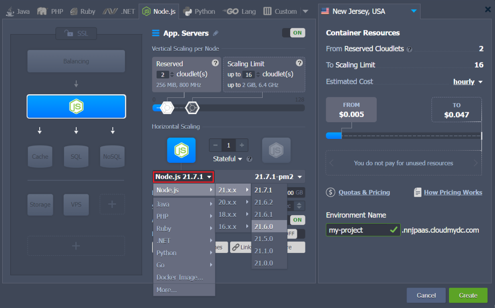
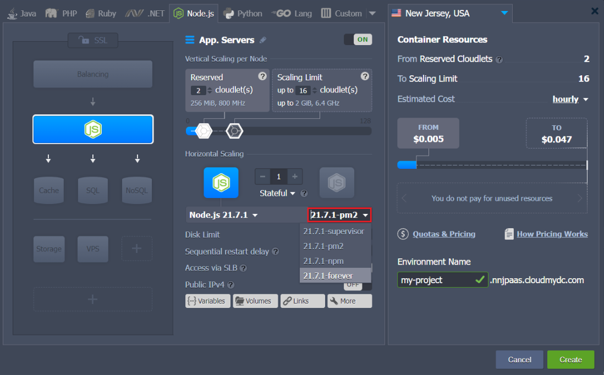
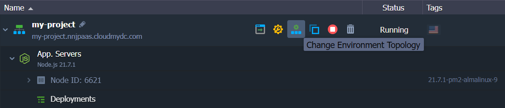
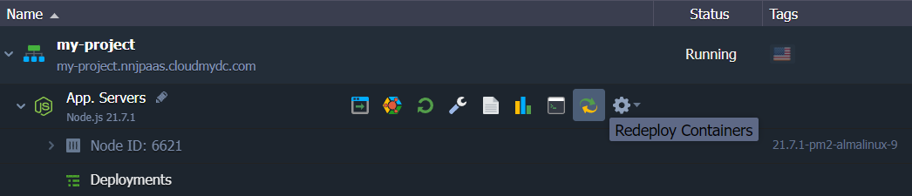

## Node.js Versions

The platform allows to pre-select any of the latest major NodeJS application server releases and the required _process_ and _package_ managers. Currently, the following versions of this stack are available:

- 14.21.3
- 16.20.0
- 18.18.0
- 20.8.0

:::tip

The up-to-date list of the releases available on the platform is provided via the dedicated, regularly (weekly) updated [Software Stack Versions](/docs/quickstart/software-stack-versions) document.

:::

The required Node.js version can be selected when creating [a new environment](/docs/Nodejs/Node.js%20Versions#create-nodejs-environment), as well as switched for [the already existing](/docs/Nodejs/Node.js%20Versions#change-nodejs-version) one.

## Create Node.js Environment

1. Click the **New Environment** button on the top of the dashboard to open the topology wizard:

2. Switch to the **_Node.js_** programming language tab and choose the required server version using the drop-down list in the central part of the frame:

3. Next, you can select the preferred [process manager](/docs/Nodejs/Nodejs%20Apps%20Specifications/Process%20Managers#nodejs-process-managers) (_supervisor_, _forever_,_npm_ or _pm2_) through the _tags_ drop-down list (circled in the image below):

A Node.js process manager helps to control your application lifecycle, providing a simple way to start, stop and restart processes on a node. Additionally, it can be configured to automatically re-run scripts in case of an application startup failure or code update:

- **_supervisor_** - monitors any code changes in the launched .js scripts, keeping them up-to-date
- **_npm_** - allows to manage additional application modules and packages by means of the _package.json_ config file
- **_forever_** - manages node processes (i.e. service start, stop, restart) to save services alive through keeping them run continuously
- **_pm2_** - provides you with multiple special options (like monitoring, load balancing, deployment, etc.), allowing to manage your application more effectively

Specify the remaining server and environment parameters (e.g. cloudlet limits, [region](/docs/EnvironmentManagement/Environment%20Regions/Choosing%20a%20Region#environment-regions), environment name, etc.) and click the **Create** button in the bottom right frame corner.

## Change Node.js Version

You are also able to switch the version of your NodeJS server and process manager afterward, for the already existing environment.

1. Access the [redeploy container(s)](/docs/category/container-deployment) dialog through either:

- clicking on the **Change Environment Topology** button next to the appropriate environment.

In the opened frame, select to edit your Nodejs server version or tag (i.e. click on the pencil icon within one of the appropriate fields).

- selecting the **Redeploy Container(s)** button next to the required node (or the appropriate environment layer, for updating all of the comprised containers at once).

2. Within the opened R**_edeploy container(s)_** dialog, re-configure the following options:

- **_Tag_** - provides a choice of needed Node.js version and preferred process manager
- **_Keep volumes data_** - allows saving data in [volumes](/docs/Container/Container%20Configuration/Volumes)
- **_Simultaneous_** or **_Sequential deployment with delay_** (for [scaled servers](/docs/ApplicationSetting/Scaling%20And%20Clustering/Horizontal%20Scaling) only) - defines whether all containers within a layer should be redeployed at once or one-by-one, to avoid downtime

3. To finish Node.js version changing, click on **Redeploy** and confirm your action within the opened pop-up dialog.

:::tip

For the detailed guidance on Node.js projects hosting, please, refer to the [Node.js Developer’s Center](/docs/Nodejs/Node.js%20Dev%20Center#nodejs-hosting) guide.

:::
