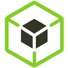
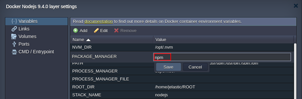

<!-- ## NodeJS Package Managers -->

Each created Node.js application server within the platform is provisioned with out-of-box support of two main package managers for this language - **_Yarn_** and **_npm_**. Both of them operates the same npm registry with a broad collection of the dedicated software packages, providing standardization and automation of the installation, update, configuration and removal processes.

By default, the **_npm_** package manager will be used for [archive](/deployment/deployment-guide#archive-deployment-configurations) or [Git](/deployment/deployment-guide#git--svn-deployment-configurations) deployment operations through the platform dashboard, but it can be easily switched to the **_yarn_** one in case of necessity. For that, access the corresponding Docker container settings frame and set the appropriate **_PACKAGE_MANAGER_** Docker container [variable](/container/container-configuration/variables) to either _npm_ or yarn value.

Below, we’ve gathered some basics on operating these managers, intended to help you on determining which one suits you best:

- [Node Package Manager (npm)](https://cloudmydc.com/)
- [Yarn Package Manager](https://cloudmydc.com/)

## Node Package Manager (npm)

**Node Package Manager** ([npm](https://www.npmjs.com/)) can be used for managing additional modules and packages, required for your project, as well as for installation of the ready-to-use applications.

There are two ways to install necessary Node.js packages with _npm_:

1. Specify required ones within the [dependencies](https://docs.npmjs.com/cli/v10/configuring-npm/package-json) section of the NodeJS **_package.json_** file, located in the root directory of your project. Such packages will be automatically downloaded and installed by npm during application server startup. Herewith, the new modules specified in the package.json file will be added after NodeJS node restart.

2. Connect to the container via [SSH Gate](/deployment-tools/ssh/ssh-overview#ssh-gate-overview) and operate your packages manually with the following commands:

- `npm search {package_name}` - to search for modules by name (or its part)
- `npm install {package_name}` - to install the necessary module
- `npm uninstall {package_name}` - to remove the previously installed module
- `npm update {package_name}` - to update the specified module to its latest version
- `npm ls installed` - to list already installed packages

## Yarn Package Manager

[Yarn](https://classic.yarnpkg.com/en/) is a recently released package manager, which is already highly popular due to its speed, reliability and convenience. Yarn operates the same NodeJS **_package.json_** file as in npm, so no changes are required for the existing applications.

You can use the following list of commands to work with Yarn, while connected over [SSH](/deployment-tools/ssh/ssh-overview#ssh-gate-overview):

- **_`yarn`_** or **_`yarn install`_** - to get all dependencies package for the project
- **_`yarn remove {package}`_** - to remove the specified package
- **_`yarn add {package}@{version}`_** - to add a new package to the dependencies list and install it; optionally, you can specify a particular version as an argument (the latest one will be used by default)
- **_`yarn upgrade {package}@{version}`_** - to update package to its latest version; optionally, you can specify a particular version as an argument
- **_`yarn list`_** - to list all of the installed packages
