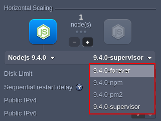
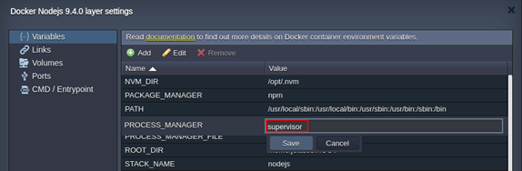
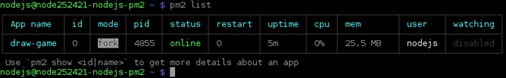
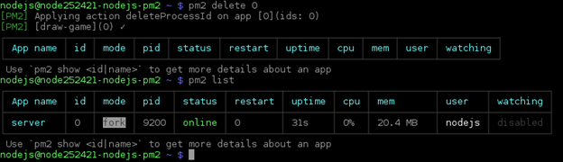
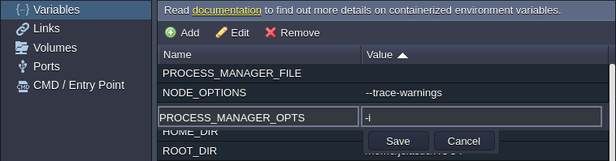
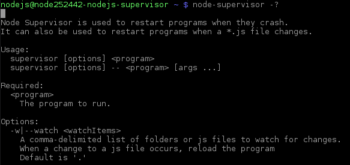
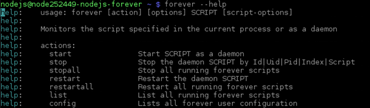

<!-- ## NodeJS Process Managers -->

<div style={{
    display: 'grid',
    gridTemplateColumns: '0.15fr 1fr',
    gap: '10px'
}}>
<div>
<div style={{
    display: 'flex',
    alignItems: 'center',
    justifyContent: 'cetner',
}}>


</div>
</div>
<div>

Node.js process manager is a tool, which provides an ability to control application lifecycle, monitor the running services and facilitate common system admin tasks to maintain your project operability.

</div>
</div>

The platform provides four pre-configured process managers by default, which can be selected in the following ways:

- by selecting the appropriate tag during the environment [creation](/environment-management/setting-up-environment) or container [redeploy](/category/container-deployment)

<div style={{
    display:'flex',
    justifyContent: 'center',
    margin: '0 0 1rem 0'
}}>



</div>

- by editing the **_PROCESS_MANAGER_** Docker environment [variable](/container/container-configuration/variables) in the already created container(s) with the _forever_, _npm_, _pm2_ or _supervisor_ value (restart is needed to apply the new options)

<div style={{
    display:'flex',
    justifyContent: 'center',
    margin: '0 0 1rem 0'
}}>



</div>

Below, we’ll consider each of the available managers to help you select one:

- [Process Manager (npm)](https://cloudmydc.com/)
- [PM2](https://cloudmydc.com/)
- [Supervisor](https://cloudmydc.com/)
- [Forever](https://cloudmydc.com/)

## Process Manager (npm)

Alongside [package management](/nodejs/nodejs-apps-specifications/process-managers#nodejs-package-managers), the NPM provides the ability to start the application. The “n*pm start*” (which is the “_npm run start_” alias) is performed if **NPM** is chosen as a value for the **_PROCESS_MANAGER_** variable on the NodeJS container. As a result, the script defined in _“start”_ of **_package.json_** is launched.

Refer to the [official documentation](https://docs.npmjs.com/cli/v8/commands/npm-run-script) for additional information.

## PM2

[PM2](https://pm2.keymetrics.io/) provides a huge variety of application management features, including the launched NodeJS processes monitoring. You can get acquainted with the [list of commands](https://www.npmjs.com/package/pm2#commands-overview) for _pm2_, which can be executed directly via SSH.

For example, after Node.js server creation, you can list the running processes with the following command:

```bash
pm2 list
```

<div style={{
    display:'flex',
    justifyContent: 'center',
    margin: '0 0 1rem 0'
}}>



</div>

As you can see it shows the default _draw-game_ application is running.

Next, you can remove this app with the **_pm2 delete_** command and [deploy](/deployment/deployment-guide) your own project (e.g. the default Hello Word application):

<div style={{
    display:'flex',
    justifyContent: 'center',
    margin: '0 0 1rem 0'
}}>



</div>

Also, PM2 provides users the ability to create the configuration files where all the run options are listed, which is useful for microservice-based applications deployment, as several apps can be described in a single file. The appropriate [config file reference](https://pm2.keymetrics.io/docs/usage/application-declaration/)) can be found by following the provided link (e.g. the default **_ecosystem.config.js_** file is used to launch the server.js application file as the “_draw game_” application).

## Supervisor

[Supervisor](https://www.npmjs.com/package/supervisor) is a great solution to keep your applications running. It automatically monitors any code changes in the launched **_.js_** scripts and restarts the appropriate app to keep it up-to-date. Herewith, it allows to perform a hot restart of your NodeJS processes, ensuring they are always available and are automatically restarted in the event of a failure.

:::tip Note

By default, the supervisor process manager monitors file changes in the application directory and, if any, automatically restarts NodeJS. Herewith, during the VCS deployment (including [auto-deploy](/deployment/git-&-svn-auto-deploy/auto-deploy-overview#auto-deploy-of-gitsvn-updates)), your application server will be restarted even if there are no project changes (due to modification of the **.git** folder).

To avoid the unnecessary restarts, you can disable file changes monitoring by adding the -i parameter into the **_PROCESS_MANAGER_OPTS_** [variable](/environment-management/environment-variables/environment-variables).

<div style={{
    display:'flex',
    justifyContent: 'center',
    margin: '0 0 1rem 0'
}}>



</div>

:::

You can run the following command on your Node.js server with the supervisor process manager to get help:

```bash
node-supervisor -?
```

<div style={{
    display:'flex',
    justifyContent: 'center',
    margin: '0 0 1rem 0'
}}>



</div>

Here, you can find a short description of the module, its usage syntax, additional options descriptions and a few examples.

## Forever

The [forever](https://www.npmjs.com/package/forever) process manager is the simple CLI tool, which allows to make your NodeJS processes run continuously. It permanently keeps a child process (such as your project on the Node.js web server) and automatically restart it upon failure.

Run the next command to get the main information on the _forever_ manager usage, actions, usage, etc.:

```bash
forever --help
```

<div style={{
    display:'flex',
    justifyContent: 'center',
    margin: '0 0 1rem 0'
}}>



</div>

Also, using _forever_ you can specify the application options in a [JSON file](https://www.npmjs.com/package/forever#json-configuration-files). For example, for the default Draw game (available after Node.js server installation), this **_/home/jelastic/ROOT/forever.json_** file looks like:

```bash
{
"uid": "app1",
"append": true,
"watch": true,
"script": "server.js",
"sourceDir": "/home/jelastic/ROOT"
}
```

where:

- **uid** - sets unique name for your app
- **append** - selects if logs should be supplemented (_true_) or overwritten (_false_)
- **watch** - allows enabling or disabling automatic restart of a child process upon the appropriate application code changes; set to _“false”_, if you want to avoid unexpected restart after deployment from VCS (including [auto-deploy](/deployment/git-&-svn-auto-deploy/auto-deploy-overview#auto-deploy-of-gitsvn-updates/))
- **script** - defines a name of the executable **_.js_** file
- **sourceDir** - provides an absolute path to the specified script
