<!-- ## Zero DownTime (ZDT) Deployment for PHP -->

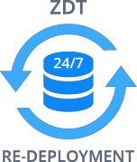

The majority of modern web-services should be accessible for users at all times. A common but often overlooked problem here is the process of project re-deployment (i.e. update), causing your application to go down or return errors until the operation is finished. This can be solved with a variety of tools like Capistrano, Fabric and others. However, these supplements often require additional time, expense, and specialist knowledge for being successfully integrated and configured properly (e.g. this may be performed through setting up multiple servers with a load-balancer in front of them; while the deployment is running on one server - it is excluded from the route list, after that other servers could be updated). Obviously, such an implementation is rather complicated and requires a lot of extra resources, thus a better method is needed.

Such a [new solution](https://cloudmydc.com/) was proposed for PHP applications, running on top of Apache, by founder of this programming language and, simultaneously, our technical advisor - Rasmus Lerdorf. As an actively used at Etsy, and, therefore, being a battle-tested approach, it was subsequently taken as the basis for Zero Downtime & Atomic Deployment feature in the platform. The main idea of this method rests on the following two points:

- each time a new deployment process is run, the corresponding app’s files are duplicated, being stored in a separate server directory (which is automatically named according to its creation date/time for easy identification)
- a special requests' redirector, called _symlink_ (i.e. symbolic link), switches between different app versions after each update, pointing to the one that should be currently used

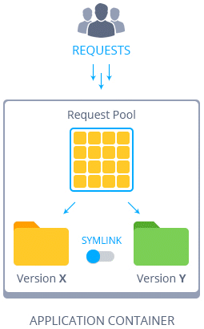

In such a way, the updated project files can be seamlessly deployed, while the initial code version continues working and handling users' sessions. And when the deployment is fully completed, the symlink instantly switches to the most recent version of the successfully deployed app, starting to redirect all the incoming requests to it. All of these together makes the deployment process fully atomic and implicit for your customers, simultaneously relieving you from performing plenty of envisioned manual operations.

:::danger Note

The availability of this functionality depends on your hosting provider’s settings.

:::

Below, we’ll explore this mechanism in more detail by describing:

- [ZDT deployment workflow](/php/zdt-deployment-for-php)
- [how ZDT functionality is ensured at the platform](/php/zdt-deployment-for-php)
- [atomic and classic deployment modes comparison](/php/zdt-deployment-for-php)

So, let’s go on!

## ZDT Deployment Workflow

First of all, we’ll consider more specifically how the above described PHP zero-downtime deployment mechanism actually works on the platform - let’s examine all of these processes step-by-step with a real example.

1. To start with, you’ll need a PHP environment (either a [new](/environment-management/setting-up-environment) or the already existing one) - we’ll use Apache for this example:

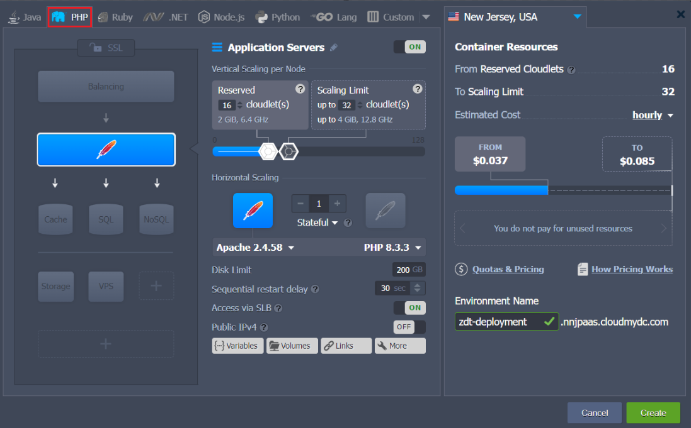

2. Next, proceed to the [deployment](/deployment/deployment-guide) of the required application. During this procedure, you need to tick the corresponding checkbox at the appropriate confirmation frame (depending on the project source type used) in order to enable the ZDT deployment option:

- for deployment via local file or direct URL

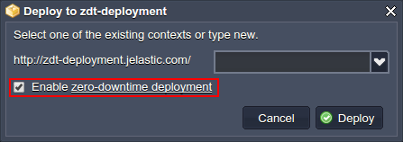

:::tip Note

While performing this for the first time for the already existing application, deployed to the _ROOT_ context, all the previous data will normally be erased and overwritten with the “bare” app installation (for the deployment via archive/URL only).

:::

- for deployment via VCS (e.g. from GIT/SVN or Bitbucket repo):

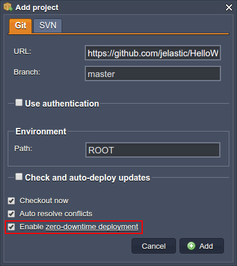

:::tip Note:

- **_Enable zero-downtime deployment_** flag becomes active only when deploying to the **ROOT** context of your PHP application server. Otherwise, the classic method will be used
- while working with VCS repos, the chosen deployment mode will be remembered and used for all further [auto-updates](https://cloudmydc.com) of this application until you change it manually
- generally, we recommend not to use the “hard-coded” absolute paths in your app’s code and configs while using the atomic deployment feature, for ensuring it remains operative regardless of the project’s directory name

:::

3. _During the initial deployment_, a **ROOT_timestamp** (i.e. _ROOT_year.mm.dd-hh.mm.ss_) folder and a special _ROOT_ file as a symlink to this folder are created inside the **_webroot_** directory of your application server.

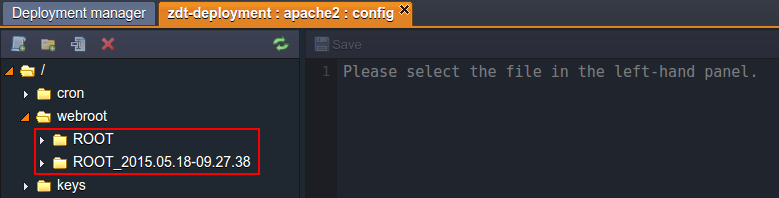

As normal, the application is ready to handle requests just after the deployment process is finished.

:::tip

If navigating inside the _ROOT_ directory, circled above, the content of the currently used application version will be viewed, i.e. it is changed each time the symlink is switched.

This can be clearly seen if entering your application server’s container [via SSH](/deployment-tools/ssh/ssh-access/overview) and executing the long format file-listing command for your **webroot** folder, i.e.:

        

        

          1
        

        

           ls -l /var/www/webroot
        

    

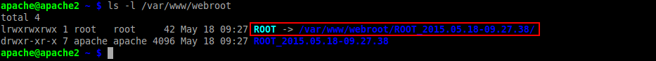

In such a way, you are able to easily locate the symlink, as it is color-marked within the list, and to see the actual redirection path.

:::

4. _During the second deployment_ (i.e. when deploying an update), a new **ROOT_timestamp** folder is created - in such a way, the actual application version and customers, that are currently working with it, are not influenced.

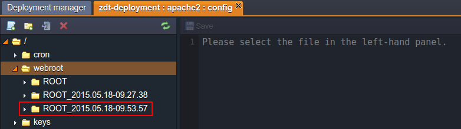

Just after the new files are unpacked, symlink switches to this new folder, redirecting all the newly received requests to it. Herewith, the first folder is kept for processing the “old” users' sessions (i.e. where handling started before the symlink switching).

:::tip Note

While updating an app version using archive/URL, all the comprised user-generated content (if there is any) should be manually moved to the newly created app directory from the older one, stored alongside (herewith, previously such an operation implies the full overriding of all the context data).
If using VCS, the app’s directory content is entirely copied (both tracked and untracked files), so no manual operations are required. However, we recommend to adopt the practice of the [_.gitignore_](https://cloudmydc.com/) list usage for the unnecessary files of your project, as this would save you some amount of resources and time during repetitive re-deploys.

:::

5. _All the following atomic deployments_ will be performed in the similar way. During each of them, the oldest project folder is removed, while a new **ROOT_timestamp** directory for the most recent project version is added.

In such a way, only 2 versions of deployed application - the latest and the previous one - are stored within an app server simultaneously (however, the older one can also be easily removed manually when it is no longer needed). This ensures no extra disk space consumption.

:::tip Note

If you’d like to avoid some project version from being automatically erased, just rename the corresponding folder before running the new deployment.

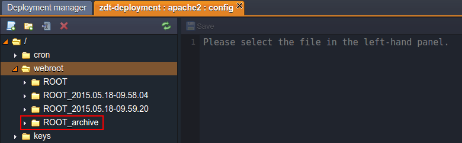

:::

All of the operations are fully automated, thus no additional developer’s involvement is required, while the deployment itself is performed in a “soft” mode, i.e. even without app server restart needed and, as a result, without any application downtime.

## ZDT Implementation at PHP Servers

Delving into the details of technical implementation, the atomic deployment option support at the platform is ensured by the following adjustments, applied to the corresponding PHP instances:

- **Apache PHP**

The appropriate functionality is handled with the help of the **_mod_realdoc_** module, which controls the abovementioned symlink switching. It can be additionally configured (if required) through the platform dashboard within the **conf.d >** **_mod_realdoc.conf_** file.

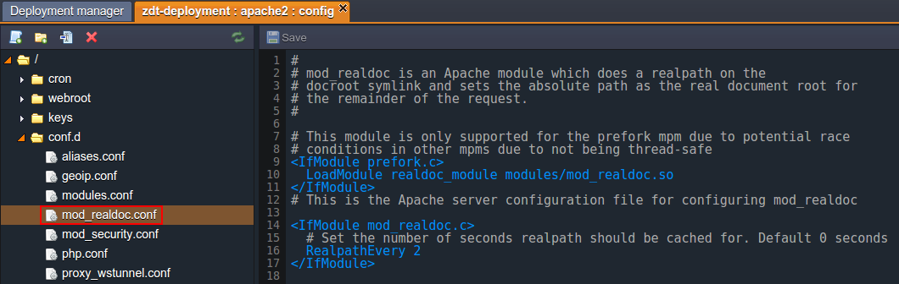

:::tip Tip

Here, the _RealpathEvery_ parameter defines the period of time for which the symbolic link path is stored and the frequency of its refreshing. It’s default value (_0_, as denoted within the code comments) was changed to _2_ for ensuring all of the required operations (i.e. deployment and switching) to be completed before redirecting the requests to the new project version and as such, preventing the I/O slowdowns.

This value can be easily changed to your custom one if needed (just do not forget to restart your app server node for its appliance). However, if using the ZDT deployment feature, we _do not recommend_ to set it too high, as this would cause the delays in symlink switching.

:::

For more information on this module’s specifics, visit its source [page](https://github.com/etsy/mod_realdoc).

- **NGINX-PHP**

Here, atomic deployment is ensured by means of the in-built functionality with no additional modules inclusion - the corresponding settings can be found at the very end of the **conf >** **_nginx.conf_** file:

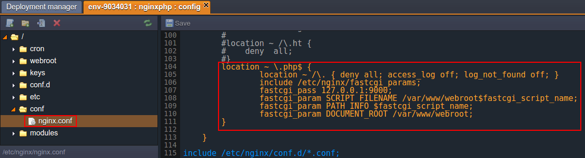

For now, as you know how all of this works, we can compare both classic and atomic deployment methods.

## Comparison and Summary

To prove the benefits of the ZDT update approach, a simple load test was run, with the following parameters as a basis:

- _application_ - a basic version of WordPress CMS deployed (i.e. its default distribution with no heavy content comprised)
- _load generation tool_ - [Apache JMeter](https://cloudmydc.com/), configured to continuously send the required amount of concurrent requests to our application during the redeployment process
- _time frame_ - the test starts a short time before the redeployment process is run and finishes a few seconds after it is completed

So, let’s evaluate the results for both deployment methods with the simple statistics we’ve received.

## Archive Deployment

Let’s start with the most commonly used variant of the project deployment, namely **_- classic_**, i.e. installation from a single archived package with no extra options like ZDT enabled:

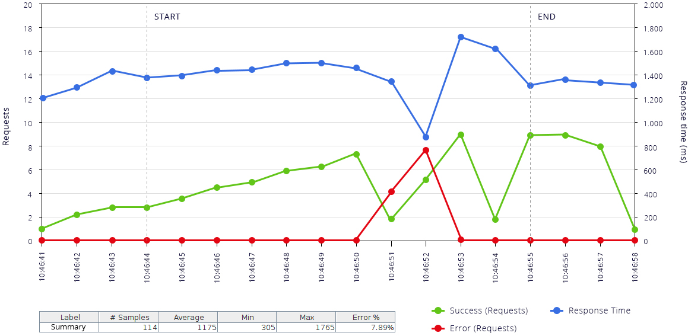

As you can see, we actually get pretty good results:

- quick and steady _response time_ (the blue graph), only _1.2_ seconds on average
- fast restoration to the normal operability (i.e. when all of the incoming requests are _successfully processed_ (the green line) with no _errors_ (the red graph) occurred) after the new package deployment
- fails to appear for two seconds only - see the red line spike (however, deploying a more heavy and content-replete project will increase this interval for certain)

Now, let’s perform the same test with the second competitor - **ZDT**. For a better comparison perception, we’ll keep the same color legend as before:

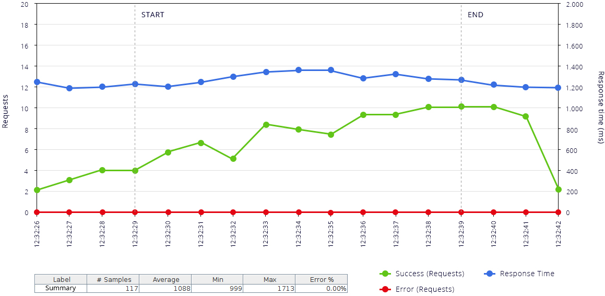

_Response time_ remains stable and almost unchanged, but you can notice its slight enlargement during the update procedure, which is caused by the additional deployment process running alongside the serving of requests. Herewith, there isn’t even a single _error_ during the whole test.

So, in such a way, we can assume that zero downtime deployment overcomes the problem of failed requests during application redeployment, simultaneously keeping the average response time on the same level. In addition, the atomic option leaves you a possibility to save all of the user-generated content, located inside the application directory, and easily move it to the new app’s version if necessary (while the classic method normally implies just the entirely new app version deployment).

:::tip

**You may also notice**, that the minimum requests' handling time for the classic method is significantly lower than for the atomic one and, therefore, seems to bring better performance. But don’t be mislead, as it’s just a side effect of the failed requests presence (where serving time is also counted, despite it being not processed), while the average response time is almost the same for both methods.

:::

## VCS Deployment

Next, let’s repeat our test for the second platform deployment type (i.e. if using Git/SVN repos) in order to find out whether ZDT retains its advantages in this case. And again we’ll start with the **_classic_** method:

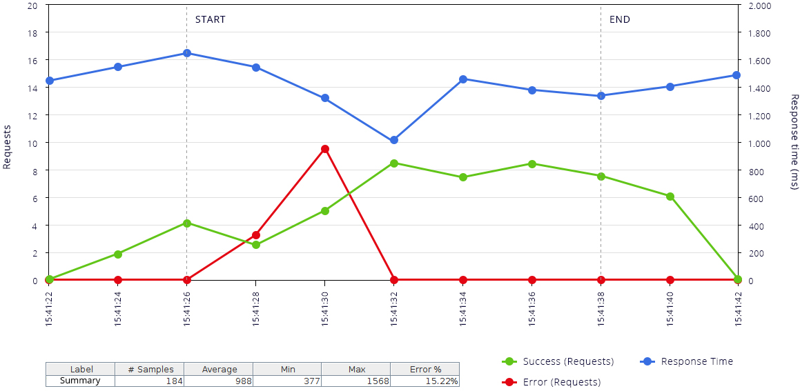

As the deployment sources are placed at the remote resource, this will require a little more time compared to the installation from the already uploaded archive, which, actually, helps us to clearly see the difference. The _response time_ now has a pretty long drop down (for nearly _4_ seconds in our case), caused by the unavailability of the application (you can see that incoming requests start to fail at the same time - this is shown with a spike at the _errors_ graph). Everything else remains similar to the previous deployment type.

:::tip Note

Unlike the archive deploy (where the old project is entirely removed before redeployment, which will always cause downtime), here the update procedure assumes changing of the differing files only. Therefore, you may not face any interruption in the service work if the files that are required to be changed, are currently unused.

:::

Finally, the last test for the **_ZDT_** deployment approach via VCS also goes in line with our expectations by bringing a stable _response time_ with its small incrementation during the simultaneous running of such operations as users' sessions handling and project copying/updating.

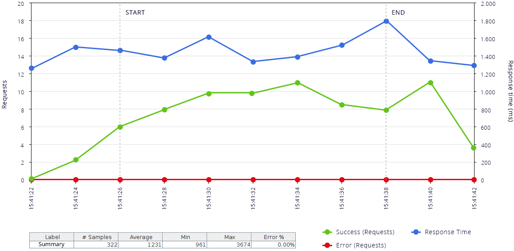

At the same time, you can see that no _errors_ appeared and all of the incoming requests are _successfully processed_.

## Conclusion

Now, when you have all the information (both raw technical and visualized in graphs practical one) on the investigation and have seen how it’s easy to use the ZDT option within the platform, it’s time to summarize and make a conclusion on the key benefits it brings for your PHP app’s hosting:

- ZDT doesn’t require any additional resources like separate instances/tools for being applied - all you need is just enough disk space for storing two project versions (current and the previous one). It could be considered as an almost free of charge solution, especially compared with the majority of other possible options, which may require additional app servers, balancers, external services, etc.
- the deployment remains just as simple as before - no additional configurations or human intervention is required
- the time needed for the atomic deployment is exactly the same as for the classic method, so no delays are expected
- finally, Zero-Downtime deployment stands by its name by ensuring it’s completely implicit for your customers with an errorless updating procedure (in contrast to the classic variant, which, without being additionally improved, causes a pretty big amount of errors even in the case of a small application redeployment)

In such a way, ZDT deployment usage makes updating of your projects completely painless and invisible to customers, helping you to get the most from your application!
