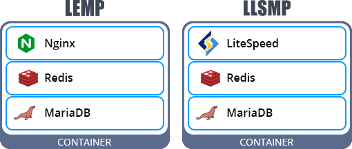
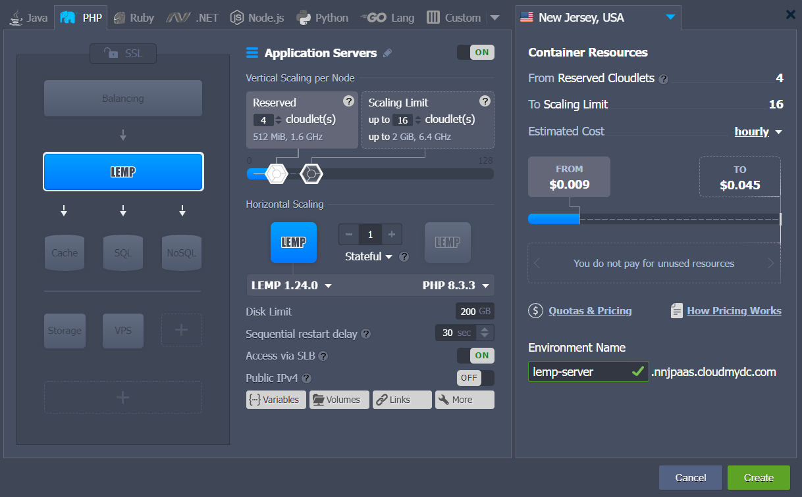
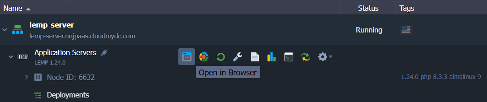
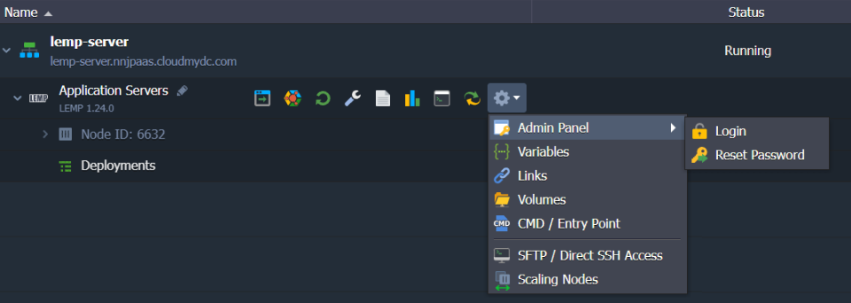
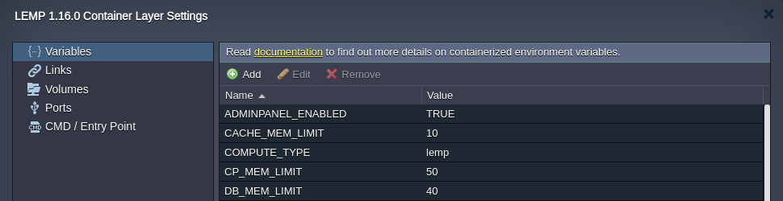

<!-- ## LEMP (LLSMP) Application Server -->

:::tip

The **LEMP** (since the **1.16.1** release) & **LLSMP** stacks are [HTTP/3](https://cloudmydc.com/) ready with the feature support enabled by default. However, a [public IP address](https://cloudmydc.com/) is required to bypass the Shared Load Balancer and work directly with the server over HTTP/3.

:::

**LEMP** is a software bundle solution based on the _Linux_ operating system, _NGINX_ HTTP web server, _MariaDB_ database, and _PHP_ programming language. Such a model is a popular choice among developers as it is sufficient to host a wide variety of projects with a single container.

If the platform provides [LiteSpeed](https://cloudmydc.com/) support, a similar **LLSMP** (_Linux, LiteSpeed, MariaDB, PHP_) stack can be available. Follow the link above to learn about the LiteSpeed Web Server benefits.

The topology structure inside of the LEMP and LLSMP containers is the following:

- a PHP-powered event-driven _NGINX_ or _LiteSpeed_ application server
- built-in _MariaDB 10_ database server is used to store your project data
- an additional _Redis 6_ database is launched by default as an object caching solution

Other p[eculiarities of the stacks](https://cloudmydc.com/) can be viewed in the appropriate section below. For now, let’s walk through the required installation steps.

1. Log in to your platform dashboard ([sign up](https://cloudmydc.com/) if you don’t have one yet) and click the **New Environment** button at the top of the page.

2. Switch to the **_PHP_** tab of the automatically opened topology wizard. Select **LEMP** (**LLSMP**) as your application server.

Configure other parameters up to your needs (e.g. [scaling limit](https://cloudmydc.com/), [public IPs](https://cloudmydc.com/), [regions](https://cloudmydc.com/)) and click **Create** to proceed.

3. Wait a few minutes for the platform to set up your environment. Once created, you can click **Open in Browser** to view the default _phpinfo()_ data on your server.

Now, you can proceed to the [deployment](https://cloudmydc.com/) of your application.

## LEMP & LLSMP Peculiarities

When working with the LLSMP software stack, all the specifics of the [LiteSpeed Web Server](https://cloudmydc.com/) are applied to this node (including [license fee](https://cloudmydc.com/)). All the other peculiarities are the same for both servers.

1. Built-in database servers can be accessed in the following way:

- The _phpMyAdmin_ administration tool for **_MariaDB_** can be connected via the _8443_ port. The exact link and access credentials can be found in the after-creation email. If needed, a password can be reset via the dashboard by hovering over the application server and selecting the **Additionally > Admin Panel > Reset Password** option.
- The **_Redis_** database is accessible without a password but only from within the container (i.e. _localhost_).

:::tip

Within the LEMP/LLSMP container, you can establish the client connection to the database via both SOCKET (_localhost_) and TCP (_127.0.0.1_) [protocols](https://cloudmydc.com/).

:::

Read the linked guide to learn more about [PHP connection to MariaDB](https://cloudmydc.com/).

2. Several [environment variables](/container/container-configuration/variables) can be used to manage your LEMP/LLSMP container:

- **_ADMINPANEL_ENABLED_** - allows (_true_, by default) or forbids (_false_) access to phpMyAdmin console for the integrated MariaDB database server
- **_REDIS_ENABLED_** - enables (_true_, by default) or disables (_false_) object caching with Redis
- **_CP_MEM_LIMIT_** - defines the portion of RAM, which should be reserved for the application server (N*GINX/LiteSpeed*), **_50%_** of container total RAM by default
- **_CACHE_MEM_LIMIT_** - defines the portion of RAM, which should be reserved for the _Redis_ cache server, **_10%_** of container total RAM by default
- **_DB_MEM_LIMIT_** - defines the portion of RAM, which should be reserved for the _MariaDB_ database server, **_40%_** of container total RAM by default

:::tip

These RAM limits can be specified in megabytes (_m|mb|M|MB_), gigabytes (_g|gb|G|GB_), or percentages (_%_). If units are omitted, the values are considered as percentages.

:::

The container(s) restart is required to apply changes to these parameters.

:::tip Note

LLSMP has additional variables (e.g. _WAF, WP_PROTECT, WP_PROTECT_LIMIT_) specific for the [LiteSpeed](https://cloudmydc.com/) stack, which are described in the dedicated document.

:::

3. Obviously, all the benefits of the regular platform containers are available for the LEMP and LLSMP stacks as well. For example:

- [automatic vertical scaling](/application-setting/scaling-and-clustering/automatic-vertical-scaling)
- [usage-based pricing](/account-and-pricing/pricing-model-overview)
- [SSH access](https://cloudmydc.com/)
- [container firewall](/application-setting/external-access-to-applications/container-firewall)
- [container redeploy](/category/container-deployment)
- [statistics monitoring](https://cloudmydc.com/)
- [deployment automation](https://cloudmydc.com/)
- and even more at [Platform Documentation](https://cloudmydc.com/)
