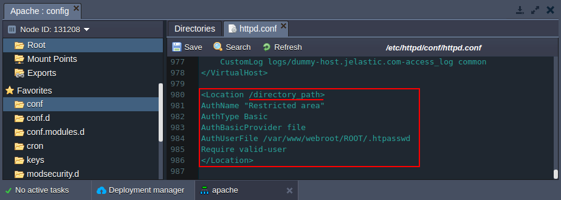
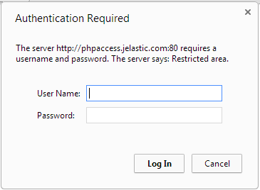
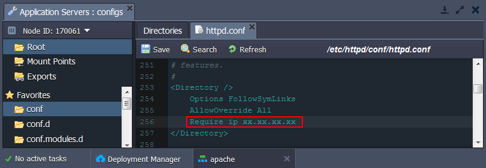
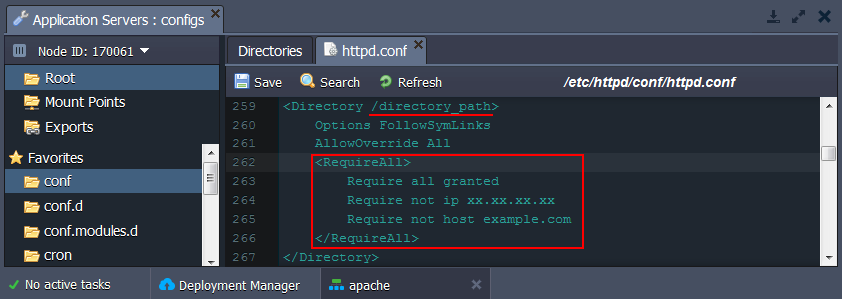
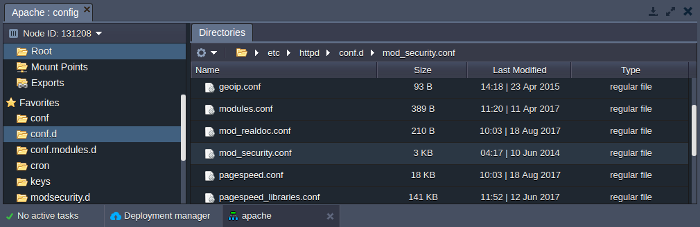
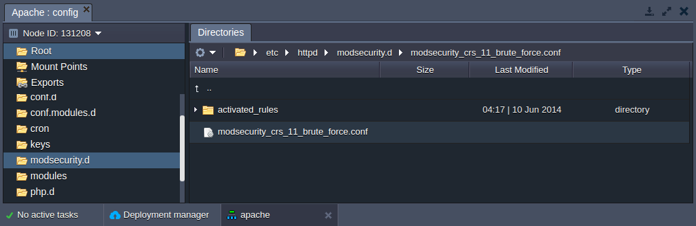

## Apache Security Configurations

In this tutorial we will show how to set up the additional security configurations for your PHP application hosted with Apache application server.

There are two ways of setting up your main security configurations:

- make changes in main configuration file of the Apache (**_httpd.conf_**)
- create special **_.htaccess_** file, which contains one or more configuration directives and is placed inside your application directory

The directives are able to override a subset of the server’s global configuration for that directory and all subdirectories thereof. What you can put in this file is determined by the AllowOverride directive.

**AllowOverride** is valid only in < directory > sections specified without regular expressions. When this directive is set to None - _.htaccess_ files are completely ignored. When this directive is set to All, then any directive which has the _.htaccess_ Context is allowed in _.htaccess_ files.

Let’s examine the every kind of security configs you can apply in order to protect your application:

- [Authentication](https://cloudmydc.com/)
- [Setting up the access criteria](https://cloudmydc.com/)
- [Configuring mod_security module](https://cloudmydc.com/)
- [Server version hiding](https://cloudmydc.com/)

## Setting Up the Authentication Request

To set the authentication to your Apache **application** or to just separate a **directory** in your application, follow these next steps.

1. Generate hash from your password. For that you can use any **htpasswd tool** or online service (for example, https://www.web2generators.com/apache-tools/htpasswd-generator).

2. Create simple text file with previously generated hash.

3. Click **Config** button for your server.

4. Upload the created file to the **/var/www/webroot/ROOT** folder.

5. In the **/etc/httpd/conf** folder open **_httpd.conf_** file (or **_.htaccess_** file, if you use it) perform the following configurations:

- **authentication for the whole application** - add the following strings to the **Directory** as it is shown in the image below:

```bash
AuthName "Restricted area"
AuthType Basic
AuthBasicProvider file
AuthUserFile /var/www/webroot/ROOT/.htpasswd
Require valid-user
```

<div style={{
    display:'flex',
    justifyContent: 'center',
    margin: '0 0 1rem 0'
}}>


</div>

- **authentication for the separate directory** - add the following **Location** strings stating the path to the required directory:

```bash
<Location /directory_path>
AuthName "Restricted area"
AuthType Basic
AuthBasicProvider file
AuthUserFile /var/www/webroot/ROOT/.htpasswd
Require valid-user
</Location>
```

<div style={{
    display:'flex',
    justifyContent: 'center',
    margin: '0 0 1rem 0'
}}>



</div>

6. Save the changes and **Restart** the Apache server.

:::tip Note

If you use _httpd.conf_ file for setting up your security configuration, you need to restart Apache after making every change in configuration. In the case of _.htaccess_ files usage, changes made in these files take immediate effect, because these files are read on every request.

:::

As a result, while accessing the application or the protected directory a user will be requested to authenticate.

<div style={{
    display:'flex',
    justifyContent: 'center',
    margin: '0 0 1rem 0'
}}>



</div>

## Security Through Setting Up Criteria

You can provide security for your application through setting access control to the particular parts of your server based on specific criteria (e.g. client hostname or IP address).

The necessary configurations can be applied with the help of the [**_Require_**](https://cloudmydc.com/) directive. And in order to set up more complex access policy, it can be used in conjunction with:

- [**_RequireAll_**](https://cloudmydc.com/) - a set of authorization directives, where none must fail and at least one to succeed
- [**_RequireAny_**](https://cloudmydc.com/) - a set of authorization directives, where at least one must succeed
- [**_RequireNone_**](https://cloudmydc.com/) - a set of authorization directives, where none must succeed

Navigate to the **/etc/httpd/conf** folder and open the **_httpd.conf_** file (or the **_.htaccess_** one directly in a target directory).

1. In order to set up access criteria by IP, just add a necessary directive to the [Directory](https://cloudmydc.com/) section.

<div style={{
    display:'flex',
    justifyContent: 'center',
    margin: '0 0 1rem 0'
}}>



</div>

2. As a more complex example, you can configure access policy of several conditions (e.g. via _RequireAll_ directive) and for a particular server folder (just change the part underlined in the image below).

<div style={{
    display:'flex',
    justifyContent: 'center',
    margin: '0 0 1rem 0'
}}>



</div>

3. Don’t forget to **Save** the changes and **Restart** your Apache server to apply changes.

:::tip Note

Denying access through IP makes sense only if you use [public IP](/docs/application-setting/external-access-to-applications/public-ip) feature.

:::

## Configuring mod_security Module

[**mod_security**](https://cloudmydc.com/) is a super handy Apache module which provides such abilities as simple filtering, URL and Unicode encoding validation, auditing, null byte attack prevention, upload memory limits, server identity masking, built in chroot support and many more.

This module is available in the platform by default and can be configured via **_/etc/httpd/conf.d/mod_security.conf_** file.

<div style={{
    display:'flex',
    justifyContent: 'center',
    margin: '0 0 1rem 0'
}}>



</div>

Here you can edit the default configurations or add your own custom.

For example, you can add some extra **ModSecurity Rules** by uploading them to the **/etc/httpd/modsecurity.d** folder (e.g. **_modsecurity_crs_11_brute_force.conf_**).

<div style={{
    display:'flex',
    justifyContent: 'center',
    margin: '0 0 1rem 0'
}}>



</div>

The rules uploaded to **modsecurity.d** or to **activated_rules** folders will be automatically activated without any extra settings. This is configured by the following default parameters in the **_/etc/httpd/conf.d/mod_security.conf_** file:

```bash
Include modsecurity.d/*.conf
Include modsecurity.d/activated_rules/*.conf
```

## Hide Apache Server Version

Usually with default configurations, the Apache server version is publicly shown. As a result, the information about the version of your Apache and operating system/version, or even the details about installed Apache Modules can be used to perform an attack.

To avoid this, the platform automatically adds the following configurations to your **_httpd.conf_** file:

- **_ServerSignature Off_** - shows 404 page instead of directory listings and other such pages generated by Apache
- **_ServerTokens Prod_** - determines Apache Server HTTP response header; with the _Prod_ value the HTTP response header will be as follows - _Server: Apache_
