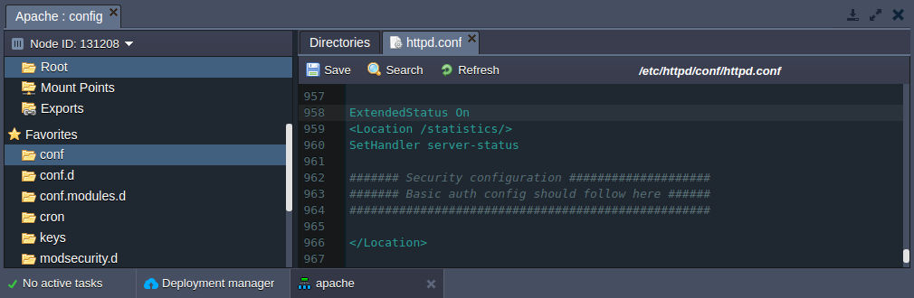
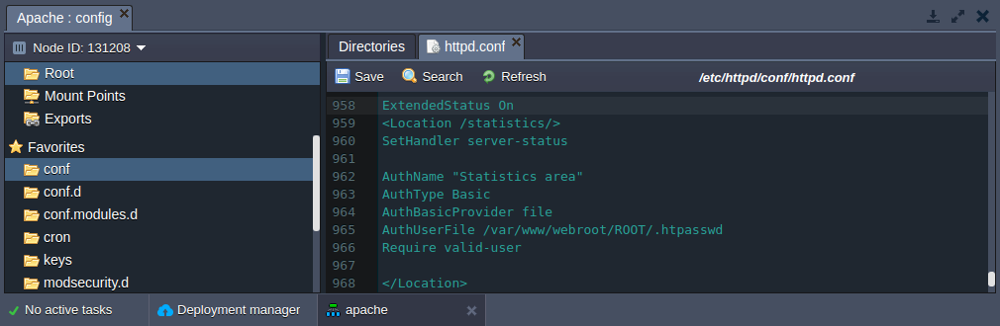

<!-- ## Apache Statistics Module -->

The **statistics** (or **status**) **module** provides an interface to view your server’s statistics.

## Enabling statistics module

In the platform, the **statistics** module is disabled by default. You can activate this module following the instruction:

- Click **Config** button for your Apache server.
- The required ***status_module*** is loaded by default, so navigate to the **/etc/httpd/conf** folder and open the ***httpd.conf*** file. Add the following code:

```bash
ExtendedStatus On  
<Location /statistics/>  
SetHandler server-status  
####### Security configuration ####################  
####### Basic auth config should follow here ######  
###################################################  
</Location>  
```

<div style={{
    display:'flex',
    justifyContent: 'center',
    margin: '0 0 1rem 0'
}}>



</div>

**Note**: you can use any other context for your statistics location (in our case we have */statistics/*).

- Save the changes and restart **Apache**.
- Click **Open in browser**. Add the location name to the link.
`http://{env_name}.{hoster_domain}/{location_name}/`

In the opened window the statistics of the server will be shown.

## Setting up security configuration

- Generate hash from your password. For that you can use any **htpasswd tool** or online service (for example, http://www.htpasswdgenerator.net/).
- Create simple text file with previously generated hash.
- Click **Config** button for your Apache server.
- Upload the created file to the **/var/www/webroot/ROOT** folder.
- In the **/etc/httpd/conf** folder open the ***httpd.conf*** file.

Instead of:

```bash
####### Security configuration ####################
####### Basic auth config should follow here ######
###################################################
```

Add the following code:

```bash
AuthName "Statistics area"
AuthType Basic
AuthBasicProvider file
AuthUserFile /var/www/webroot/ROOT/.htpasswd
Require valid-user
```

<div style={{
    display:'flex',
    justifyContent: 'center',
    margin: '0 0 1rem 0'
}}>



</div>

- Save the changes and restart **Apache**.
- Click **Open in browser**. Add the location context to the link.
`http://{env_name}.{hoster_domain}/{location_name}/`

In the opened window you’ll be requested to log in with your credentials. Use the credentials you stated while generating the hash to see the statistics of the server.