<!-- ## Apache as the Frontend of Tomcat -->

**Tomcat** is a reliable and rapid server which is able to operate with a large amount of data. That is the reason it can compete in performance with native web servers. Placing a secure, fast and flexible HTTP **Apache** server in front of Tomcat provides you with some additional functionality, e.g. high availability through performing the load balancing among multiple Tomcat servers, fast processing and delivering of static content, additional security issues available with Apache, extra functions via Apache modules and so on.

In such a way putting Tomcat behind the Apache is widely used in order to improve the high-load environments' performance.

In this tutorial we will examine how to interconnect Apache and Tomcat servers using **_mod_proxy_** or **_mod_rewrite_** modules. With such configurations Apache will pass on requests to your Tomcat application server and relay the responses back to the client.

<!-- Follow the next instruction to find out three the most popular cases of using such settings.
- [Rewriting links](https://cloudmydc.com/)
- [Serving static content](https://cloudmydc.com/)
- [Load balancing](https://cloudmydc.com/) -->

## Rewriting Links

Let’s consider a situation you have at least two Java application hosted on separate app servers and different ports. As a simple example we will use two applications showing the servers' IP addresses.

- **https://env-tomcat.jelastic.com/app1/**

<div style={{
    display:'flex',
    justifyContent: 'center',
    margin: '0 0 1rem 0'
}}>

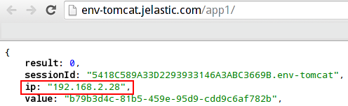

</div>

- **https://second-tomcat.jelastic.com/app2/**

<div style={{
    display:'flex',
    justifyContent: 'center',
    margin: '0 0 1rem 0'
}}>

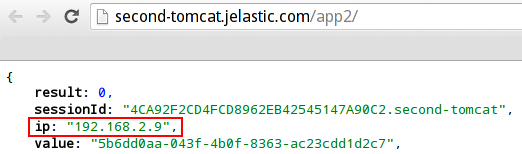

</div>

With Apache **mod_rewrite** module you can make both of your apps be available on one port using the different paths. E.g.:

*http://env-apache.jelastic.com/application1/*

*http://env-apache.jelastic.com/application2/*

This configuration will provide you with an ability to manage, restart and debug each of your application separately, but at the same time the end-user will see them as a single application. Let’s find out how to set this with PaaS hosting:

1. At the very beginning, you should have at least three environments created: one frontend Apache environment and two or more backend Tomcat environments with your Java applications hosted.

<div style={{
    display:'flex',
    justifyContent: 'center',
    margin: '0 0 1rem 0'
}}>

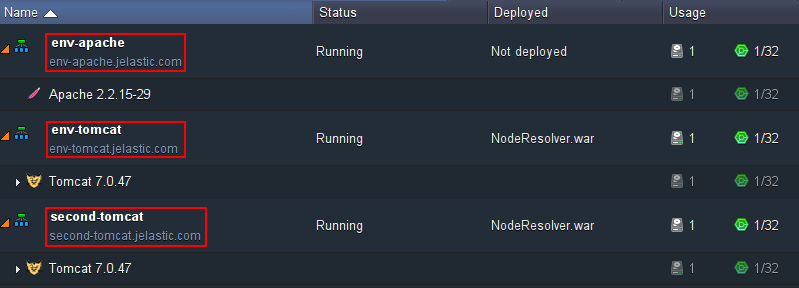

</div>

2. Open the Apache configuration manager (click **Config** next to it). In the appeared tab open the **_/etc/httpd/conf/httpd.conf_** file and specify the following configuration for < _VirtualHost_ > file section.

```bash
<VirtualHost *:80>  
  ServerAdmin webmaster@domain.com  
  DocumentRoot /var/www/webroot/ROOT  
  ServerName website.jelastic.com  
  ServerAlias   
    
  RewriteEngine On  
    
  RewriteRule ^/application1/(.*)   http://env-tomcat.jelastic.com/app1/ [P]  
  ProxyPassReverse /application1/ http://env-tomcat.jelastic.com/app1/  
    
  RewriteRule ^/application2/(.*) http://second-tomcat.jelastic.com/app2/ [P]  
  ProxyPassReverse /application2/ http://second-tomcat.jelastic.com/app2/  
    
  RewriteLog "/var/log/httpd/rewrite.log"  
    
  ErrorLog logs/dummy-host.jelastic.com-error_log  
  CustomLog logs/dummy-host.jelastic.com-access_log common  
</VirtualHost>  
```

<div style={{
    display:'flex',
    justifyContent: 'center',
    margin: '0 0 1rem 0'
}}>

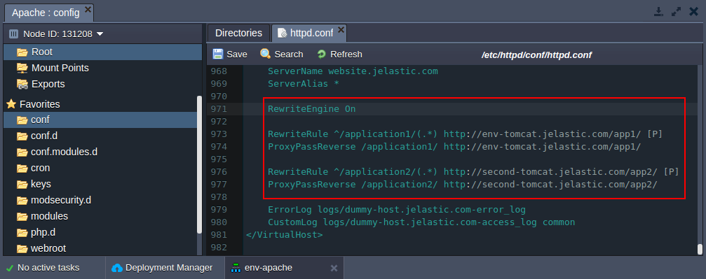

</div>

- **_RewriteEngine On_** is used for enabling the rewriting ability
- **_RewriteRule_** and **_ProxyPassReverse_** state the conditions and the result of rewriting for both applications
- **_RewriteLog_** is optionally added to store the logs of rewriting in the specified location

Don’t forget to **Save** the changes made and **Restart** your Apache server:

3. In order to check the results, press **Open in Browser** button next to your Apache frontend environment and add the path you’ve specified in the _RewriteRule_ lines to the end of URL. It is used as a condition to open the necessary application.

In our case we add:

- /application1/

<div style={{
    display:'flex',
    justifyContent: 'center',
    margin: '0 0 1rem 0'
}}>

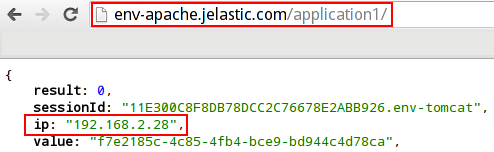

</div>

- /application2/

<div style={{
    display:'flex',
    justifyContent: 'center',
    margin: '0 0 1rem 0'
}}>

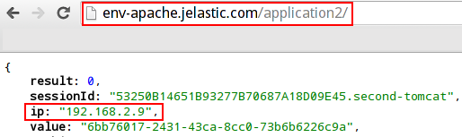

</div>

As you can see above, each of applications is opened with one port and within different paths.

This configuration is also useful for providing descriptive links for your applications as it is much more convenient for your users to get the information about the page content from the URL itself.

## Static Content Processing

Distributing the activities between both Tomcat and Apache will increase the rapidity of your application. It is available with Apache **mod_proxy** module:

<div style={{
    display:'flex',
    justifyContent: 'center',
    margin: '0 0 1rem 0'
}}>

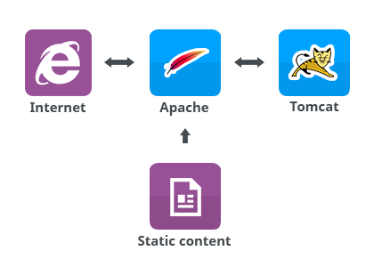

</div>

As you can see in the scheme above, Tomcat will serve the application itself while Apache will work with delivering of the static content. Come through the following steps to make your application serve more users simultaneously:

1. Let’s imagine that you have two environments listed: first one with Tomcat server and your application hosted and the second one with Apache server used for serving the static content.

<div style={{
    display:'flex',
    justifyContent: 'center',
    margin: '0 0 1rem 0'
}}>

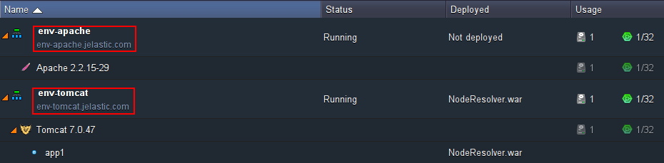

</div>

2. Press **Config** button next to your Apache application server and navigate to the **var/www/webroot/ROOT** folder. Create a special folder for your static content (named, for example, static) and upload the necessary files there.

<div style={{
    display:'flex',
    justifyContent: 'center',
    margin: '0 0 1rem 0'
}}>

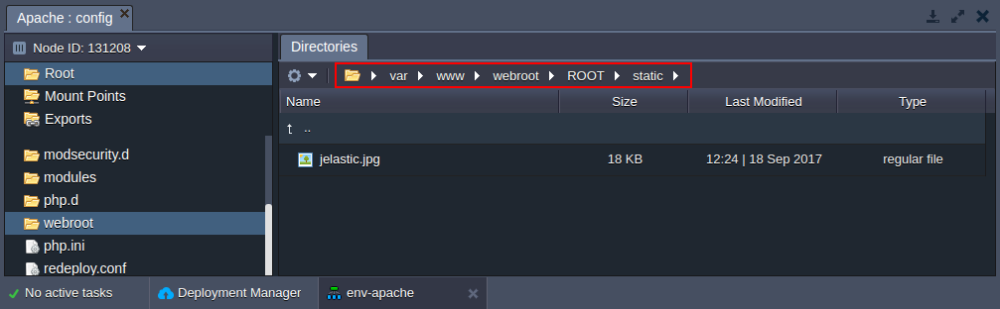

</div>

3. Then open the **_/etc/httpd/conf/httpd.conf_** file.

Perform the necessary configurations in the < VirtualHost > block as it is described below:

```bash
<VirtualHost *:80>  
  ServerAdmin webmaster@domain.com    
  DocumentRoot /var/www/webroot/ROOT  
  ServerName website.jelastic.com  
  ServerAlias *
    
  ProxyPass        /static !  
    
  ProxyPass        / http://env-tomcat.jelastic.com/app1/  
  ProxyPassReverse / http://env-tomcat.jelastic.com/app1/  
    
  ErrorLog logs/dummy-host.jelastic.com-error_log  
  CustomLog logs/dummy-host.jelastic.com-access_log common  
</VirtualHost> 
```

<div style={{
    display:'flex',
    justifyContent: 'center',
    margin: '0 0 1rem 0'
}}>

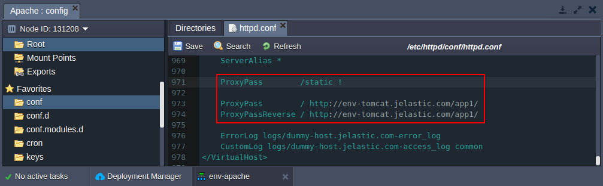

</div>

The **_ProxyPass /static !_** line means we don’t proxy requests started with /stat keyword.

All other requests will be proxied to the Tomcat server with your app hosted within path specified in **_ProxyPass_** and **_ProxyPassReverse_** lines.

4. **Restart** your Apache server.

5. Press **Open in Browser** next to the Apache environment to check the result. If everything was done correctly, you will see that your app proxied from Tomcat.

<div style={{
    display:'flex',
    justifyContent: 'center',
    margin: '0 0 1rem 0'
}}>

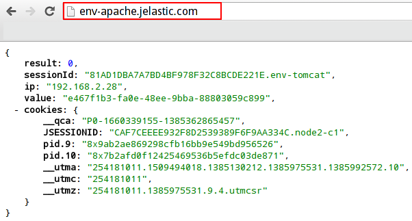

</div>

6. Your static content folder is also available - just specify the path to it in the URL.

<div style={{
    display:'flex',
    justifyContent: 'center',
    margin: '0 0 1rem 0'
}}>

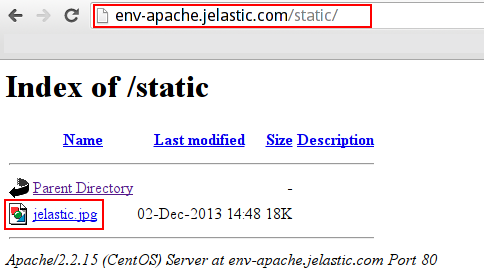

</div>

<div style={{
    display:'flex',
    justifyContent: 'center',
    margin: '0 0 1rem 0'
}}>

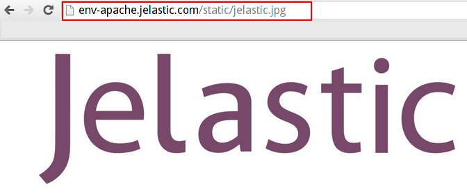

</div>

Thus both Tomcat apps and static files in Apache are accessible within single port.

## Load Balancing

You can add multiple Tomcat instances in order to make your environment handle more load and get some failover capabilities. In this case frontend Apache server will serve as a load distributor between all Tomcat servers.

<div style={{
    display:'flex',
    justifyContent: 'center',
    margin: '0 0 1rem 0'
}}>

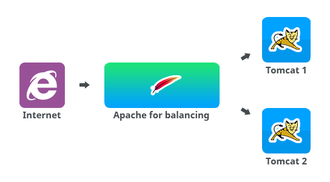

</div>

Using the following steps you can configure your Apache server for balancing of load in your Java application within **mod_rewrite module**.

1. We will use three apart environments: two backend **Tomcat** environments with your Java applications deployed (note that using the similar context for both applications deployed in both environments is an obligatory requirement) and one frontend **Apache** environment.

<div style={{
    display:'flex',
    justifyContent: 'center',
    margin: '0 0 1rem 0'
}}>

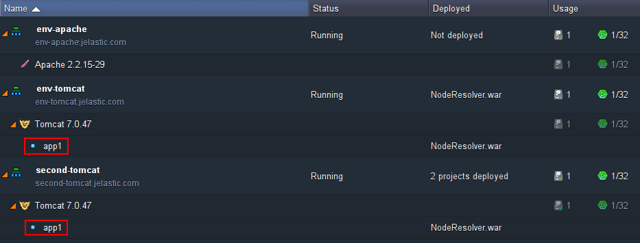

</div>

2. Press **Config** button next to your Apache node and navigate to the **/etc/httpd/conf.d** folder in the opened configuration manager. Create new _server_list_ file there.

3. Add the hosts of your applications deployed to this newly created file like it is shown below:

*servers {env1_name}.{hoster_domain}|{env2_name}.{hoster_domain}*

<div style={{
    display:'flex',
    justifyContent: 'center',
    margin: '0 0 1rem 0'
}}>

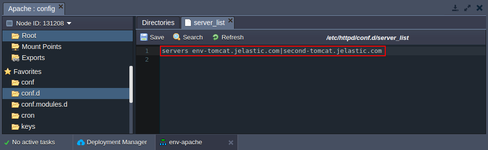

</div>

4. Then open the **/etc/httpd/conf/httpd.conf** file and specify the following configurations:

```bash
<VirtualHost *:80>  
  ServerAdmin webmaster@domain.com  
  DocumentRoot /var/www/webroot/ROOT  
  ServerName website.jelastic.com  
  ServerAlias *  
    
  RewriteEngine On  
    
  RewriteMap lb rnd:/etc/httpd/conf.d/servers_list  
  RewriteRule ^/(.*) http://${lb:servers}/app1/$1 [P,L]  
         
  RewriteLog "/var/log/httpd/rewrite.log"  
     
  ErrorLog logs/dummy-host.jelastic.com-error_log  
  CustomLog logs/dummy-host.jelastic.com-access_log common  
</VirtualHost>
```

<div style={{
    display:'flex',
    justifyContent: 'center',
    margin: '0 0 1rem 0'
}}>


</div>

- **_RewriteEngine On_** is used for enabling the rewriting ability
- **_RewriteMap_** sets the path to the hosts, stated in the server_list file, created before.
- **_RewriteRule_** sets the load balancing terms
- **_RewriteLog_** is optionally added to store the logs of rewriting in the specified location

5. Press **Restart** button for your Apache node.

6. Click **Open in Browser** icon next to the Apache application in order to see the results. One of the Tomcat applications will be opened. Refresh the page (maybe you need to do this several times) to see the second app opened - it is the result of load distribution.

<div style={{
    display:'flex',
    justifyContent: 'center',
    margin: '0 0 1rem 0'
}}>

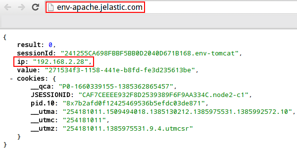

</div>

<div style={{
    display:'flex',
    justifyContent: 'center',
    margin: '0 0 1rem 0'
}}>

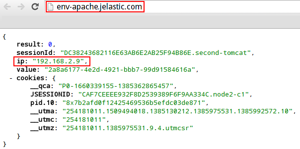

</div>

Enjoy the benefits of Tomcat and Apache interconnection by making your application even more high-performing, flexible and stable.
