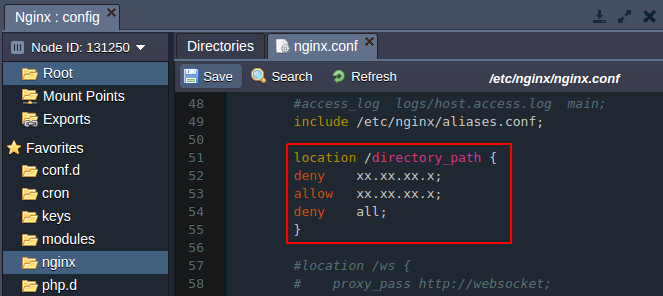
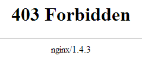

## Security Configurations for NGINX

In this tutorial we will show how to set up the additional security configurations for your **PHP application** hosted with NGINX application server.

You can use the following types of security configurations:

- [Authentication](https://cloudmydc.com/)
- [Setting up the access criteria](https://cloudmydc.com/)

**A. Security through authentication**

To provide this, come through the next steps:

- Generate hash from your password. For that you can use any **htpasswd tool** or online service (for example, http://www.htpasswdgenerator.net/).

- Create simple text file with previously generated hash.

- Click **Config** button for your server.

- Upload the created file to the **/var/www/webroot/ROOT** directory.

- In the **/etc/nginx** directory, open _nginx.conf_ file and modify directory configurations:

  - **authentication for the whole application** Modify the location configurations by adding the following strings:

_auth_basic “Restricted area”;_

_auth_basic_user_file /var/www/webroot/ROOT/.htpasswd;_

- **authentication for the separate directory**

Add the following **location** strings stating the path to the required directory:

_location ~ /directory_path {_

_auth_basic “Restricted”;_

_auth_basic_user_file /var/www/webroot/ROOT/.htpasswd;_

_}_

- Save the changes and restart **NGINX**

As a result, while accessing the application or the protected directory a user will be requested to authenticate.

**B. Security through setting up criteria**

You can provide security for your application through setting up different criteria, for example, allow or deny access by IP address.

- The **Allow** and **Deny** directives are used to specify which clients are or are not allowed access to the server. The rules are checked in sequence until the first match is found.
- Open _nginx.conf_ file in the **/etc/nginx** directory and add necessary directives:

  - **deny access to the whole application** Modify the **location** configurations using the strings of the following type:

_deny xx.xx.xx.x;_

_allow xx.xx.xx.x;_

_deny all;_

- **deny access to the separate directory**

Add the following **location** strings stating the path to the needed **directory**:

_location /directory_path {_

_deny xx.xx.xx.x;_

_allow xx.xx.xx.x;_

_deny all;_

_}_

As a result, a user with any IP except of the allowed ones will see the 403 error while trying to open your application.

Note:

- Denying access through IP makes sense only if you use Public IP feature.
- Both criteria access restrictions and password-based authentication may be implemented simultaneously. In that case, the Satisfy directive is used to determine how the two sets of restrictions interact. More information you can get [here](https://cloudmydc.com/).
