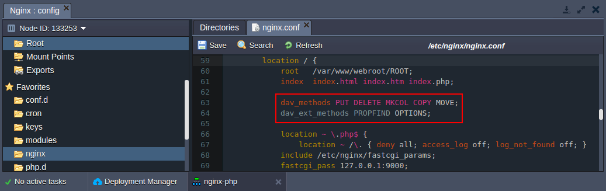
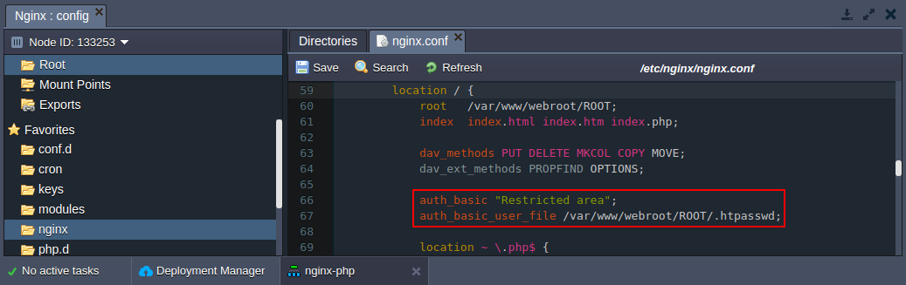

<!-- ## NGINX WebDav Module -->

While setting up a website you can face the need to build some complicated method of viewing and updating the information on the site. There are lots of solutions - using a local copy, using a combination of HTTP and FTP tools to download the original and upload the changes etc. But also as an easy solution you can use **Web-based Distributed Authoring and Versioning (WebDAV)** which is available in the platform.

WebDAV is turning into an important tool which was invented in order to simplify the way you update websites.

## Enabling WebDAV module for NGINX server

1. Click **Config** button for the server in your environment.

2. In the **/etc/nginx** folder open the ***nginx.conf*** file. Modify configuration by adding the following strings as it is shown in the picture below:

*dav_methods PUT DELETE MKCOL COPY MOVE;*

*dav_ext_methods PROPFIND OPTIONS;*

3. Save the changes and restart **NGINX**. Using *nginx.conf* file you can set any other configurations for WebDav module. Follow the link (http://wiki.nginx.org/HttpDavModule) to find some additional useful information.

## Setting up security configuration

1. Generate hash from your password. For that you can use any **htpasswd tool** or online service (for example, http://www.htpasswdgenerator.net/).

2. Create simple text file with previously generated hash.

3. Click **Config** button for your **NGINX** server.

4. Upload the created file to the **/var/www/webroot/ROOT** folder.

5. In the **/etc/nginx** folder open the ***nginx.conf*** file. Add the following strings:

*auth_basic “Restricted area”;*

*auth_basic_user_file /var/www/webroot/ROOT/.htpasswd;*

6. Save the changes and restart **NGINX**.

Finally you can go to any **WebDAV client**. State there the host (also your credentials if you set up security configuration) and connect to the server. As a result you’ll see your files and will be able to edit them, update, add some new files etc.