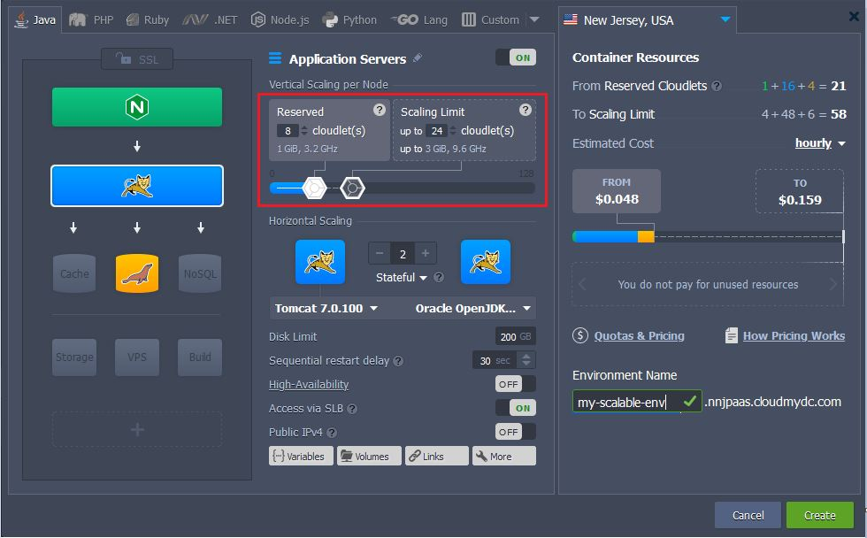
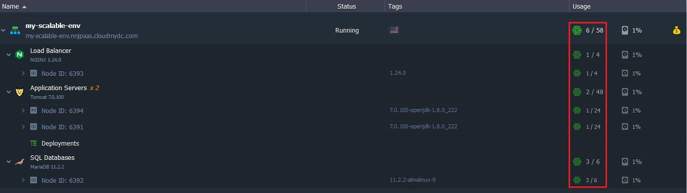

At the platform, consumed by container resources are measured in cloudlets - a special measurement unit, which includes **128 MiB** of **RAM** and **400 MHz** of **CPU** power simultaneously.resources per cloudlet

Being highly granular, it allows to accurately determine the required capacity for each server in environment, which ensures the truly fair [usage-based pricing](/account-and-pricing/pricing-model-overview) so you do not overpay for the unused resources.

:::tip Note

that in contrast to RAM consumption (with MiB=1024 KiB unit), usage of [disk space and network traffic](/account-and-pricing/resource-charging/charged-resources) is measured in megabytes (1000 KB).

:::

Below, we’ll consider which [types of cloudlet](/platform-overview/cloudlet#cloudlet-types) are used at the platform, how the [cloudlet consumption is calculated](/platform-overview/cloudlet#cloudlet-consumption-calculation) and where to [track your resource usage](/platform-overview/cloudlet#consumption-tracking).

## Cloudlet Types

There are two types of cloudlet at the platform, available to be setup for every server in environment via the [Vertical Scaling per Node](/application-setting/scaling-and-clustering/automatic-vertical-scaling) topology wizard section: **_Reserved_** and **_Dynamic_**.

Herewith, if a layer contains [multiple nodes](/application-setting/scaling-and-clustering/horizontal-scaling), these limits are configured for all of them at once, i.e. are stated equal for each instance.

Here, each toddler corresponds to a particular cloudlet type:

- **Reserved Cloudlets**  - these ones are reserved in advance and will be charged irrespective of your actual resource usage. In exchange, you’ll get significant [automatic discounts](/account-and-pricing/automatic-discounts) based on their number.
- **Dynamic Cloudlets**  - are added & removed automatically according to the amount of resources that are required by your application in a particular moment of time - i.e. they’re assigned when load goes up and removed again as soon as it drops down. As a result, you pay based on your [actual resource usage](/account-and-pricing/pricing-model-overview).

setting a scaling limitThis type of cloudlet helps to cope with unexpected surges in demand without any pre-planning, special coding or overpaying for resources you won’t need the majority of time. In such a way, with the Dynamic Cloudlets slider you set the container’s Scaling Limit, defining the maximum possible number of cloudlets available to be allocated for it.

In order to gain the maximum profit, it is recommended to use _Dynamic Cloudlets alongside_ with the _Reserved Cloudlets_ to get all the advantages of your application’s [automatic vertical scaling](/application-setting/scaling-and-clustering/automatic-vertical-scaling) and, simultaneously, to benefit on [automatic discounts](/account-and-pricing/automatic-discounts).

## Cloudlet Consumption Calculation

Number of used cloudlets is calculated on hourly basis in the following way:

- **for RAM** - the peak value (i.e. the highest RAM consumption over the hour)
- **for CPU** - the average usage

The greater of these values (but not both of them combined) is considered as the actual environment consumption, which will be charged from your account according to the provider’s tariff (check it within [Quotas & Pricing](/account-and-pricing/resource-charging/pricing-faq) information frame).

For example, if during one hour your average CPU usage is _2400 MHz_ (6 cloudlets), and your highest RAM usage is _1024 MiB_ (8 cloudlets), you’ll be charged for 8 cloudlets only - not for the combined total of 14 units.

## Consumption Tracking

The current resource usage of your environment in general and for every layer/node it comprises in particular can be seen within the corresponding **Usage** column at dashboard:

And in order to review your servers' consumption level for a particular period of time, you can use the corresponding [Statistics](/application-setting/built-in-monitoring/statistics) section or check the applied account charges within your [Billing History](/account-and-pricing/resource-charging/monitoring-consumed-resources).
