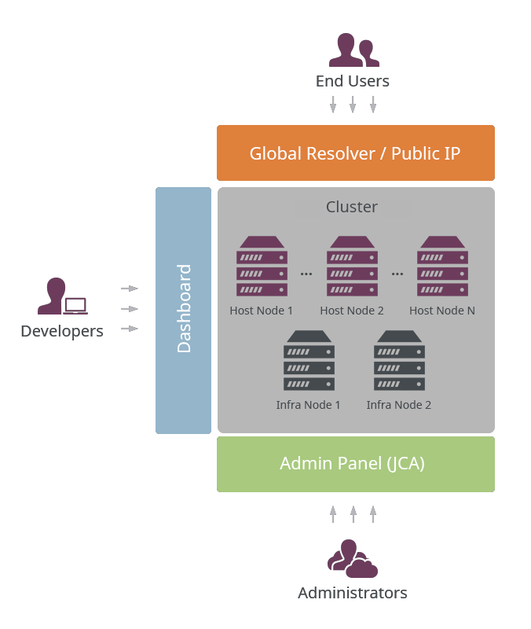
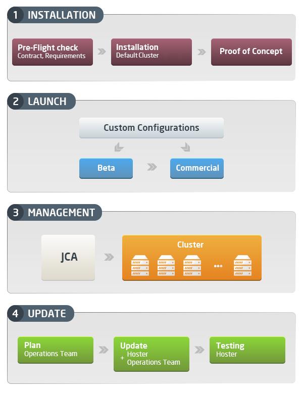
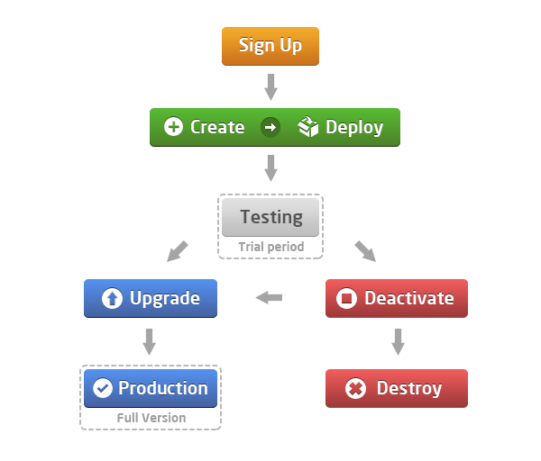
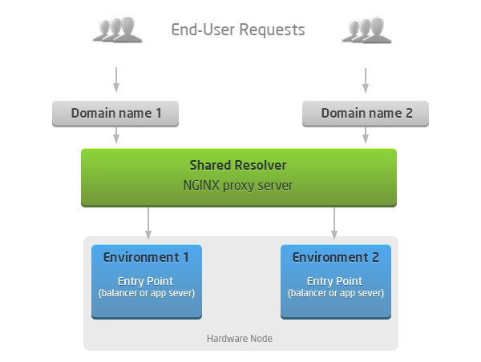
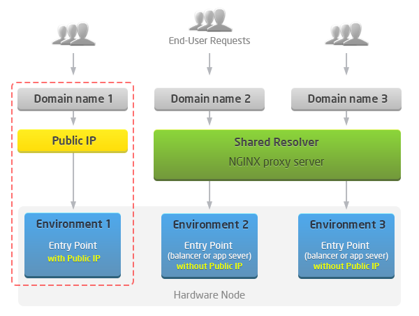

PaaS is targeted at a wide audience of developers and SMBs, enterprises and hosting providers. Each class of customers has its own level of access and a specific way to interact with our platform.

There are three levels of access to the PaaS Cluster:

- [administrators](/platform-overview/cluster-access-levels#administrators)
- [developers or SMBs](/platform-overview/cluster-access-levels#developers-or-smbs)
- [end users](/platform-overview/cluster-access-levels#end-users)

The platform provides two admin panels for accessing the cluster. Cluster Panel (JCA) is available for administrators at hosting providers and enterprise companies. The other admin panel is the Platform Dashboard which is used by developers. This makes the system ideal for DevOps teams.

## Administrators

The **administrators** of the platform are operations departments of [hosting providers](/quickstart/hosters-list-&-info) or IT departments of enterprise companies. After the platform installation, they become the owner and begin to manage the overall performance via _Cluster Admin Panel_ by setting the main configurations (quotas, tariffs, customization etc.) and supporting all of the required aspects.

There are four main tasks performed by the administrators during the PaaS Cluster lifecycle:

- Installation
- Launch
- Management
- Update

The platform provides a full set of analytics, documentation and required tools for performing the above mentioned tasks in an efficient and high quality way.

## Developers or SMBs

This group of platform customers can create environments, deploy their applications and perform all the actions required for the successful [lifecycle of their applications](/application-setting/application-lifecycle-management). Environment and application management is performed via the platform’s panel for developers - [PaaS Dashboard](/quickstart/dashboard-guide).

The main activities available for developers or SMBs in the platform are as follows:

- create simple and complex environments
- deploy applications in different ways without any code change
- ability to tune and tweak configurations
- scale applications vertically and horizontally
- test and debug applications remotely
- application lifecycle management
- clone and share environments
- suspend and activate stopped environments
- process statistics and logs
- upgrade and fund account, etc.

While using PaaS, the typical developer might go from trial registration to features testing during the trial period. The major steps of this life cycle are represented in the diagram below:

At the end of the trial period developers decide whether to upgrade the account and reach the production or to get the account destroyed.

Enterprise installations do not have a trial period. In the enterprise private cloud developers can self-manage their application environments using the platform dashboard relieving IT administrators from environment configuration and setup tasks.

## End Users

The **end-users** are connected to the PaaS Cluster indirectly by **using applications** deployed to the environments created by developers or SMBs or enterprise developers. All of the incoming users' requests are sent to the domain name of an appropriate application and are processed in one of the following ways:

- via **[Global Resolvers](/application-setting/external-access-to-applications/shared-load-balancer)** The platform uses several synchronized Resolvers (SLBs) for receiving requests simultaneously. As a result, there can be several entry points for environments used at the same time.

- via [Public IP](/application-setting/external-access-to-applications/public-ip) if it is attached to the entry point of the environment (balancer, app server or database container). This solution provides less risk of being affected by other applications (as in the case with shared Resolvers) and is recommended for production applications. Also Public IP usage makes more features available such as remote debugging, remote backup, JMX, FTP, Custom SSL, websockets and polling etc.

Access levels make using and managing the PaaS Cluster fully efficient, convenient and easy. Each type of customer is provided with their own range of rights and limitations making the system well structured and organized.
