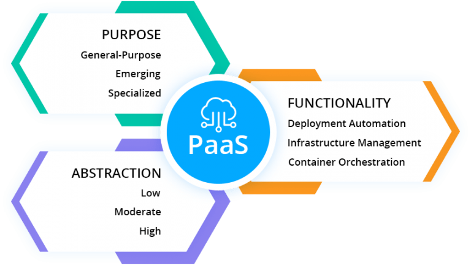

## work todo

## What is PaaS? Platform-as-a-Service Types Explained

There’s no single PaaS for everyone. Even the definition of this cloud computing service model is quite vague today. Commonly, it is described as a cloud hosting platform with a set of deployment and scaling automation, application management and DevOps tools that can be run on shared infrastructure or on-premise. Also, PaaS eliminates the complexity of building and maintaining the underlying infrastructure. Let’s see how PaaSes differ through the prism of their use cases and supported technologies, and how to determine which one will meet specific needs.

Let’s take a closer look and analyze Platform-as-a-Service solutions from several angles:

- purpose
- abstraction
- functionality

## Purpose-Driven Categories of PaaS

Today's PaaS vendors bring innovative approaches to application development and their hosting in the cloud by providing various tools built specifically for a particular service. Considering use cases hosted within Platform-as-a-Service solutions, we can break down PaaS offerings into three broad categories: general-purpose, emerging and specialized.

**_General-purpose_** platforms are widely chosen for traditional stateful web and N-tier applications thus offering “lift and shift” approach for migrating existing workloads. In addition, this PaaS type is timely expanding with modern technologies that meet the needs of stateless cloud-native applications and microservices, and help to develop new scalable and fault tolerant services.

**_Emerging_** PaaSes bring new approaches to the market. They are commonly used for development of independent services based on emerging technologies such as serverless, distributed event processing, machine learning frameworks, and others.

**_Specialized_** platforms focus on narrow niche use cases but with high demand on the market. Such products have proved to be effective in different directions including e-commerce, big data processing and business applications. Often, these platforms are transformed into subcategories such as [CMSaaS](https://cloudmydc.com/), eCommerce-as-a-Service, DBaaS, BPaaS, etc.

## Abstraction Levels of PaaS

PaaS solutions are increasingly focused on full-cycle automation of application deployment and delivery processes. This helps developers to focus more on application design and its implementation instead of time consuming routine or complex tasks, such as server and storage configuration, application and infrastructure security, auto scaling, load balancing, and so on.

There can be considered three levels of PaaS abstraction: low, mid and high.

**_Low abstraction_** level platforms, especially Container-as-a-Service (CaaS) solutions, provide DevOps teams with deep access to infrastructure configurations, as well as granular control over containers and various platform services (e.g. service discovery, logging, security and load balancing).

**_Mid abstraction_** has the primary goal to let developers code without headache of infrastructure configuration and management. These platforms give developers access to a wide range of integrated and optimized development frameworks, middleware software stacks, APIs and services completely abstracted from CaaS and IaaS deployment properties. Very often such PaaS solutions provide [automatic scaling](/docs/application-setting/scaling-and-clustering/automatic-vertical-scaling), load balancing, high-availability, backup, disaster recovery, CI/CD, and other application lifecycle management features out-of-box.

**_High abstraction_** solutions are aimed to abstract even coding process to increase the application delivery speed and reduce the cost of innovations. In this case, developers get the entire technology stack but with full abstraction of application, platform and infrastructure levels. It helps to boost performance of team members and reduce requirements to their technical skills.

## Functionality and Services Integrated to PaaS

In order to automate the application lifecycle management processes, PaaS represents a collection of configuration tools, continuous integration and delivery services, connectors and plugins to popular IDEs.

We can highlight three main approaches in this category:

**_Deployment Automation_**

PaaSes concentrated on providing tools and services for deployment automation offering “one-click” or “git-push” functionality, as well as pre-configured environments for code building, continuous integration and project management tools.

**_Infrastructure Management_**

Cloud platforms focused on infrastructure configuration, health and availability monitoring, security and performance checks, cost optimization, as well as offering automation and services related to upgrades and maintenance.

**_Container Orchestration_**

Container management platforms offering functionality to solve challenges of containerization process and implementation of cloud-native approach for existing or new applications. Many PaaS vendors now offer CaaS as an integral component of their products, further reinforcing the view of PaaS as a collection of different DevOps tools.

## Make the PaaS Choice

There are several important points that should be considered before selecting a PaaS for a company.

Above all, analyze if the chosen PaaS supports the technologies, middleware stacks and programming languages used by development teams today or planned to be used in the future.

The next point to consider is vendor and data lock-in. Despite benefits some PaaSes offer, the access to the application itself and used middleware stacks can be very limited due to proprietary design of tools and services. This aspect affects the application portability. So migration to any other cloud or implementing multi-cloud interoperability approach becomes a real challenge. Same issue applies to the stored data. Ensure that PaaS provider allows to import/export data easily without any lock-in.

They say there’s no “one-size-fits-all” technology for every project but in modern cloud world with all integrations and interconnections available the borders between specific products are blurring. Jelastic Multi-Cloud PaaS provides the required freedom of choice when it comes to cloud services, DevOps tools and container management systems. Give it a try to immensely improve development productivity and application delivery processes with minimal investment.
