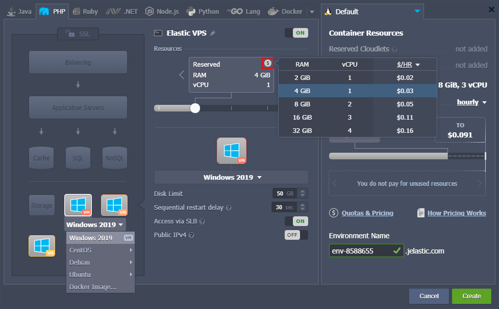
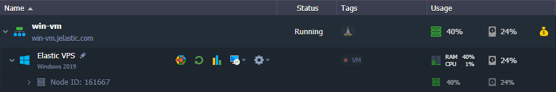
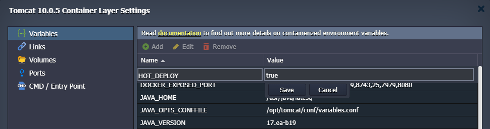
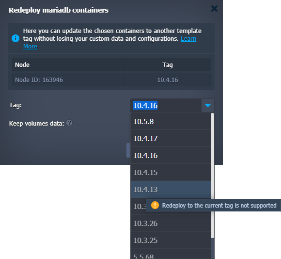
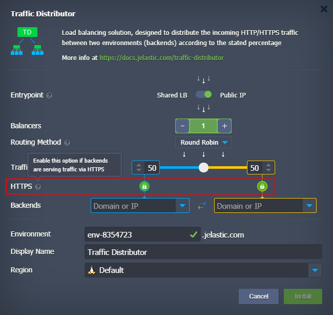
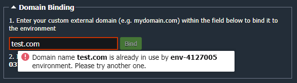

import obj from './ReleaseNotes6.0.json'

## CloudMyDc Application Platform 6.0

_This document is preliminary and subject to change._

In this document, you will find all of the new features, enhancements and visible changes included to the **CloudMyDc PaaS 6.0** release.

    

New

    

        

            <h3 style={{
                fontSize: '23px',
                fontWeight: '500',
        }}>Windows VMs Support</h3>
            
Implemented support of the traditional virtual machines with Windows workloads

            

                <a href="/docs/PlatformOverview/Release%20Notes/Release%20Notes%206.0#windows-vms-support">
                    Learn More >>
                </a>
            

        

        

            <h3 style={{
                fontSize: '23px',
                fontWeight: '500',
        }}>Tomcat/TomEE Hot Deploy</h3>
            
Added the HOT_DEPLOY variable to enable/disable restartless application deployment for the Tomcat/TomEE servers

            

                <a href="/docs/PlatformOverview/Release%20Notes/Release%20Notes%206.0#tomcattomee-hot-deploy">
                    Learn More >>
                </a>
            

        

        

            <h3 style={{
                fontSize: '23px',
                fontWeight: '500',
        }}>Non-Downgradable Software Stacks</h3>
            
Added functionality for disabling redeployment to a version lower than the current one

            

                <a href="/docs/PlatformOverview/Release%20Notes/Release%20Notes%206.0#non-downgradable-software-stacks">
                    Learn More >>
                </a>
            

        

        

            <h3 style={{
                fontSize: '23px',
                fontWeight: '500',
        }}>Extended Target Node Filtering in Cloud Scripting</h3>
            
Added target node filtering by OS type when installing JPS update packages

            

                <a href="/docs/PlatformOverview/Release%20Notes/Release%20Notes%206.0#extended-target-node-filtering-in-cloud-scripting">
                    Learn More >>
                </a>
            

        

    

    

Changed

    

        

            <h3 style={{
                fontSize: '23px',
                fontWeight: '500',
        }}>Traffic Distributor Package Update</h3>
            
Updated the Traffic Distributor package to integrate an ability to connect backends via SSL and to add some optimizations

            

                <a href="/docs/PlatformOverview/Release%20Notes/Release%20Notes%206.0#traffic-distributor-package-update">
                    Learn More >>
                </a>
            

        

        

            <h3 style={{
                fontSize: '23px',
                fontWeight: '500',
        }}>Extended Logs in Tasks Manager</h3>
            
Added information from the error’s log field to the response in tasks manager

            

                <a href="/docs/PlatformOverview/Release%20Notes/Release%20Notes%206.0#extended-logs-in-tasks-manager">
                    Learn More >>
                </a>
            

        

        

            <h3 style={{
                fontSize: '23px',
                fontWeight: '500',
        }}>No Free Disk Error Clarification</h3>
            
Separated errors for the disk space shortage within a container and on a hardware host

            

                <a href="/docs/PlatformOverview/Release%20Notes/Release%20Notes%206.0#no-free-disk-error-clarification">
                    Learn More >>
                </a>
            

        

        

            <h3 style={{
                fontSize: '23px',
                fontWeight: '500',
        }}>Binding Busy Domain Error Clarification</h3>
            
Clarified the validation message when binding a custom domain that is already used by another environment on the platform

            

                <a href="/docs/PlatformOverview/Release%20Notes/Release%20Notes%206.0#binding-busy-domain-error-clarification">
                    Learn More >>
                </a>
            

        

        

            <h3 style={{
                fontSize: '23px',
                fontWeight: '500',
        }}>Run.log Logrotate</h3>
            
Added the run.log file to the list of logs that should be automatically rotated by the system

            

                <a href="/docs/PlatformOverview/Release%20Notes/Release%20Notes%206.0#runlog-logrotate">
                    Learn More >>
                </a>
            

        

        

            <h3 style={{
                fontSize: '23px',
                fontWeight: '500',
        }}>API Changes</h3>
            
Listed all the changes to the public platform API in the current release

            

                <a href="/docs/PlatformOverview/Release%20Notes/Release%20Notes%206.0#api-changes">
                    Learn More >>
                </a>
            

        

        

            <h3 style={{
                fontSize: '23px',
                fontWeight: '500',
        }}>Software Stack Versions</h3>
            
Actualized list of supported OS templates and software stack versions

            

                <a href="/docs/PlatformOverview/Release%20Notes/Release%20Notes%206.0#software-stack-versions">
                    Learn More >>
                </a>
            

        

    

    

.png>)

Fixed

    

        

            <h3 style={{
                fontSize: '23px',
                fontWeight: '500',
        }}>CentOS 6 End-of-Life</h3>
            
Removed CentOS 6 from the list of supported OS templates

            

                <a href="/docs/PlatformOverview/Release%20Notes/Release%20Notes%206.0#centos-6-end-of-life">
                    Learn More >>
                </a>
            

        

        

            <h3 style={{
                fontSize: '23px',
                fontWeight: '500',
        }}>Fixes Compatible with Prior Versions</h3>
            
Bug fixes implemented in the current release and integrated into the previous platform versions through the appropriate patches

            

                <a href="/docs/PlatformOverview/Release%20Notes/Release%20Notes%206.0#fixes-compatible-with-prior-versions">
                    Learn More >>
                </a>
            

        

        

            <h3 style={{
                fontSize: '23px',
                fontWeight: '500',
        }}>Bug Fixes</h3>
            
List of fixes applied to the platform starting from the current release

            

                <a href="/docs/PlatformOverview/Release%20Notes/Release%20Notes%206.0#bug-fixes">
                    Learn More >>
                </a>
            

        

    

## Windows VMs Support

Starting with the PaaS 6.0 release, [Windows VM](/docs/PlatformOverview/Release%20Notes/Release%20Notes%206.0#windows-vms-support) support is implemented for the platforms. The feature availability depends on each particular service hosting provider as it requires additional configurations in order to be set up on a platform.

VM hosting at the platform is provided in a familiar way to the regular containers. Windows VM instances can be added via the topology wizard under the VPS section. However, there are a few peculiarities for virtual machines:

- a small VM label is displayed on the stack image for better clarity
- only fixed resources based on the several predefined plans (licenses) are available; the exact sizes and prices can vary for different platforms
- the _[Horizontal Scaling](/docs/ApplicationSetting/Scaling%20And%20Clustering/Horizontal%20Scaling)_ and IPv6 options are not available in the current implementation

Virtual machines are visually highlighted in the dashboard via the dedicated VM label and unique resource Usage icon (instead of the regular cloudlets-shaped one). For Windows VM, the following management options are available:

- Add-Ons - installs available pluggable modules (e.g. Env Start/Stop Scheduler)
- Restart Node(s) - restarts a VM
- Statistics - shows real-time and historical VM’s [resource consumption](/docs/application-setting/built-in-monitoring/statistics)
- Remote Desktop - provides [RDP-related functionality](/docs/windows-and-.NET/windows-rd-access) for Windows VM
- Additionally - lists additional options (if any)

Regardless of the actual consumption, VM Resources (vCPU and Memory) cost is always fixed, predefined by resource plan (license). Disk, Network, and Options are billed separately, just as for containers.

[More info](/docs/Windows&.NET/Windows%20Server%20VM)

    <a href="/docs/PlatformOverview/Release%20Notes/Release%20Notes%208.3#CloudMyDc-application-platform-83">
        Back to the top
    </a>

## Tomcat/TomEE Hot Deploy

Tomcat and TomEE application servers provide support for the **_hot deploy_** feature, which allows speeding up deployment and avoiding downtime during the process. In short, it means that server adjustments are made while the server is still running (i.e. without restart). However, as not all applications are compatible with such a flow, the platform implemented a special **_HOT_DEPLOY_** variable that controls the hot deploy feature. This variable is not set and considered disabled by default. If needed, it can be manually added and enabled by providing the “true”, “1”, or “enabled” value.

[More info](/docs/Windows&.NET/Windows%20Server%20VM)

    <a href="/docs/PlatformOverview/Release%20Notes/Release%20Notes%208.3#CloudMyDc-application-platform-83">
        Back to the top
    </a>

## Non-Downgradable Software Stacks

The platform provides out-of-the-box support for multiple [software stacks](/docs/quickstart/software-stack-versions) to build topologies that meet the most demanding users' requirements. Moreover, most of the stacks have at least a few releases to choose from. These versions can be freely switched at any time due to the **[Containers Redeploy](/docs/category/container-deployment)** feature.

However, not all of the software solutions provide backward compatibility. If there are substantial differences between the releases, downgrading a software version can result in unforeseen problems. In the current PaaS 6.0 upgrade, all the stacks were analyzed to locate those vulnerable to the issue and explicitly restricted from downgrading during the redevelopment process.

Currently, redeployment to the lower version is forbidden on the following stacks:

- MariaDB
- MongoDB
- MySQL
- Percona
- PostgreSQL
- Couchbase

    <a href="/docs/PlatformOverview/Release%20Notes/Release%20Notes%208.3#CloudMyDc-application-platform-83">
        Back to the top
    </a>

## CentOS 6 End-of-Life

**CentOS 6** software stack support has officially reached its [end-of-life](https://wiki.centos.org/About/Product). It will no longer get any updates and security fixes. In order to ensure that users operate with reliable and secure stacks only, CentOS 6 was removed from the list of [supported OS templates](/docs/Container/Container%20Image%20Requirements) on the platform. After the 6.0 upgrade, the creation of the new containers based on the CentOS 6 will not be possible, while any existing instance will remain fully operable. However, we strictly recommend updating to the 7th or 8th release versions via built-in [redeploy functionality](/docs/category/container-deployment).

[More info](https://cloudmydc.com/)

    <a href="/docs/PlatformOverview/Release%20Notes/Release%20Notes%208.3#CloudMyDc-application-platform-83">
        Back to the top
    </a>

## Traffic Distributor Package Update

**[Traffic Distributor](/docs/ApplicationSetting/Traffic%20Distributor/Traffic%20Distributor%20Overview)** is a package powered by the platform, which helps control traffic flow between environments. It is an easy-to-manage solution suitable for multiple use cases and hosting scenarios (Blue-Green Deploy, Failover Protection, A/B Testing). In the present 6.0 PaaS upgrade, PaaS team integrated the ability to choose between proxying traffic to backends over SSL or without it. The corresponding **HTTPS** config within the **_Traffic Distributor_** package UI is shown in the image below:

Also, the default value for the **_proxy_connect_timeout_** setting in Traffic Distributor was increased to 60 seconds to reduce the number of reconfigurations due to the false-positive backend failures. However, upon selecting the Failover routing method, this parameter is automatically changed to the 20 seconds value.

[More info](/docs/ApplicationSetting/Traffic%20Distributor/Traffic%20Distributor%20Overview)

    <a href="/docs/PlatformOverview/Release%20Notes/Release%20Notes%208.3#CloudMyDc-application-platform-83">
        Back to the top
    </a>

## Extended Logs in Tasks Manager

Dashboard’s [tasks manager](/docs/QuickStart/Dashboard%20Guide) provides all the vital information on the account activities. It helps developers with troubleshooting, issues analysis, and action tracking. In the current 6.0 PaaS release, the tasks manager was improved by providing additional **_log_** information for errors. This log field is present in the response of some error messages and contains valuable data for debugging.

    <a href="/docs/PlatformOverview/Release%20Notes/Release%20Notes%208.3#CloudMyDc-application-platform-83">
        Back to the top
    </a>

## No Free Disk Error Clarification

The platform has two types of the “No free disk space” error. The first one relates to the particular node and can be handled by the container owner. The second one reports the disk space shortage on the host (hardware server), which can only be resolved by the service hosting provider. In the present 6.0 upgrade, additional clarifications were added to separate such issues in the dashboard and provide correct resolution steps, i.e. either to increase disk space or contact support.

    <a href="/docs/PlatformOverview/Release%20Notes/Release%20Notes%208.3#CloudMyDc-application-platform-83">
        Back to the top
    </a>

## Binding Busy Domain Error Clarification

In the current PaaS 6.0 upgrade, a validation message for the binding of a [custom domain](/docs/application-setting/domain-name-management/custom-domain-name) that is already used by some other environment on the platform was improved. For now, instead of a general error, it explicitly notifies that the specified domain is already in use. Moreover, if an external domain belongs to the same account, the error message will point to the appropriate environment.

    <a href="/docs/PlatformOverview/Release%20Notes/Release%20Notes%208.3#CloudMyDc-application-platform-83">
        Back to the top
    </a>

## Run.log Logrotate

Logrotate is a standard UNIX rotation and compression tool for log files. The platform automatically rotates all the main log files on the containers to ensure efficient disk space utilization without losing any crucial information from the log files. In the present 6.0 platform release, the **_run.log_** file was added to the list of logs that should be automatically rotated by the system.

    <a href="/docs/PlatformOverview/Release%20Notes/Release%20Notes%208.3#CloudMyDc-application-platform-83">
        Back to the top
    </a>

## Extended Target Node Filtering in Cloud Scripting

The **_[targetNodes](https://docs.cloudscripting.com/creating-manifest/visual-settings/#target-nodes)_** parameter is an optional config for the JPS add-on solutions that defines environments suitable for installation. In the current PaaS 6.0 release, its functionality was extended with an additional **guestOSType** filter, which lists the suitable OS templates for the add-on installation. The possible values are:

- _LINUX_
- _WINDOWS2008_
- _WINDOWS2012_
- _WINDOWS2016_
- _WINDOWS2019_

For example, this parameter can be used to hide unnecessary (not supported) add-ons for the Windows-based nodes and vice versa.

[More info](https://docs.cloudscripting.com/creating-manifest/visual-settings/#target-nodes)

    <a href="/docs/PlatformOverview/Release%20Notes/Release%20Notes%208.3#CloudMyDc-application-platform-83">
        Back to the top
    </a>

## API Changes

Below, you can find a list of all changes to the public API in the 6.0 platform version (compared to the preceding [5.9.8](/docs/category/platform-overview) ones):

- added new **_Get_**, **_SetSLBAccessEnabled_**, **_SetOptions_**, and **_ApplyData_** methods to the **_nodegroup_** service
- added a new **_GetNodeTags_** method to the **control** service
- added the lang optional parameter to the **_RecoverPassword_** method from the **account** service
- changed the search parameter to mandatory for the **_SearchActions_** method from the **tracking** service

Also, all the deprecated methods were explicitly marked in the API documentation.

[More info](https://cloudmydc.com/)

    <a href="/docs/PlatformOverview/Release%20Notes/Release%20Notes%208.3#CloudMyDc-application-platform-83">
        Back to the top
    </a>

## Fixes Compatible with Prior Versions

Below, you can find the fixes that were implemented in the PaaS 6.0 release and also integrated into previous platform versions by means of the appropriate patches.

    

        PaaS 6.0
    

    

        

            

                #
            

            

               Compatible from
            

            

               Description
            
 
        

        {obj.data1.map((item, idx) => {
            return 

            

                {item.JE}
            

            

                    {item.CompatibleFrom}
            

            

                {item.Desc}
            

        

        })}
    

    <a href="/docs/PlatformOverview/Release%20Notes/Release%20Notes%208.3#CloudMyDc-application-platform-83">
        Back to the top
    </a>

## Software Stack Versions

The software stack provisioning process is independent of the platform release, which allows new software solutions to be delivered as soon as they are ready. However, due to the necessity to adapt and test new stack versions, there is a small delay between software release by its respective upstream maintainer and integration into CloudMyDc Application Platform.

The most accurate and up-to-date list of the certified [software stack versions](/docs/quickstart/software-stack-versions) can be found on the dedicated documentation page.

[More info](/docs/quickstart/software-stack-versions)

    <a href="/docs/PlatformOverview/Release%20Notes/Release%20Notes%208.3#CloudMyDc-application-platform-83">
        Back to the top
    </a>

## Bug Fixes

In the table below, you can see the list of bug fixes applied to the platform starting from PaaS 6.0 release:

    

        PaaS 6.0
    

    

        

            

                #
            

            

               Affected Versions
            

            

               Description
            
 
        

        {obj.data2.map((item, idx) => {
            return 

            

                {item.JE}
            

            

                {item.AffectedVersions}
            

            

                {item.Desc}
            

        

        })}
    

