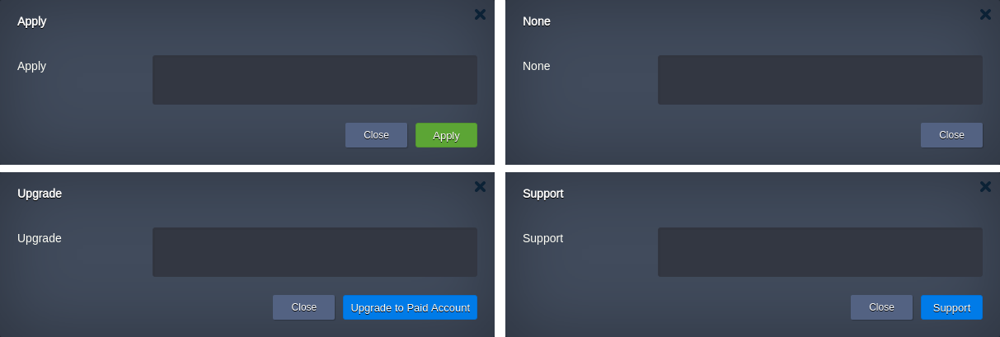

import obj from './ReleaseNotes6.1.4.json'

## CloudMyDc Application Platform 6.1.4

_This document is preliminary and subject to change._

In this document, you will find all of the new features, enhancements and visible changes included to the **CloudMyDc PaaS 6.1.4** release.

    

New

    

        

            <h3 style={{
                fontSize: '23px',
                fontWeight: '500',
        }}>Submit Button Customization in CS</h3>
            
Implemented the possibility to customize the default behavior of the submit button in the Cloud Scripting dialogs

            

                <a href="/docs/PlatformOverview/Release%20Notes/Release%20Notes%206.1.4#submit-button-customization-in-cs">
                    Learn More >>
                </a>
            

        

    

    

Changed

    

        

            <h3 style={{
                fontSize: '23px',
                fontWeight: '500',
        }}>Let’s Encrypt Root Certificate Expiration</h3>
            
Updated root certificate package on PaaS installations to ensure the modern LE root certificate is supported

            

                <a href="/docs/PlatformOverview/Release%20Notes/Release%20Notes%206.1.4#lets-encrypt-root-certificate-expiration">
                    Learn More >>
                </a>
            

        

        

            <h3 style={{
                fontSize: '23px',
                fontWeight: '500',
        }}>API Changes</h3>
            
Listed all the changes to the public platform API in the current release

            

                <a href="/docs/PlatformOverview/Release%20Notes/Release%20Notes%206.1.4#api-changes">
                    Learn More >>
                </a>
            

        

        

            <h3 style={{
                fontSize: '23px',
                fontWeight: '500',
        }}>Software Stack Versions</h3>
            
Actualized list of supported OS templates and software stack versions

            

                <a href="/docs/PlatformOverview/Release%20Notes/Release%20Notes%206.1.4#software-stack-versions">
                    Learn More >>
                </a>
            

        

    

    

.png>)

Fixed

    

        

            <h3 style={{
                fontSize: '23px',
                fontWeight: '500',
        }}>Fixes Compatible with Prior Versions</h3>
            
Bug fixes implemented in the current release and integrated into the previous platform versions through the appropriate patches

            

                <a href="/docs/PlatformOverview/Release%20Notes/Release%20Notes%206.1.4#fixes-compatible-with-prior-versions">
                    Learn More >>
                </a>
            

        

        

            <h3 style={{
                fontSize: '23px',
                fontWeight: '500',
        }}>Bug Fixes</h3>
            
List of fixes applied to the platform starting from the current release

            

                <a href="/docs/PlatformOverview/Release%20Notes/Release%20Notes%206.1.4#bug-fixes">
                    Learn More >>
                </a>
            

        

    

## Let’s Encrypt Root Certificate Expiration

Due to the [**DST Root CA X3** Let’s Encrypt certificate expiration](https://letsencrypt.org/docs/dst-root-ca-x3-expiration-september-2021/) on September 30, clients with the outdated list of root certificates will consider certificates issued by LE as expired. In order to make sure that all platform clients support the modern **_ISRG Root X1_** Let’s Encrypt certificate, the root certificate package was updated on all PaaS installations.

    <a href="/docs/PlatformOverview/Release%20Notes/Release%20Notes%208.3#CloudMyDc-application-platform-83">
        Back to the top
    </a>

## Submit Button Customization in CS

In the current PaaS 6.1.4 release, the possibility to customize the default submit button in the [Cloud Scripting](https://docs.cloudscripting.com/) dialogs was implemented. In some specific use cases, developers may need customization to the submit button behavior. For example, using the recently [improved **OnBeforeInit** event](https://cloudmydc.com/), it is possible to determine if the user has enough permissions for the specific operation. If not, this improvement allows hiding the default **Apply** button or displaying an account upgrade / platform support button instead.

The exact list of new options to the buttons and settings configuration is provided below:

- submitType (string) - determines the behavior of the submit button. This setting is applicable for installation and configuration dialogs and supports the following values:

  - **none** - submit button is hidden
  - **apply** (default value) - standard green button for installation or configuration
  - **support** - blue button to open platform’s support window
  - **upgrade** - blue button that redirects to the Upgrade to Paid Account dialog

- **_submitUnchanged_** (boolean) - ability to submit unchanged values in the configuration dialog, **false** by default

    <a href="/docs/PlatformOverview/Release%20Notes/Release%20Notes%208.3#CloudMyDc-application-platform-83">
        Back to the top
    </a>

## API Changes

Below, you can find a list of all changes to the public API in the 6.1.4 platform version (compared to the preceding [6.0](/docs/PlatformOverview/Release%20Notes/Release%20Notes%206.1.4#api-changes) ones):

- The response of the **_[GetSSLCerts](https://cloudmydc.com/)_** method was extended. Now it contains information about linked domains.

[More info](https://cloudmydc.com/)

    <a href="/docs/PlatformOverview/Release%20Notes/Release%20Notes%208.3#CloudMyDc-application-platform-83">
        Back to the top
    </a>

## Fixes Compatible with Prior Versions

Below, you can find the fixes that were implemented in the CloudMyDc Application Platform 8.3 release and also integrated into previous platform versions by means of the appropriate patches.

    

       PaaS 6.1.4
    

    

        

            

                #
            

            

               Compatible from
            

            

               Description
            
 
        

        {obj.data1.map((item, idx) => {
            return 

            

                {item.JE}
            

            

                    {item.CompatibleFrom}
            

            

                {item.Desc}
            

        

        })}
    

    <a href="/docs/PlatformOverview/Release%20Notes/Release%20Notes%208.3#CloudMyDc-application-platform-83">
        Back to the top
    </a>

## Software Stack Versions

The software stack provisioning process is independent of the platform release, which allows new software solutions to be delivered as soon as they are ready. However, due to the necessity to adapt and test new stack versions, there is a small delay between software release by its respective upstream maintainer and integration into CloudMyDc Application Platform.

The most accurate and up-to-date list of the certified [software stack versions](/docs/QuickStart/Software%20Stack%20Versions) can be found on the dedicated documentation page.

[More info](/docs/QuickStart/Software%20Stack%20Versions)

    <a href="/docs/PlatformOverview/Release%20Notes/Release%20Notes%208.3#CloudMyDc-application-platform-83">
        Back to the top
    </a>

## Bug Fixes

In the table below, you can see the list of bug fixes applied to the platform starting from CloudMyDc Application Platform 8.3 release:

    

        CloudMyDc Application Platform 8.3
    

    

        

            

                #
            

            

               Affected Versions
            

            

               Description
            
 
        

        {obj.data2.map((item, idx) => {
            return 

            

                {item.JE}
            

            

                {item.AffectedVersions}
            

            

                {item.Desc}
            

        

        })}
    

