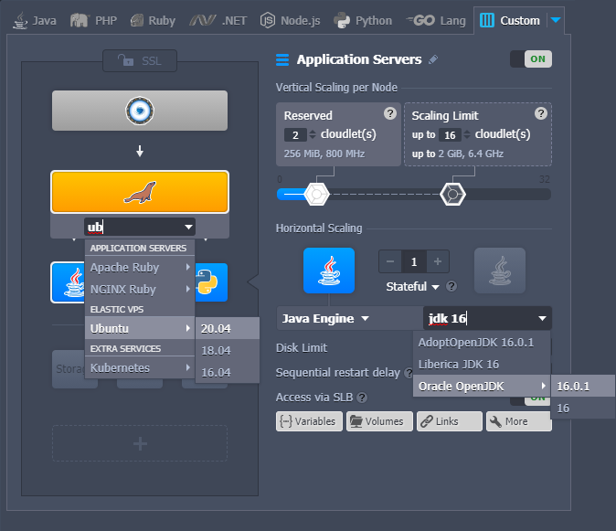
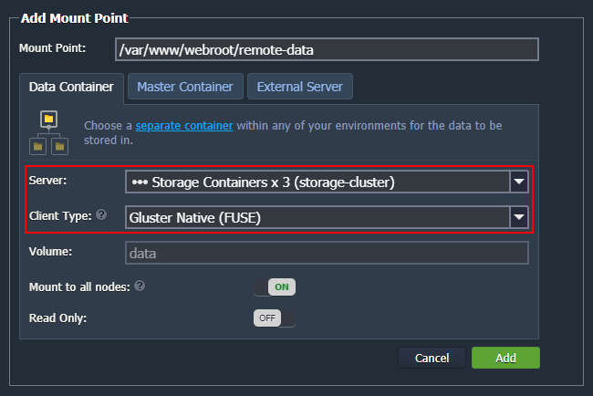
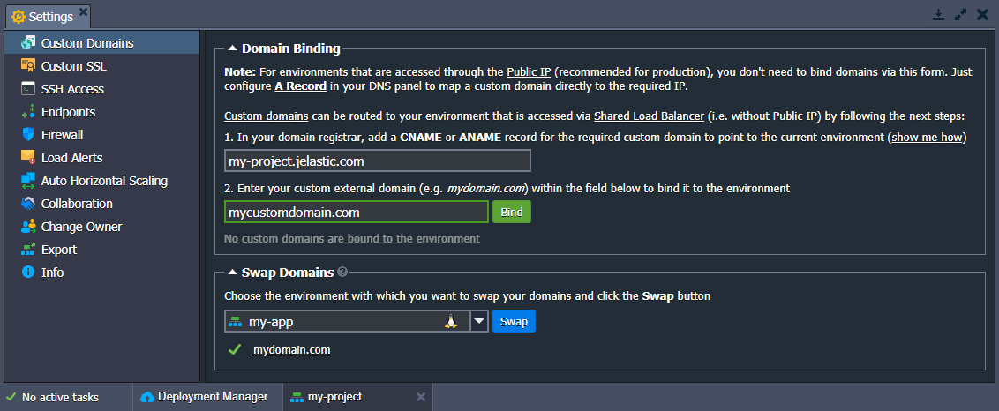

import obj from './ReleaseNotes6.1.json'

## CloudMyDc Application Platform 6.1

_This document is preliminary and subject to change._

In this document, you will find all of the new features, enhancements and visible changes included to the **CloudMyDc PaaS 6.1** release.

    

New

    

        

            <h3 style={{
                fontSize: '23px',
                fontWeight: '500',
        }}>Topology Wizard Improvements</h3>
            
Implemented a new flexible topology structure with the possibility to search for the required stacks

            

                <a href="/docs/platform-overview/release-notes/release-notes-6.1#topology-wizard-improvements">
                    Learn More >>
                </a>
            

        

        

            <h3 style={{
                fontSize: '23px',
                fontWeight: '500',
        }}>GlusterFS Native Client for Storage Cluster</h3>
            
Provided support for the Gluster Native Client for distributed shared (cloud) storage

            

                <a href="/docs/platform-overview/release-notes/release-notes-6.1#glusterfs-native-client-for-storage-cluster">
                    Learn More >>
                </a>
            

        

        

            <h3 style={{
                fontSize: '23px',
                fontWeight: '500',
        }}>JEM Commands Validation</h3>
            
Implemented error response for cases when incorrect JEM module or action is requested

            

                <a href="/docs/platform-overview/release-notes/release-notes-6.1#jem-commands-validation">
                    Learn More >>
                </a>
            

        

    

    

Changed

    

        

            <h3 style={{
                fontSize: '23px',
                fontWeight: '500',
        }}>Custom Domains Tab Improvements</h3>
            
Reviewed texts and UI forms for the custom domain binding and swap domains functionality in the dashboard

            

                <a href="/docs/platform-overview/release-notes/release-notes-6.1#custom-domains-tab-improvements">
                    Learn More >>
                </a>
            

        

        

            <h3 style={{
                fontSize: '23px',
                fontWeight: '500',
        }}>Apache PHP Redeployment Amendments</h3>
            
Optimized redeployment process for the Apache PHP template

            

                <a href="/docs/platform-overview/release-notes/release-notes-6.1#apache-php-redeployment-amendments">
                    Learn More >>
                </a>
            

        

        

            <h3 style={{
                fontSize: '23px',
                fontWeight: '500',
        }}>Default File Permissions Adjustments</h3>
            
Adjusted default file permissions for containers after an environment creation

            

                <a href="/docs/platform-overview/release-notes/release-notes-6.1#default-file-permissions-adjustments">
                    Learn More >>
                </a>
            

        

        

            <h3 style={{
                fontSize: '23px',
                fontWeight: '500',
        }}>Keytool Utility for Java Containers</h3>
            
Allowed usage of the keytool utility with the sudo rights on the Java-based containers

            

                <a href="/docs/platform-overview/release-notes/release-notes-6.1#keytool-utility-for-java-containers">
                    Learn More >>
                </a>
            

        

        

            <h3 style={{
                fontSize: '23px',
                fontWeight: '500',
        }}>OnBeforeInit CS Event Improvements</h3>
            
Configured placeholders support and new trigger condition for the onBeforeInit event in Cloud Scripting

            

                <a href="/docs/platform-overview/release-notes/release-notes-6.1#onbeforeinit-cs-event-improvements">
                    Learn More >>
                </a>
            

        

        

            <h3 style={{
                fontSize: '23px',
                fontWeight: '500',
        }}>VCS Deployment Errors Clarification</h3>
            
Improved description for the VCS Deployment errors to clarify the root cause of the issue and provide pointers for further troubleshooting

            

                <a href="/docs/platform-overview/release-notes/release-notes-6.1#vcs-deployment-errors-clarification">
                    Learn More >>
                </a>
            

        

        

            <h3 style={{
                fontSize: '23px',
                fontWeight: '500',
        }}>Software Stack Versions</h3>
            
Actualized list of supported OS templates and software stack versions

            

                <a href="/docs/platform-overview/release-notes/release-notes-6.1#software-stack-versions">
                    Learn More >>
                </a>
            

        

    

    

.png>)

Fixed

    

        

            <h3 style={{
                fontSize: '23px',
                fontWeight: '500',
        }}>Debian 8 End-of-Life</h3>
            
Ceased support of the images based on the Debian 8 OS

            

                <a href="/docs/platform-overview/release-notes/release-notes-6.1#debian-8-end-of-life">
                    Learn More >>
                </a>
            

        

        

            <h3 style={{
                fontSize: '23px',
                fontWeight: '500',
        }}>Fixes Compatible with Prior Versions</h3>
            
Bug fixes implemented in the current release and integrated into the previous platform versions through the appropriate patches

            

                <a href="/docs/platform-overview/release-notes/release-notes-6.1#fixes-compatible-with-prior-versions">
                    Learn More >>
                </a>
            

        

        

            <h3 style={{
                fontSize: '23px',
                fontWeight: '500',
        }}>Bug Fixes</h3>
            
List of fixes applied to the platform starting from the current release

            

                <a href="/docs/platform-overview/release-notes/release-notes-6.1#bug-fixes">
                    Learn More >>
                </a>
            

        

    

## Topology Wizard Improvements

A major overhaul of the topology builder for the environment wizard was performed in the current 6.1 PaaS release. The main change is the implementation of the ability to search for the required [software stack](/docs/quickstart/software-stack-versions) and add it to any layer. The standard approach recommends the following topology structure from top to bottom:

- **load balancers** (_green blocks_)
- **application servers** (_blue_)
- **databases** (_orange_)
- **extra** (_gray_)

With the new change, the configuration of the custom topologies is significantly simplified. For example, you can easily add Kubernetes nodes into the application servers section in the middle of the wizard.

Usually, when selecting a stack for a block ([layer](/docs/platform-overview/basics-&-terminology#layer)) in the topology wizard, users are provided with a list of recommended software for the specific role according to the block position. For now, a new “**_More…_**” option is added to the stack selection drop-down list to choose a template from any role. For example, you can easily add a database into the central block, which is commonly reserved for application servers.

In order to help locate the required stack quicker, the **Search** field can be accessed by clicking on the current stack name at the top of the list. Start typing to see the relevant results grouped by their role. Additionally, the search option was added for the engine/version field in the central part of the wizard when a particular stack is already selected.

Other adjustments of the topology wizard include:

- renamed the **Docker** tab to **Custom** (since different [container types](/docs/container/container-types) are available - Kubernetes, Docker Native, etc.), adjusted the corresponding icon and descriptions of the available options
- added the default **Storage** block to the **_.NET_** tab
- implemented **_tags search_** when working with custom containers based on the Docker images in topology wizard and during [container redeploy](/docs/category/container-deployment)

[More info](https://cloudmydc.com/)

    <a href="/docs/platform-overview/release-notes/release-notes-8.3#CloudMyDc-application-platform-83">
        Back to the top
    </a>

## GlusterFS Native Client for Storage Cluster

Starting with the 6.1 platform release, [Shared Storage Cluster](/docs/platform-overview/release-notes/release-notes-6.1) provides support of the **Gluster Native Client** for distributed shared (cloud) storage. Such a change allows connecting clients over the FUSE interface (in addition to the standard NFS).

Compared to the **NFS** protocol, GlusterFS offers greater reliability. It operates with multiple servers and is recommended for cases that require high concurrency, high performance of the write operations, and failover recovery upon emergencies.

Currently, only the Shared Storage Cluster can export data using GlusterFS (i.e. as a Gluster Native server). At the same time, any node (except _alpine-based_ containers) can operate as a client and mount data via the GlusterFS protocol.

When selecting a protocol, as a general rule, you choose NFS for better performance and Gluster Native for reliability:

- **[NFS](/docs/data-storage-container/data-sharing/mount-protocols/nfs)** - straightforward file system protocol, designed for accelerated processing and high performance
- **[Gluster Native](/docs/data-storage-container/data-sharing/mount-protocols/glusterfs)** (FUSE) - reliable file system protocol with automatic replication of the mounted data, designed for data backup and failover (requires less CPU/disk than NFS)

You can learn more about the [architecture implementation](https://docs.gluster.org/en/latest/Quick-Start-Guide/Architecture/) of GlusterFS from the official documentation.

[More info](/docs/data-storage-container/data-sharing/mount-protocols/glusterfs)

    <a href="/docs/platform-overview/release-notes/release-notes-8.3#CloudMyDc-application-platform-83">
        Back to the top
    </a>

## Custom Domains Tab Improvements

The platform provides a [Domain Binding](/docs/application-setting/domain-name-management/custom-domain-name) option that allows configuring custom domains for environments that are accessed via [Shared Load Balancer](/docs/application-setting/external-access-to-applications/shared-load-balancer) (i.e. without public IP). The process is simple - you just need to create the appropriate CNAME or ANAME record for your domain and bind it to the environment via the platform dashboard.

:::danger Note

For environments that are accessed through the [public IP](/docs/application-setting/external-access-to-applications/public-ip) (recommended for production), you don’t need to bind domains via the dashboard. Just configure **[A Record](https://cloudmydc.com/)** in your DNS panel to map a custom domain directly to the required IP address.

:::

In order to clarify the process to users, the appropriate specifics and detailed steps were added to the **_Custom Domains_** tab. For further convenience, the exact environment domain that should be used for CNAME or ANAME records was placed in a separate field with a quick copy button. Another UI adjustment is that the form explicitly denotes if the current environment does not have any bound domains.

Additionally, the **[swap domains](/docs/application-setting/domain-name-management/swap-domains)** section was provided with a list of bound domains. As a result, you can view the list of the current and target environment domains (in the Domain Binding and Swap Domains subsections, respectively).

[More info](https://cloudmydc.com/)

    <a href="/docs/platform-overview/release-notes/release-notes-8.3#CloudMyDc-application-platform-83">
        Back to the top
    </a>

## Apache PHP Redeployment Amendments

Some adjustments were applied to the backups created via the [redeploy functionality](https://cloudmydc.com/) on the **Apache PHP** stacks. In addition to the latest backup (**_{file_name}.backup_**), the platform will create and keep a copy of the required config files for every redeployment to a different tag (**_{file_name}.{time_stamp}_**). Such an improvement allows you to track the changes better, simplifying analysis and rollback in case of necessity.

Also, when redeploying to the same tag, the platform won’t overwrite the existing **_php.ini_** file.

[More info](/docs/category/container-deployment)

    <a href="/docs/platform-overview/release-notes/release-notes-8.3#CloudMyDc-application-platform-83">
        Back to the top
    </a>

## Default File Permissions Adjustments

Starting with the PaaS 6.1 release, file permissions for containers after an environment creation are adjusted to match the default values required for some of the most popular applications. For example, such a change ensures that cPanel can be deployed without additional configurations.

    <a href="/docs/platform-overview/release-notes/release-notes-8.3#CloudMyDc-application-platform-83">
        Back to the top
    </a>

## Keytool Utility for Java Containers

In order to allow a straightforward use of the Java keytool utility, a small adjustment was made to the Java-based containers. Namely, the application was added to the sudoers file, which allows using keytool with the sudo rights and adjusting the container’s keystore even if it belongs to the root user.

    <a href="/docs/platform-overview/release-notes/release-notes-8.3#CloudMyDc-application-platform-83">
        Back to the top
    </a>

## JEM Commands Validation

JEM (Jelastic Environment Manager) is a platform component responsible for all operations with containers. It supports a list of commands that users can call to perform specific actions on the containers (e.g. jem service restart). In order to improve user experience with the module, error notification was added for the cases when an incorrect module or action is specified for the jem command.

    <a href="/docs/platform-overview/release-notes/release-notes-8.3#CloudMyDc-application-platform-83">
        Back to the top
    </a>

## OnBeforeInit CS Event Improvements

**_[OnBeforeInit](https://docs.cloudscripting.com/creating-manifest/events/#onbeforeinit)_** is a Cloud Scripting event that is triggered before application installation. It is usually used to dynamically configure the installation form based on some specifics (e.g. account quotas). In the current 6.1 PaaS upgrade, the onBeforeInit event was improved to support placeholders, allowing validation of the collaborator account’s permissions. Such a change ensures that the JPS installation frame can be correctly customized when installing as a [collaborator](/docs/account-and-pricing/accounts-collaboration/collaboration-overview).

Additionally, a new trigger condition was added for the onBeforeInit event. For now, it is possible to implement some custom initialization actions upon clicking a [custom button](https://docs.cloudscripting.com/creating-manifest/visual-settings/#custom-buttons).

[More info](/docs/container/container-image-requirements)

    <a href="/docs/platform-overview/release-notes/release-notes-8.3#CloudMyDc-application-platform-83">
        Back to the top
    </a>

## Debian 8 End-of-Life

D**ebian 8 “Jessie”** software stack [LTS support](https://wiki.debian.org/LTS) has officially ended. It will no longer get any updates and security fixes. In the current PaaS 6.1 release, this version was removed from the list of [supported OS templates](/docs/container/container-image-requirements) to ensure that users operate with reliable and secure stacks only. The platform restricts the creation of new Debian 8 containers, but all existing ones remain fully operable. However, we strongly recommend updating such instances to the 9th or 10th release versions via built-in [redeploy functionality](/docs/category/container-deployment).

[More info](/docs/container/container-image-requirements)

    <a href="/docs/platform-overview/release-notes/release-notes-8.3#CloudMyDc-application-platform-83">
        Back to the top
    </a>

## VCS Deployment Errors Clarification

In the current 6.1 platform version, error notifications for the failed VCS deployment operations were reviewed and adjusted to clarify the root cause of the issue or provide pointers for further troubleshooting. The new texts are aimed to help developers quicker resolve any problems related to the deployments from Git/SVN repositories.

    <a href="/docs/platform-overview/release-notes/release-notes-8.3#CloudMyDc-application-platform-83">
        Back to the top
    </a>

## Fixes Compatible with Prior Versions

Below, you can find the fixes that were implemented in the CloudMyDc Application Platform 8.3 release and also integrated into previous platform versions by means of the appropriate patches.

    

        CloudMyDc Application Platform 8.3
    

    

        

            

                #
            

            

               Compatible from
            

            

               Description
            
 
        

        {obj.data1.map((item, idx) => {
            return 

            

                {item.JE}
            

            

                    {item.CompatibleFrom}
            

            

                {item.Desc}
            

        

        })}
    

    <a href="/docs/platform-overview/release-notes/release-notes-8.3#CloudMyDc-application-platform-83">
        Back to the top
    </a>

## Software Stack Versions

The software stack provisioning process is independent of the platform release, which allows new software solutions to be delivered as soon as they are ready. However, due to the necessity to adapt and test new stack versions, there is a small delay between software release by its respective upstream maintainer and integration into CloudMyDc Application Platform.

The most accurate and up-to-date list of the certified [software stack versions](/docs/quickstart/software-stack-versions) can be found on the dedicated documentation page.

[More info](/docs/quickstart/software-stack-versions)

    <a href="/docs/platform-overview/release-notes/release-notes-8.3#CloudMyDc-application-platform-83">
        Back to the top
    </a>

## Bug Fixes

In the table below, you can see the list of bug fixes applied to the platform starting from CloudMyDc Application Platform 8.3 release:

    

        CloudMyDc Application Platform 8.3
    

    

        

            

                #
            

            

               Affected Versions
            

            

               Description
            
 
        

        {obj.data2.map((item, idx) => {
            return 

            

                {item.JE}
            

            

                {item.AffectedVersions}
            

            

                {item.Desc}
            

        

        })}
    

    <a href="/docs/platform-overview/release-notes/release-notes-8.3#CloudMyDc-application-platform-83">
        Back to the top
    </a>

