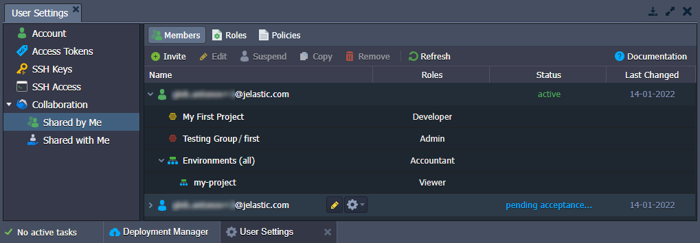

---

## sidebar_position: 2

import obj from './ReleaseNotes7.0.json'

## CloudMyDc Application Platform 7.0

_This document is preliminary and subject to change._

In this document, you will find all of the new features, enhancements and visible changes included to the **CloudMyDc PaaS 7.0** release.

    

New

    

        

            <h3 style={{
                fontSize: '23px',
                fontWeight: '500',
        }}>Extended Account Collaboration</h3>
            
Reworked the account collaboration feature to provide better flexibility and cover more use cases

            

                <a href="/docs/platform-overview/release-notes/release-notes-7.0#extended-account-collaboration">
                    Learn More >>
                </a>
            

        

    

    

Changed

    

        

            <h3 style={{
                fontSize: '23px',
                fontWeight: '500',
        }}>API Changes</h3>
            
Listed all the changes to the public platform API in the current release

            

                <a href="/docs/platform-overview/release-notes/release-notes-7.0#api-changes">
                    Learn More >>
                </a>
            

        

        

            <h3 style={{
                fontSize: '23px',
                fontWeight: '500',
        }}>Software Stack Versions</h3>
            
Actualized list of supported OS templates and software stack versions

            

                <a href="/docs/platform-overview/release-notes/release-notes-7.0#software-stack-versions">
                    Learn More >>
                </a>
            

        

    

    

.png>)

Fixed

    

        

            <h3 style={{
                fontSize: '23px',
                fontWeight: '500',
        }}>Fixes Compatible with Prior Versions</h3>
            
Bug fixes implemented in the current release and integrated into the previous platform versions through the appropriate patches

            

                <a href="/docs/platform-overview/release-notes/release-notes-7.0#fixes-compatible-with-prior-versions">
                    Learn More >>
                </a>
            

        

        

            <h3 style={{
                fontSize: '23px',
                fontWeight: '500',
        }}>Bug Fixes</h3>
            
List of fixes applied to the platform starting from the current release

            

                <a href="/docs/platform-overview/release-notes/release-notes-7.0#bug-fixes">
                    Learn More >>
                </a>
            

        

    

## Extended Account Collaboration

The platform’s **_account collaboration_** feature is a powerful tool that allows multiple users to work on the same project. The core idea is straightforward - you can share your environment with other accounts on the platform. Additionally, different permissions can be provided to the collaboration members to cover various use cases.

In the current 7.0 upgrade, the feature received a major rework, mainly focusing on extending its flexibility. Two focal points are **roles and policies** mechanics for advanced permission management and **integration with [environment groups](/docs/environment-management/environment-groups/overview)** to better organize shared components. All the features are wrapped in a new comprehensive UI:

- **Shared by Me** - collaboration options for the primary account, it has three tabs:
  - **Members** - manages a list of collaboration members (invite new users, suspend or remove existing ones, customize shared environments, groups, roles, etc.)
  - **Roles** - configures custom roles (a combination of policies) that create the required range of actions
  - **Policies** - lists actions (_specific operations_) that can be included in a role
- **_Shared with Me_** - options for the collaboration member (accept/reject the invitation, view roles and policies, leave collaboration, etc.)

The new collaboration flow remains the same in principle but much more configurable in detail. In general, the primary account still sends a collaboration invite, and the user can accept it. However, instead of the two predefined collaboration roles (admin and viewer), you can manually create as many roles with different permissions as you need. Also, in addition to the ability to share separate environments, it is now possible to share environment groups, which can help organize things on the primary account in a much easier and clearer way.

You can find information on even more changes to the collaboration feature (ability to temporarily suspend collaboration, role assigning algorithm, direct environment sharing, etc.) in the dedicated documentation:

- [Collaboration Overview](/docs/account-and-pricing/accounts-collaboration/collaboration-overview)
- [Collaboration Roles & Policies](/docs/account-and-pricing/accounts-collaboration/collaboration-roles-policies)
- [Create Collaboration](/docs/account-and-pricing/accounts-collaboration/create-collaboration)
- [Collaboration User Experience](/docs/account-and-pricing/accounts-collaboration/collaboration-user-experience)
- [Share Environment](/docs/environment-management/share-environment)

:::danger Note

During the upgrade, the platform automatically generates configurations equivalent to the existing collaboration setup (if any) so that existing collaborations may continue their work as usual.

:::

[More info](/docs/account-and-pricing/accounts-collaboration/collaboration-overview)

    <a href="/docs/platform-overview/release-notes/release-notes-8.3#CloudMyDc-application-platform-83">
        Back to the top
    </a>

## API Changes

Below, you can find a list of all changes to the public API in the 7.0 platform version (compared to the preceding [6.3](https://cloudmydc.com/) ones):

- in the **users** namespace:
  - added a new **[collaboration](/docs/account-and-pricing/accounts-collaboration/collaboration-overview)** service
  - removed methods from the **[account](https://docs.jelastic.com/api/#!/api/users.Account)** service: _SetLinkedUserDisplayName_, _SetOwnerUserDisplayName_, _ConfirmLinkRequest_, _UnlinkLinkedUser_, _UnlinkOwnerUser_, _GetLinkedUsers_, _GetOwnerUsers_, _GetLinkedUsersByLogin_, _GetOwnerUsersByLogin_, _GetPayerQuotas_, _HazelcastPartitionsTest_, _LinkUsers_, _SetLinkedUserRole_, _SetLinkedUserDisplayName_, _SetOwnerUserDisplayName_, _ConfirmLinkRequest_, _UnlinkLinkedUser_, _UnlinkOwnerUser_, _GetLinkedUsers_, _GetOwnerUsers_, _SendLinkRequest_, _LinkUsersInner_
- in the **marketplace** namespace:
  - added new **[favorite](https://docs.jelastic.com/api/#!/api/marketplace.Favorite)**, **[installation](https://docs.jelastic.com/api/#!/api/marketplace.Installation)**, and **[app services](https://docs.jelastic.com/api/#!/api/marketplace.App)**
  - added the **_GetAppInfo_** and **_GetAppSettings_** methods to the **[jps](https://docs.jelastic.com/api/#!/api/marketplace.Jps)** service
  - removed the **_AttachAddon_** and **_DetachAddon_** methods from the **[jps](https://docs.jelastic.com/api/#!/api/marketplace.Jps)** service
  - added **_ReadLog_** and **_ClearLog_** methods to the [console](https://docs.jelastic.com/api/#!/api/marketplace.Console) service
- in the **environment > [control](https://docs.jelastic.com/api/#!/api/environment.Control)** service:
  - added new **_GetSSHAccessInfo_**, **_GetEndpoints_**, and **_Exports_** methods
  - added the **_ownerUid_** optional parameter for the **_CreateEnvironment_**, **_GetTemplates_**, and **_GetEnvs_** methods
  - added the **_envGroups_** optional parameter for the **_CreateEnvironment_** method
  - merged the **_envGroup_** parameter with the envGroups one and made mandatory for the **_AttachEnvGroup_**, **_DetachEnvGroup_**, and **_SetEnvGroup_** methods
  - added the **_lazy_** optional parameter for the **_GetEnvInfo_** method
- in the **environment > [group](https://cloudmydc.com/)** service:
  - added new **_SetEnv_** and **_SetIsolationEnabled_** methods
  - added the **_ownerUid_** optional parameter for the **_AttachEnv_**, **_DetachEnv_**, **_CreateGroup_**, **_EditGroup_**, **_RemoveGroup_**, and **_GetGroups_** methods
  - merged the **_envGroup_** parameter with the envGroups one and made mandatory for the **_AttachEnv_**, and **_DetachEnv_** methods
  - added the **_targetAppid_** optional parameter for the **_GetGroups_** method
- added a new **environment > [export](https://docs.jelastic.com/api/#!/api/environment.Group)** service
- added new methods to the **environment > [trigger](https://docs.jelastic.com/api/#!/api/environment.Trigger)** service: _AddAutoScalingTrigger_, _EditAutoScalingTrigger_, _SetAutoScalingTriggerEnabled_, _GetAutoScalingTriggers_, _DeleteAutoScalingTrigger_, _AutoScalingHistory_, _AddLoadAlertTrigger_, _EditLoadAlertTrigger_, _SetLoadAlertTriggerEnabled_, _GetLoadAlertTriggers_, _DeleteLoadAlertTrigger_, _LoadAlertHistory_

[More info](https://cloudmydc.com/)

    <a href="/docs/platform-overview/release-notes/release-notes-8.3#CloudMyDc-application-platform-83">
        Back to the top
    </a>

## Fixes Compatible with Prior Versions

Below, you can find the fixes that were implemented in the PaaS 7.0 release and also integrated into previous platform versions by means of the appropriate patches.

    

PaaS 7.0
    

    

        

            

                #
            

            

               Compatible from
            

            

               Description
            
 
        

        {obj.data1.map((item, idx) => {
            return 

            

                {item.JE}
            

            

                    {item.CompatibleFrom}
            

            

                {item.Desc}
            

        

        })}
    

    <a href="/docs/platform-overview/release-notes/release-notes-8.3#CloudMyDc-application-platform-83">
        Back to the top
    </a>

## Software Stack Versions

The software stack provisioning process is independent of the platform release, which allows new software solutions to be delivered as soon as they are ready. However, due to the necessity to adapt and test new stack versions, there is a small delay between software release by its respective upstream maintainer and integration into CloudMyDc Application Platform.

The most accurate and up-to-date list of the certified [software stack versions](/docs/quickstart/software-stack-versions) can be found on the dedicated documentation page.

[More info](/docs/quickstart/software-stack-versions)

    <a href="/docs/platform-overview/release-notes/release-notes-8.3#CloudMyDc-application-platform-83">
        Back to the top
    </a>

## Bug Fixes

In the table below, you can see the list of bug fixes applied to the platform starting from PaaS 7.0 release:

    

       PaaS 7.0
    

    

        

            

                #
            

            

               Affected Versions
            

            

               Description
            
 
        

        {obj.data2.map((item, idx) => {
            return 

            

                {item.JE}
            

            

                {item.AffectedVersions}
            

            

                {item.Desc}
            

        

        })}
    

