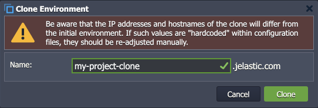

import obj from './ReleaseNotes7.1.json'

## CloudMyDc Application Platform 7.1

_This document is preliminary and subject to change._

In this document, you will find all of the new features, enhancements and visible changes included to the **CloudMyDc PaaS 7.1** release.

    

New

    

        

            <h3 style={{
                fontSize: '23px',
                fontWeight: '500',
        }}>Send Message API with IP Authorization</h3>
            
Added two new API methods that can send email notification to container owner using IP authorization (without user session)

            

                <a href="/docs/PlatformOverview/Release%20Notes/Release%20Notes%207.1#send-message-api-with-ip-authorization">
                    Learn More >>
                </a>
            

        

    

    

Changed

    

        

            <h3 style={{
                fontSize: '23px',
                fontWeight: '500',
        }}>Info for Environment Clone Dialog</h3>
            
Added notification to the Clone Environment dialog that manual adjustment may be needed due to IP addresses and hostnames changes

            

                <a href="/docs/PlatformOverview/Release%20Notes/Release%20Notes%207.1#info-for-environment-clone-dialog">
                    Learn More >>
                </a>
            

        

        

            <h3 style={{
                fontSize: '23px',
                fontWeight: '500',
        }}>API Changes</h3>
            
Listed all the changes to the public platform API in the current release

            

                <a href="/docs/PlatformOverview/Release%20Notes/Release%20Notes%207.1#api-changes">
                    Learn More >>
                </a>
            

        

        

            <h3 style={{
                fontSize: '23px',
                fontWeight: '500',
        }}>Software Stack Versions</h3>
            
Actualized list of supported OS templates and software stack versions

            

                <a href="/docs/PlatformOverview/Release%20Notes/Release%20Notes%207.1#software-stack-versions">
                    Learn More >>
                </a>
            

        

    

    

.png>)

Fixed

    

        

            <h3 style={{
                fontSize: '23px',
                fontWeight: '500',
        }}>Fixes Compatible with Prior Versions</h3>
            
Bug fixes implemented in the current release and integrated into the previous platform versions through the appropriate patches

            

                <a href="/docs/PlatformOverview/Release%20Notes/Release%20Notes%207.1#fixes-compatible-with-prior-versions">
                    Learn More >>
                </a>
            

        

        

            <h3 style={{
                fontSize: '23px',
                fontWeight: '500',
        }}>Bug Fixes</h3>
            
List of fixes applied to the platform starting from the current release

            

                <a href="/docs/PlatformOverview/Release%20Notes/Release%20Notes%207.1#bug-fixes">
                    Learn More >>
                </a>
            

        

    

## Send Message API with IP Authorization

In the current 7.1 PaaS release, two new API methods were implemented for sending email notifications from the container to its owner. These methods provide automatic authentication based on the container IP address so that user session (password and login) is not required. Such implementation significantly simplifies notification of the container owner based on the events inside the node, which allows automating various scenarios that previously were difficult in realization.

Both new methods are part of the **environment > node** service:

- **_SendEvent_** - sends a predefined event using IP authorization
  - **eventName** - the name of the required event; currently, the following values are supported:
    - _SEND_NOTIFICATION_ - sends an email notification to the node owner
    - _OOM_KILLER_ - sends a message after OOM Killer invocation
    - _CUSTOM_NODE_EVENT_ - a user-defined custom event
  - **params** - JSON object with parameters for Cloud Scripting
- **_SendNotification_** - sends an email notification to the node owner using IP authorization
  - **name** - title of the message
  - **message** - body of the message

The platform already utilizes these new methods to provide proper notification about changes in containers - for example, automatic notifications due to [smart recovery after the OOM error](/docs/ApplicationSetting/Smart%20Auto-Configuration/Auto-Configuration%20Overview). Developers can benefit from the implementation by extending their custom packages with automatic notification of the container owner based on some specific condition.

[More info](https://cloudmydc.com/)

    <a href="/docs/PlatformOverview/Release%20Notes/Release%20Notes%208.3#CloudMyDc-application-platform-83">
        Back to the top
    </a>

## Info for Environment Clone Dialog

The **[Clone Environment](/docs/environment-management/cloning-environment)** is a powerful platform feature that allows you to create an identical copy of the existing environment. For example, it can be helpful during development to create a separate instance of the project where tuning and adjustments can be safely tested without affecting existing customers. However, when utilizing the feature, users should be aware that the IP addresses and hostnames of the clone will differ from the initial environment (i.e. manual re-adjustment of these values may be required). To ensure better awareness of the fact, such information was added to the **_Clone Environment_** dialog.

[More info](/docs/environment-management/cloning-environment)

    <a href="/docs/PlatformOverview/Release%20Notes/Release%20Notes%208.3#CloudMyDc-application-platform-83">
        Back to the top
    </a>

## API Changes

Below, you can find a list of all changes to the public API in the 7.1 platform version (compared to the preceding [7.0](/docs/PlatformOverview/Release%20Notes/Release%20Notes%207.0#api-changes) ones).

Two new API methods were added to the **environment > node** service, implementing a simplified flow to [notify the container owner](/docs/PlatformOverview/Release%20Notes/Release%20Notes%207.1#send-message-api-with-ip-authorization) (using IP authorization instead of user session):

- **_SendEvent_** - sends a predefined notification based on the specific event inside a container
- **_SendNotification_** - sends a custom email notification to the node owner

[More info](https://cloudmydc.com/)

    <a href="/docs/PlatformOverview/Release%20Notes/Release%20Notes%208.3#CloudMyDc-application-platform-83">
        Back to the top
    </a>

## Fixes Compatible with Prior Versions

Below, you can find the fixes that were implemented in the CloudMyDc Application Platform 8.3 release and also integrated into previous platform versions by means of the appropriate patches.

    

        CloudMyDc Application Platform 8.3
    

    

        

            

                #
            

            

               Compatible from
            

            

               Description
            
 
        

        {obj.data1.map((item, idx) => {
            return 

            

                {item.JE}
            

            

                    {item.CompatibleFrom}
            

            

                {item.Desc}
            

        

        })}
    

    <a href="/docs/PlatformOverview/Release%20Notes/Release%20Notes%208.3#CloudMyDc-application-platform-83">
        Back to the top
    </a>

## Software Stack Versions

The software stack provisioning process is independent of the platform release, which allows new software solutions to be delivered as soon as they are ready. However, due to the necessity to adapt and test new stack versions, there is a small delay between software release by its respective upstream maintainer and integration into CloudMyDc Application Platform.

The most accurate and up-to-date list of the certified [software stack versions](/docs/quickstart/software-stack-versions) can be found on the dedicated documentation page.

[More info](/docs/quickstart/software-stack-versions)

    <a href="/docs/PlatformOverview/Release%20Notes/Release%20Notes%208.3#CloudMyDc-application-platform-83">
        Back to the top
    </a>

## Bug Fixes

In the table below, you can see the list of bug fixes applied to the platform starting from CloudMyDc Application Platform 8.3 release:

    

        CloudMyDc Application Platform 8.3
    

    

        

            

                #
            

            

               Affected Versions
            

            

               Description
            
 
        

        {obj.data2.map((item, idx) => {
            return 

            

                {item.JE}
            

            

                {item.AffectedVersions}
            

            

                {item.Desc}
            

        

        })}
    

    

        PaaS 7.1.2
    

    

        

            

                #
            

            

               Affected Versions
            

            

               Description
            
 
        

        {obj.data3.map((item, idx) => {
            return 

            

                {item.JE}
            

            

                {item.AffectedVersions}
            

            

                {item.Desc}
            

        

        })}
    

