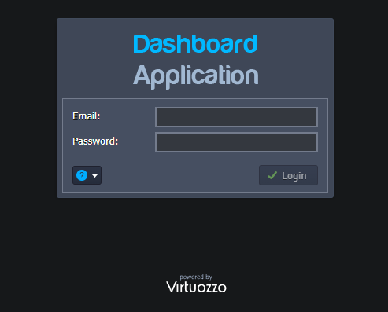
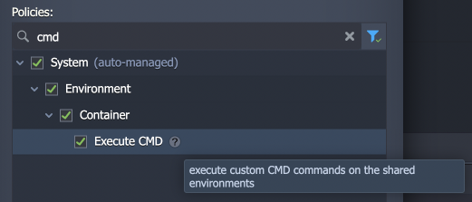
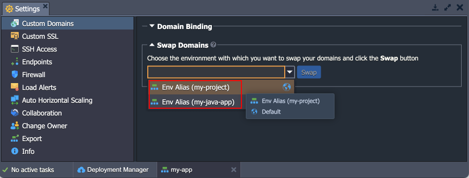

import obj from './ReleaseNotes7.2.json'

_This document is preliminary and subject to change._

In this document, you will find all of the new features, enhancements and visible changes included to the **CloudMyDc PaaS 7.2** release.

    

New

    

        

            <h3 style={{
                fontSize: '23px',
                fontWeight: '500',
        }}>Platform Rebranding</h3>
            
Updated the PaaS name (formerly known as Jelastic) to CloudMyDc Application Platform

            

                <a href="/platform-overview/release-notes/release-notes-7.2#platform-rebranding">
                    Learn More >>
                </a>
            

        

        

            <h3 style={{
                fontSize: '23px',
                fontWeight: '500',
        }}>CentOS Stream 8 OS Support</h3>
            
Added support for the CentOS Stream 8 OS template

            

                <a href="/platform-overview/release-notes/release-notes-7.2#centos-stream-8-os-support">
                    Learn More >>
                </a>
            

        

    

    

Changed

    

        

            <h3 style={{
                fontSize: '23px',
                fontWeight: '500',
        }}>Collaboration Policy for Custom Commands</h3>
            
Added a new Execute CMD policy to run custom CMD commands on the shared environments

            

                <a href="/platform-overview/release-notes/release-notes-7.2#collaboration-policy-for-custom-commands">
                    Learn More >>
                </a>
            

        

        

            <h3 style={{
                fontSize: '23px',
                fontWeight: '500',
        }}>Environment Selection Field Adjustment</h3>
            
Improved options denomination for the environment selection combo-boxes in the dashboard to provide better clarity

            

                <a href="/platform-overview/release-notes/release-notes-7.2#environment-selection-field-adjustment">
                    Learn More >>
                </a>
            

        

        

            <h3 style={{
                fontSize: '23px',
                fontWeight: '500',
        }}>Software Stack Versions</h3>
            
Actualized list of supported OS templates and software stack versions

            

                <a href="/platform-overview/release-notes/release-notes-7.2#software-stack-versions">
                    Learn More >>
                </a>
            

        

    

    

.png>)

Fixed

    

        

            <h3 style={{
                fontSize: '23px',
                fontWeight: '500',
        }}>Fixes Compatible with Prior Versions</h3>
            
Bug fixes implemented in the current release and integrated into the previous platform versions through the appropriate patches

            

                <a href="/platform-overview/release-notes/release-notes-7.2#fixes-compatible-with-prior-versions">
                    Learn More >>
                </a>
            

        

        

            <h3 style={{
                fontSize: '23px',
                fontWeight: '500',
        }}>Bug Fixes</h3>
            
List of fixes applied to the platform starting from the current release

            

                <a href="/platform-overview/release-notes/release-notes-7.2#bug-fixes">
                    Learn More >>
                </a>
            

        

    

## Platform Rebranding

Continuing the smooth integration of the PaaS (formerly known as Jelastic) with the CloudMyDc family, the platform name was changed to **Vitruozzo Application Platform**. The appropriate changes are integrated into the platform dashboard default images, labeling, documentation references, Hello World application, etc.

    <a href="/platform-overview/release-notes/release-notes-8.3#CloudMyDc-application-platform-83">
        Back to the top
    </a>

## Collaboration Policy for Custom Commands

In order to extend the capabilities of the [account collaboration](/account-and-pricing/accounts-collaboration/collaboration-overview) feature even further and ensure the possibility of providing full access to the shared account, a new **Execute CMD** policy was added. If included in the collaboration role, it allows members to execute custom CMD commands on the shared environments. This permission may be required when installing some complex JPS solutions.

    <a href="/platform-overview/release-notes/release-notes-8.3#CloudMyDc-application-platform-83">
        Back to the top
    </a>

## Environment Selection Field Adjustment

In the current CloudMyDc Application Platform 7.2 release, the dashboard’s combo-boxes for environment selection were improved. For now, the displayed items provide better clarity by showing both the [custom alias](/environment-management/environment-aliases) (if specified) and the environment name. Such implementation uniquely identifies the provided options and helps avoid possible confusion when several environments have similar aliases.

    <a href="/platform-overview/release-notes/release-notes-8.3#CloudMyDc-application-platform-83">
        Back to the top
    </a>

## CentOS Stream 8 OS Support

CloudMyDc Application Platform supports the most popular [operating system templates](/container/container-image-requirements), which allows using multiple different solutions from Docker Hub as [custom containers](/container/container-types). Due to the recent CentOS Linux 8 end of life, the recommended alternative template was added to the platform – **CentOS Stream 8**. You can find a [comparison of these two versions](https://centos.org/cl-vs-cs/) in the official documentation.

:::tip Note

Do not confuse OS templates (base image for containers) support with container templates ([stacks](/quickstart/software-stack-versions)).

:::

[More info](https://cloudmydc.com/)

    <a href="/platform-overview/release-notes/release-notes-8.3#CloudMyDc-application-platform-83">
        Back to the top
    </a>

## Fixes Compatible with Prior Versions

Below, you can find the fixes that were implemented in the CloudMyDc Application Platform 7.2 release and also integrated into previous platform versions by means of the appropriate patches.

    

        CloudMyDc Application Platform 7.2
    

    

        

            

                #
            

            

               Compatible from
            

            

               Description
            
 
        

        {obj.data1.map((item, idx) => {
            return 

            

                    {item.JE}
            

            

                    {item.CompatibleFrom}
            

            

                {item.Desc}
            

        

        })}
    

    <a href="/platform-overview/release-notes/release-notes-8.3#CloudMyDc-application-platform-83">
        Back to the top
    </a>

## Software Stack Versions

The software stack provisioning process is independent of the platform release, which allows new software solutions to be delivered as soon as they are ready. However, due to the necessity to adapt and test new stack versions, there is a small delay between software release by its respective upstream maintainer and integration into CloudMyDc Application Platform.

The most accurate and up-to-date list of the certified [software stack versions](/quickstart/software-stack-versions) can be found on the dedicated documentation page.

[More info](/quickstart/software-stack-versions)

    <a href="/platform-overview/release-notes/release-notes-8.3#CloudMyDc-application-platform-83">
        Back to the top
    </a>

## Bug Fixes

In the table below, you can see the list of bug fixes applied to the platform starting from CloudMyDc Application Platform 7.2 release:

    

        CloudMyDc Application Platform 7.2
    

    

        

            

                #
            

            

               Affected Versions
            

            

               Description
            
 
        

        {obj.data2.map((item, idx) => {
            return 

            

                {item.JE}
            

            

                {item.AffectedVersions}
            

            

                {item.Desc}
            

        

        })}
    

