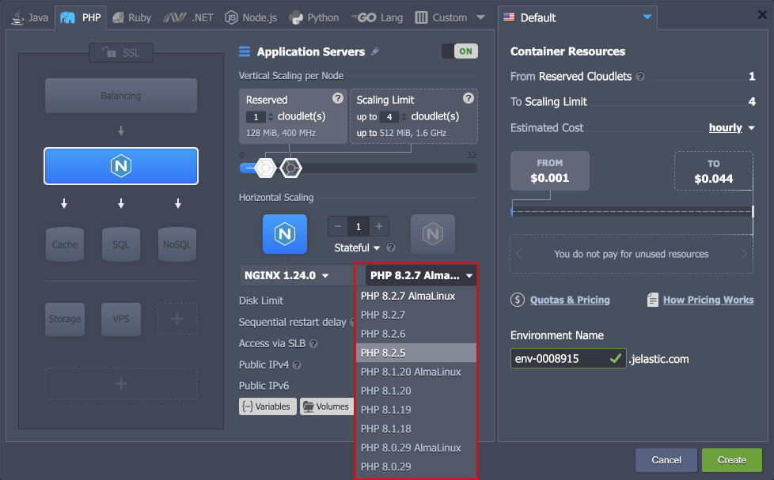
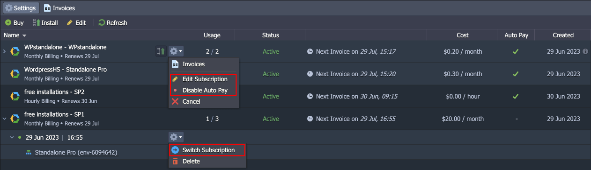
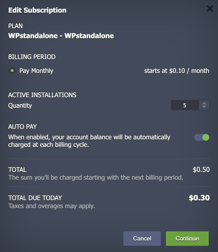
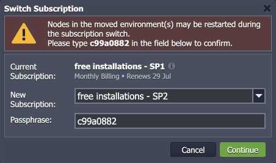
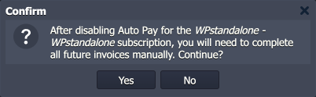

import obj from './ReleaseNotes8.3.json'

_This document is preliminary and subject to change._

In this document, you will find all of the new features, enhancements and visible changes included to the **CloudMyDC PaaS 8.3** release.

    

New

    

        

            <h3 style={{
                fontSize: '23px',
                fontWeight: '500',
        }}>AlmaLinux 9 Base OS Image</h3>
            
Started a gradual process of transitioning certified software stacks to the AlmaLinux 9 based images

            

                <a href="/platform-overview/release-notes/release-notes-8.3#almalinux-9-base-os-image">
                    Learn More >>
                </a>
            

        

        

            <h3 style={{
                fontSize: '23px',
                fontWeight: '500',
        }}>Subscription Improvements</h3>
            
Implemented new features for the subscription solution, including subscription update, migration, and disabling/enabling the Auto Pay option

            

                <a href="/platform-overview/release-notes/release-notes-8.3#subscription-improvements">
                    Learn More >>
                </a>
            

        

    

    

Changed

    

        

            <h3 style={{
                fontSize: '23px',
                fontWeight: '500',
        }}>Action Initiator for Emails</h3>
            
Extended the collaboration email notifications with the “action initiator” data to help with account activity tracking

            

                <a href="/platform-overview/release-notes/release-notes-8.3#action-initiator-for-emails">
                    Learn More >>
                </a>
            

        

        

            <h3 style={{
                fontSize: '23px',
                fontWeight: '500',
        }}>API Changes</h3>
            
Listed all the changes to the public platform API in the current release

            

                <a href="/platform-overview/release-notes/release-notes-8.3#api-changes">
                    Learn More >>
                </a>
            

        

        

            <h3 style={{
                fontSize: '23px',
                fontWeight: '500',
        }}>Software Stack Versions</h3>
            
Actualized list of supported OS templates and software stack versions

            

                <a href="/platform-overview/release-notes/release-notes-8.3#software-stack-versions">
                    Learn More >>
                </a>
            

        

    

    

.png>)

Fixed

    

        

            <h3 style={{
                fontSize: '23px',
                fontWeight: '500',
        }}>Fixes Compatible with Prior Versions</h3>
            
Bug fixes implemented in the current release and integrated into the previous platform versions through the appropriate patches

            

                <a href="/platform-overview/release-notes/release-notes-8.3#fixes-compatible-with-prior-versions">
                    Learn More >>
                </a>
            

        

        

            <h3 style={{
                fontSize: '23px',
                fontWeight: '500',
        }}>Bug Fixes</h3>
            
List of fixes applied to the platform starting from the current release

            

                <a href="/platform-overview/release-notes/release-notes-8.3#bug-fixes">
                    Learn More >>
                </a>
            

        

    

## AlmaLinux 9 Base OS Image

Starting with the current 8.3 release, CloudMyDC Application Platform starts transitioning to the [software stacks](/quickstart/software-stack-versions) based on the new **_AlmaLinux 9_** images (from the previously used CentOS 7). Such a change ensures support of all the up-to-date functionality, modern security standards, and compatibility with all the latest software solutions.

The transition process will be gradual and non-intrusive. It follows the next points:

- <u>AlmaLinux 9 images are supported starting with the 8.3 platform version</u> and won’t be available on the preceding versions.
- All the newly released stack versions will be based on AlmaLinux 9, so the whole pool of images will be seamlessly replaced with the new OS over time.
- Updates for the CentOS 7 based images will still be provided in case of critical patches and security issues.
- In the dashboard, tags based on the AlmaLinux 9 will be explicitly highlighted.
- [Redeployment](/category/container-deployment) from the CentOS 7 to the AlmaLinux 9 version of the stack can be performed without any setbacks. <u>However, downgrading back to CentOS 7 is not supported.</u>
- The up-to-date list of the [software stacks](/quickstart/software-stack-versions) based on the AlmaLinux 9 image can be checked in the linked document.

Alongside the AlmaLinux 9 image implementation, some new functionality is introduced, including updated key generation (_rsa-sha2-256_ and _rsa-sha2-512_ signatures support), updated Guacamole ([Web SSH](/deployment-tools/ssh/ssh-access/web-ssh)) client, and **_[nftables](https://netfilter.org/projects/nftables/)_** netfilter (replaces _iptables_). The _nftables_ solution is a new recommended choice for firewall rules management. It offers unified and consistent syntax (contrary to the _xtables_ utilities), high performance through maps and concatenations, and increased security as rules get translated into bytecode. At the same time, all the dashboard UI and API calls remain the same as before so that the management process is unchanged.

Other stack-related changes include an updated list of [supported OS distributions](/container/container-image-requirements), including **CentOS Stream 9** addition and **Debian 9** deprecation.

[More info](/container/container-image-requirements)

    <a href="/platform-overview/release-notes/release-notes-8.3">
        Back to the top
    </a>

## Subscription Improvements

The recently implemented **[Subscription-Based Product](/account-and-pricing/subscription-based-products)** solution was further improved in the current release to ensure the best experience for the customers. All the new changes are seamlessly integrated into the dedicated dashboard’s **_Subscription_** section.

One of the most requested features is the possibility to update the number of installations for the existing subscriptions. Starting with the 8.3 platform upgrade, the appropriate functionality was fully implemented. The update window is available using the new **Edit Subscription** option. Here, user can increase and decrease Quantity based on their need:

- Upon upgrade, an additional invoice will be automatically generated by the platform.
- In case of a downgrade (no less than the existing number of instances), the account’s balance will be recharged according to the subscription price and remaining billing period.

Another new feature is the ability to switch subscription plan within the same product. This solution availability depends on the hosting provider. If available, you’ll see the corresponding **Switch Subscription** option for the required installation.

Lastly the ability to enable/disable **Auto Pay** option was implemented, allowing to switch between automatic (with default payment method) and manual payment for the subscriptions.

[More info](/account-and-pricing/subscription-based-products)

    <a href="/platform-overview/release-notes/release-notes-8.3">
        Back to the top
    </a>

## Action Initiator for Emails

CloudMyDC Application Platform provides a powerful [collaboration functionality](/account-and-pricing/accounts-collaboration/collaboration-overview) that allows multiple users to work on the same account. However, with high participants number and active development, it may become difficult to track all the actions performed by individuals and create confusion on whether the account is compromised. In order to help the tracking efforts, the email notifications were extended with the “action initiator” data. Depending on the operation, it can be the email address of the collaboration member or a reference to the internal trigger (e.g., [automatic horizontal scaling](/application-setting/scaling-and-clustering/automatic-horizontal-scaling)).

    <a href="/platform-overview/release-notes/release-notes-8.3">
        Back to the top
    </a>

## API Changes

Below, you can find a list of all changes to the public API in the 8.3 platform version (compared to the preceding [8.2.2](/platform-overview/release-notes/release-notes-8.2#api-changes) ones):

- Added new **_SetAutopay_**, **_MoveProduct_**, **_UpdateSubscription_**, **_UpcomingInvoice_**, and **_DiscardUpdateSubscription_** API methods due to [subscription](/platform-overview/release-notes/release-notes-8.3#subscription-improvements) changes.
- Added a new **_invalidateSessions_** parameter to all the password reset methods, which allows terminating all active user sessions (except the current one).

The API documentation’s complete review has started in order to provide a comprehensive description of all the methods and their parameters. Currently, most of the **_billing_** and **_environment_** services have been updated. You can expect complete coverage over the course of several future releases.

[More info](https://cloudmydc.com/)

    <a href="/platform-overview/release-notes/release-notes-8.3">
        Back to the top
    </a>

## Fixes Compatible with Prior Versions

Below, you can find the fixes that were implemented in the CloudMyDC Application Platform 8.3 release and also integrated into previous platform versions by means of the appropriate patches.

    

        CloudMyDC Application Platform 8.3
    

    

        

            

                #
            

            

               Compatible from
            

            

               Description
            
 
        

        {obj.data1.map((item, idx) => {
            return 

            

                    {item.JE}
            

            

                    {item.CompatibleFrom}
            

            

                {item.Desc}
            

        

        })}
    

    <a href="/platform-overview/release-notes/release-notes-8.3">
        Back to the top
    </a>

## Software Stack Versions

The software stack provisioning process is independent of the platform release, which allows new software solutions to be delivered as soon as they are ready. However, due to the necessity to adapt and test new stack versions, there is a small delay between software release by its respective upstream maintainer and integration into CloudMyDC Application Platform.

The most accurate and up-to-date list of the certified [software stack versions](/quickstart/software-stack-versions) can be found on the dedicated documentation page.

[More info](/quickstart/software-stack-versions)

    <a href="/platform-overview/release-notes/release-notes-8.3">
        Back to the top
    </a>

## Bug Fixes

In the table below, you can see the list of bug fixes applied to the platform starting from CloudMyDC Application Platform 8.3 release:

    

        CloudMyDC Application Platform 8.3
    

    

        

            

                #
            

            

               Affected Versions
            

            

               Description
            
 
        

        {obj.data2.map((item, idx) => {
            return 

            

                {item.JE}
            

            

                {item.AffectedVersions}
            

            

                {item.Desc}
            

        

        })}
    

