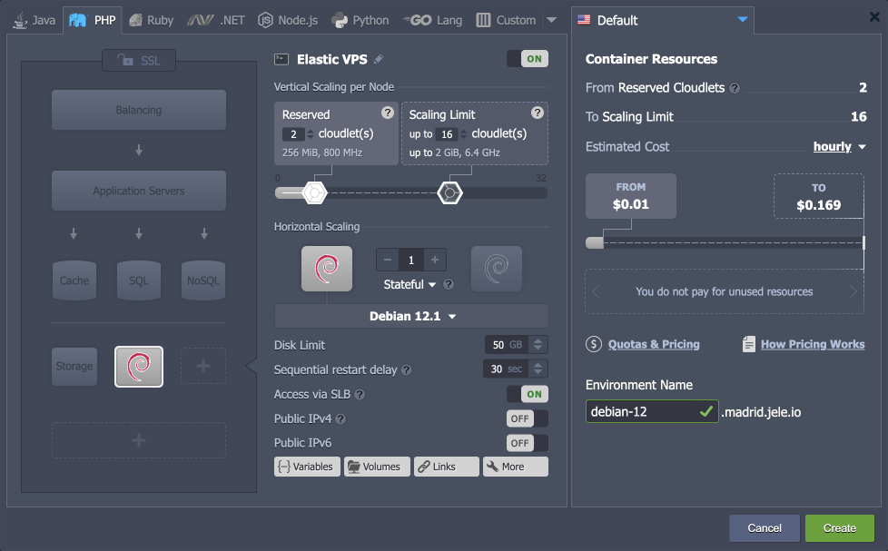
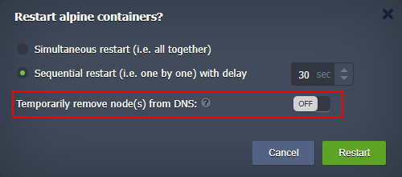

import obj from './ReleaseNotes8.4.json'

This document is preliminary and subject to change.

In this document, you will find all of the new features, enhancements and visible changes included to the **CloudMyDc PaaS 8.4** release.

    

New

    

        

            <h3 style={{
                fontSize: '23px',
                fontWeight: '500',
        }}>Ubuntu 23 Support</h3>
            
Implemented base OS template to support images based on the Ubuntu 23.04 version

            

                <a href="/platform-overview/release-notes/release-notes-8.4#ubuntu-23-support">
                    Learn More >>
                </a>
            

        

        

            <h3 style={{
                fontSize: '23px',
                fontWeight: '500',
        }}>Debian 12 Support</h3>
            
Implemented base OS template to support images based on the Debian 12 version

            

                <a href="/platform-overview/release-notes/release-notes-8.4#debian-12-support">
                    Learn More >>
                </a>
            

        

        

            <h3 style={{
                fontSize: '23px',
                fontWeight: '500',
        }}>Excluding Nodes from DNS during Sequential Actions</h3>
            
Added an option to exclude node from DNS when managing layers with scaled nodes

            

                <a href="/platform-overview/release-notes/release-notes-8.4#excluding-nodes-from-dns-during-sequential-actions">
                    Learn More >>
                </a>
            

        

    

    

.png>)

Changed

    

        

            <h3 style={{
                fontSize: '23px',
                fontWeight: '500',
        }}>Firewall ICMP Restriction</h3>
            
Configured firewall rules to block potentially harmful ICMP Timestamp requests

            

                <a href="/platform-overview/release-notes/release-notes-8.4#firewall-icmp-restriction">
                    Learn More >>
                </a>
            

        

        

            <h3 style={{
                fontSize: '23px',
                fontWeight: '500',
        }}>Environment-Associated Scripts</h3>
            
Implemented functionality to create persistent associations between the environments and deployed add-ons

            

                <a href="/platform-overview/release-notes/release-notes-8.4#environment-associated-scripts">
                    Learn More >>
                </a>
            

        

        

            <h3 style={{
                fontSize: '23px',
                fontWeight: '500',
        }}>Deactivated Account Improvements</h3>
            
Provided an ability for the deactivated users to remove their environment

            

                <a href="/platform-overview/release-notes/release-notes-8.4#deactivated-account-improvements">
                    Learn More >>
                </a>
            

        

        

            <h3 style={{
                fontSize: '23px',
                fontWeight: '500',
        }}>API Changes</h3>
            
Listed all the changes to the public platform API in the current release

            

                <a href="/platform-overview/release-notes/release-notes-8.4#api-changes">
                    Learn More >>
                </a>
            

        

        

            <h3 style={{
                fontSize: '23px',
                fontWeight: '500',
        }}>Software Stack Versions</h3>
            
Actualized list of supported OS templates and software stack versions

            

                <a href="/platform-overview/release-notes/release-notes-8.4#software-stack-versions">
                    Learn More >>
                </a>
            

        

    

    

.png>)

Fixed

    

        

            <h3 style={{
                fontSize: '23px',
                fontWeight: '500',
        }}>Fixes Compatible with Prior Versions</h3>
            
Bug fixes implemented in the current release and integrated into the previous platform versions through the appropriate patches

            

                <a href="/platform-overview/release-notes/release-notes-8.4#fixes-compatible-with-prior-versions">
                    Learn More >>
                </a>
            

        

        

            <h3 style={{
                fontSize: '23px',
                fontWeight: '500',
        }}>Bug Fixes</h3>
            
List of fixes applied to the platform starting from the current release

            

                <a href="/platform-overview/release-notes/release-notes-8.4#bug-fixes">
                    Learn More >>
                </a>
            

        

    

## Ubuntu 23 Support

The platform introduces support for the latest version of one of the most popular Linux distributions - **Ubuntu 23.04** (Lunar Lobster). The release introduces a lot of software updates, security improvements, and bug fixes for those who need the most up-to-date patches. However, if you prefer Long Term Support, it is recommended to stick with Ubuntu 22.04 LTS.

The Ubuntu 23.04 distribution support is automatically available through the appropriate [base operating system](/container/container-image-requirements#supported-os-distributions) template (for custom Docker containers).

:::tip Tip

Also, the Ubuntu 22.10 template was deprecated due to the version’s official end of life.

:::

[More info](/container/container-image-requirements#supported-os-distributions)

    <a href="/platform-overview/release-notes/release-notes-8.4">
        Back to the top
    </a>

## Debian 12 Support

The platform implements support for the **Debian 12** “bookworm” OS templates on all the PaaS installations (available for all platforms starting with the 8.4 release). It is the latest LTS (Long Term Support) version with an estimated support period of at least five years. The new release is focused on performance, stability, and ease of use. It provides a massive update of the default packages, creates a separate package archive for non-free firmware, extends architectures and kernel support, and introduces many other improvements, optimizations, and security fixes. For detailed information, refer to the official [Debian 12 release notes](https://www.debian.org/releases/bookworm/releasenotes).

Also, **Debian 12** was added as an out-of-box [Elastic VPS](/elastic-vps/elastic-vps-overview/debian-vps) stack in the platform dashboard.

[More info](/container/container-image-requirements#supported-os-distributions)

    <a href="/platform-overview/release-notes/release-notes-8.4">
        Back to the top
    </a>

## Firewall ICMP Restriction

The Internet Control Message Protocol (ICMP) is used for reporting errors and performing network diagnostics. However, some ICMP request types can be considered a minor security vulnerability that allows attackers to gain information on the remote host.

In the 8.4 release, the Virtuozzo Application Platform added rules to the default firewall configurations that block **ICMP Timestamp** request messages. Such an adjustment resolves a vulnerability that can potentially be exploited to probe the network to find live hosts, gather time/date information on the target host, or generate shared traffic to trick the intrusion detection system.

    <a href="/platform-overview/release-notes/release-notes-8.4">
        Back to the top
    </a>

## Excluding Nodes from DNS during Sequential Actions

Virtuozzo Application Platform provides an easy-to-use [horizontal scaling](/application-setting/scaling-and-clustering/horizontal-scaling) functionality for the containers, i.e. offering a quick high-availability option for users. Combined with the sequential configuration option that allows performing actions on nodes successively (so that at least one node remains operable), even intrusive operations like restart and redeploy can be performed without disrupting end-user experience.

However, even with the sequential option enabled, some connections can be lost in case of high traffic. In order to ensure application availability for all incoming requests, an additional suboption to “Temporarily remove node(s) from DNS” was implemented. If enabled, a node will be excluded from the DNS tables (internal and external) during the intrusive operation.

This new option is available during the following operations:

- nodes restart on the multi-node layer
- nodes redeploy on the multi-node layer

    <a href="/platform-overview/release-notes/release-notes-8.4">
        Back to the top
    </a>

## Environment-Associated Scripts

In the present 8.4 release, functionality to create a more firm association between the environment and deployed add-ons was implemented. The implementation creates the necessary persistence to support such cases as:

- all collaboration members can view and manage add-ons of the [shared environment](/environment-management/share-environment)
- add-ons' management is available to the new owner after [environment transferring](/environment-management/environment-transferring)

The following add-ons are already updated to benefit from this association functionality: Git-Push-Deploy, Start/Stop Scheduler, and Let’s Encrypt add-ons. However, please note that the change affects the new installations only.

    <a href="/platform-overview/release-notes/release-notes-8.4">
        Back to the top
    </a>

## Deactivated Account Improvements

The platform automatically deactivates an account after the trial period expires or if it runs out of funds. In **_deactivated_** [status](/account-and-pricing/account-statuses), all the environments are forcibly stopped till the balance is replenished to a positive value.

Starting with the current 8.4 PaaS release, the ability to manually delete environments on the deactivated account was added. It allows cleaning up an account before re-activation and removing environments immediately (no need to wait for automatic removal upon account destruction).

Also, the account activations process was improved as well. Now, it triggers immediately after refilling the balance (to a positive value) and automatically starts all the stopped environments.

    <a href="/platform-overview/release-notes/release-notes-8.4">
        Back to the top
    </a>

## API Changes

Below, you can find a list of all changes to the public API in the 8.4 platform version (compared to the preceding [8.3](/platform-overview/release-notes/release-notes-8.3) ones):

- Extended response of the GetSSLCerts method to provide information on SSL type. The new sslType parameter has two values:
  - _CUSTOM_ – for any certificates added via the dashboard or AddSslCert API call
  - _LETSENCRYPT_ – for certificates issued for resellers or regions
    The public API documentation review has been completed. All the services, methods, and parameters were provided with comprehensive descriptions to help new and existing users start using the platform’s API.

[More info](/container/container-image-requirements#supported-os-distributions)

    <a href="/platform-overview/release-notes/release-notes-8.4">
        Back to the top
    </a>

## Fixes Compatible with Prior Versions

Below, you can find the fixes that were implemented in the Virtuozzo Application Platform 8.4 release and also integrated into previous platform versions by means of the appropriate patches.

    

        CloudMyDc Application Platform 8.4
    

    

        

            

                #
            

            

               Compatible from
            

            

               Description
            
 
        

        {obj.data1.map((item, idx) => {
            return 

            

                {item.JE}
            

            

                {item.CompatibleFrom}
            

            

                {item.Desc}
            

        

        })}
    

    

        CloudMyDc Application Platform 8.4.2
    

    

        

            

                #
            

            

               Compatible from
            

            

               Description
            
 
        

        {obj.data2.map((item, idx) => {
            return 

            

                {item.JE}
            

            

                {item.CompatibleFrom}
            

            

                {item.Desc}
            

        

        })}
    

    <a href="/platform-overview/release-notes/release-notes-8.4">
        Back to the top
    </a>

## Software Stack Versions

The software stack provisioning process is independent of the platform release, which allows new software solutions to be delivered as soon as they are ready. However, due to the necessity to adapt and test new stack versions, there is a small delay between software release by its respective upstream maintainer and integration into Virtuozzo Application Platform.

The most accurate and up-to-date list of the certified [software stack versions](/quickstart/software-stack-versions) can be found on the dedicated documentation page.

[More info](/container/container-image-requirements#supported-os-distributions)

    <a href="/platform-overview/release-notes/release-notes-8.4">
        Back to the top
    </a>

## Bug Fixes

In the table below, you can see the list of bug fixes applied to the platform starting from Virtuozzo Application Platform 8.4 release:

    

        CloudMyDc Application Platform 8.4
    

    

        

            

                #
            

            

               Affected Versions
            

            

               Description
            
 
        

        {obj.data3.map((item, idx) => {
            return 

            

                {item.JE}
            

            

                {item.AffectedVersions}
            

            

                {item.Desc}
            

        

        })}
    

    <a href="/platform-overview/release-notes/release-notes-8.4">
        Back to the top
    </a>

