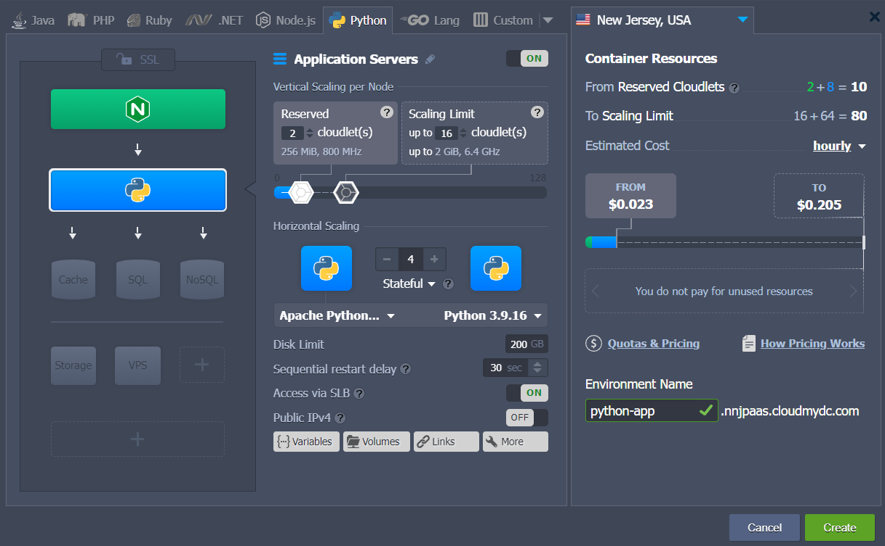
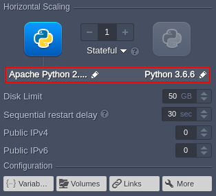
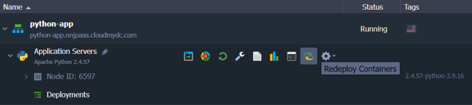
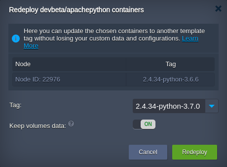
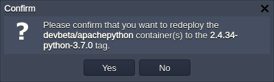

## Python Versions

The platform provides all the latest versions of the Python programming language and ensures a swift implementation of any further releases. The list of supported engine versions:

- _3.8.18_
- _3.9.18_
- _3.10.13_
- _3.11.6_
- _3.12.0_

:::tip

The up-to-date list of the releases available on the platform is provided via the dedicated, regularly (weekly) updated [Software Stack Versions](/docs/quickstart/software-stack-versions) document.

:::

These can be selected during a new [environment creation](/docs/Python/Python%20Versions#create-python-environment) and adjusted for [existing Python instances](/docs/Python/Python%20Versions#change-python-version).

## Create Python Environment

1. Access the topology wizard by clicking the **New Environment** button at the top of the dashboard.

2. Navigate to the **_Python_** programming language tab, where the **Apache Python** application server is automatically selected, and choose the required engine version (_2.7, 3.5, 3.6, 3.7, 3.8_, or _3.9_).

Adjust any other settings (e.g. [cloudlets limits](http://localhost:3000/docs/application-setting/scaling-and-clustering/automatic-vertical-scaling#automatic-vertical-scaling), [public IPs](http://localhost:3000/docs/application-setting/external-access-to-applications/public-ip#public-ip), [region](http://localhost:3000/docs/environment-management/environment-regions/choosing-a-region#environment-regions), etc.), provide environment name and click **Create**.

## Change Python Version

The version of the existing Python instances can be changed with the [container redeploy](/docs/category/container-deployment) feature.

1. The appropriate dialog can be accessed in the following ways:

- from the central part of the topology wizard (can be accessed with the **Change Environment Topology** button next to the appropriate environment)

- using the **Redeploy container(s)** button next to the required node or layer

2. Within the opened frame, you can adjust the following settings:

- **Tag** - select the needed Python engine version
- **Keep volumes data** - protect data in the volumes from erasing during redeploy
- **Simultaneous** or **Sequential deployment with delay** (for [scaled servers](http://localhost:3000/docs/application-setting/scaling-and-clustering/horizontal-scaling#horizontal-scaling-inside-the-cloud-multi-node) only) - choose whether all containers within a layer should be redeployed at once or one-by-one

Click **Redeploy** to proceed.

3. Confirm an action via the appeared pop-up window.

That’s it! In a minute the Python engine version of your container(s) will be updated.
