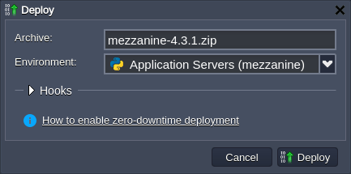
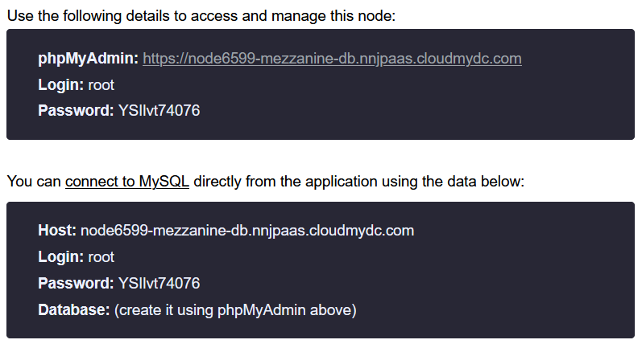

<!-- ## Mezzanine CMS: Python-Based Hosting with Jelastic PaaS -->

<div style={{
    display: 'grid',
    gridTemplateColumns: '0.15fr 1fr'
}}>
<div style={{
    width:'100%',
    height: '100%',
    display: 'flex',
    alignItems: 'center',
}}>


</div>

<div>

[Mezzanine CMS](https://github.com/stephenmcd/mezzanine) (content management system) is an open source, powerful and easy-to-use solution for content management and blogging. It is built on top of Django - Python-powered web-development framework - under the BSD license. The default functionality of the Mezzanine CMS allows covering the majority of common needs. At the same time, due to a vast number of third-party extensions, widgets, modules, and themes, the platform can be easily customized to suit customers specific needs.

</div>

</div>

Mezzanine CMS provide benefits for both developers and content managers:

- WYSIWYG editor with the Drag-and-Drop page ordering and visual content editing
- scheduled publishing
- a broad variety of ready-to-use themes
- rich API
- out-of-the-box Django internationalization, Twitter Bootstrap, Disqus, Akismet spam filter, Twitter feed, and Google Analytics support
- embedded integration with social networks, search engines, SEO functionality, and a huge number of modules
  So, today we’ll consider how to host such CMS at Jelastic PaaS.

## Create Python Environment

To host Mezzanine CMS, you need a Python-based application server. Let’s [create](/environment-management/setting-up-environment) a new environment with the Apache Python node:

1. Click the **New Environment** button at the top of the dashboard to access topology wizard.

<div style={{
    display:'flex',
    justifyContent: 'center',
    margin: '0 0 1rem 0'
}}>


</div>

2. Open the **Python** tab, where the required Apache Python application server will be selected by default.

<div style={{
    display:'flex',
    justifyContent: 'center',
    margin: '0 0 1rem 0'
}}>


</div>

:::tip Note

The Mezzanine CMS is not supported on **_Python 3.7_** yet and, also, on **_Python 2.7_** after the 1.4 release. Thus, it is recommended to select between the **_3.4-3.6_** engine versions.

:::

If needed, configure other settings (e.g. [cloudlet limit](/application-setting/scaling-and-clustering/automatic-vertical-scaling), [public IPs](/application-setting/external-access-to-applications/public-ip), [region](/environment-management/environment-regions/choosing-a-region), etc), type environment name and click **Create**.

3. Your environment will appear at the dashboard in a moment.

<div style={{
    display:'flex',
    justifyContent: 'center',
    margin: '0 0 1rem 0'
}}>


</div>

Now, you can proceed to the Mezzanine CMS application deployment (either automatically from the pre-packaged archive or manually).

## Mezzanine CMS Automatic Deployment

You can automatically deploy Mezzanine CMS using a specially prepared deployment archive with the latest application version (i.e. 4.3.1) already configured with SQLite database.

:::tip Note

If configuring own deployment archive, please ensure your Mezzanine CMS package contains the following files in its root:

- **_requirements.txt_** file with the names of all the Python modules your application requires, it will be read by the deployment script to install the listed modules via the **_pip_** manager automatically
- **_wsgi.py_** file with the entry point script for running your application inside a virtual environment by means of the mod_wsgi for Apache

:::

1. Add application archive to the [deployment manager](/deployment/deployment-manager) via the following link:

<a href="https://download.jelastic.com/public.php?service=files&amp;t=3d6fa1ed641a044c6a291bbeaa6c333c&amp;download" target="_blank" rel="noopener noreferrer external" data-wpel-link="external"><i>https://download.jelastic.com/public.php?service=files&amp;t=3d6fa1ed641a044c6a291bbeaa6c333c&amp;download</i></a>

<div style={{
    display:'flex',
    justifyContent: 'center',
    margin: '0 0 1rem 0'
}}>


</div>

2. [Deploy](/deployment/deployment-guide) Mezzanine CMS into the environment with the Apache Python application server.

<div style={{
    display:'flex',
    justifyContent: 'center',
    margin: '0 0 1rem 0'
}}>



</div>

3. After successful deployment, click **Open in Browser** next to your environment.

<div style={{
    display:'flex',
    justifyContent: 'center',
    margin: '0 0 1rem 0'
}}>


</div>

4. That’s all, your Mezzanine CMS is up and running in just a few minutes!

<div style={{
    display:'flex',
    justifyContent: 'center',
    margin: '0 0 1rem 0'
}}>


</div>

Start working with your Mezzanine CMS application (the default credentials for the admin panel are - **_admin_**/**_default_**).

## Mezzanine CMS Manual Deployment

The process of the Mezzanine CMS deployment can be divided into three steps: installation, database configuration, and starting.

## Install Mezzanine CMS

1. Connect to your application server via **[Web SSH](/deployment-tools/ssh/ssh-access/web-ssh)**:

<div style={{
    display:'flex',
    justifyContent: 'center',
    margin: '0 0 1rem 0'
}}>


</div>

2. It is a common practice to run Python web applications in the isolated virtual environments, using the **virtual environment** tool, which allows managing projects’ dependencies independently and without the administrator privileges.

Create and start a new virtual environment with the next command:

_virtualenv virtenv_
_source virtenv/bin/activate_

<div style={{
    display:'flex',
    justifyContent: 'center',
    margin: '0 0 1rem 0'
}}>


</div>

3. Use the **_pip_** package manager to download Mezzanine content manager:

_pip install mezzanine_

<div style={{
    display:'flex',
    justifyContent: 'center',
    margin: '0 0 1rem 0'
}}>


</div>

:::tip Note

On the servers with the **_Python 2.7_** version, you should define the appropriate Mezzanine version explicitly, i.e. pip install mezzanine==1.4.

:::

4. Let’s remove the default application in the **ROOT** context and install the Mezzanine project instead:

_rm -rf ROOT_
_mezzanine-project ROOT_

<div style={{
    display:'flex',
    justifyContent: 'center',
    margin: '0 0 1rem 0'
}}>


</div>

Now, you need to configure a database for the application.

## Configure Database

You have two main options when selecting a database for Mezzanine CMS:

- **_SQLite_** is a default solution, which is implemented by default and does not require any additional configurations (data will be stored locally in **_~/ROOT/db.sqlite3_**); it is suitable for the development and testing purposes
- **_external SQL database_** (e.g. MySQL or PostgreSQL) is much more a more secure option, which provides greater scalability; it is recommended for the production environment

If the first option is sufficient for you, skip this section and proceed to the **Run Mezzanine CMS** one. As for the usage of the external database, you can find a detailed step-by-step guide on the required adjustments in the steps below:

1. Create the desired database instance. For example, we’ll add the **MySQL** server to the separate environment.

<div style={{
    display:'flex',
    justifyContent: 'center',
    margin: '0 0 1rem 0'
}}>


</div>

2. Log into your database admin panel with credentials from the appropriate email (automatically sent after DB node creation).

<div style={{
    display:'flex',
    justifyContent: 'center',
    margin: '0 0 1rem 0'
}}>



</div>

3. Switch to the **User accounts** tab and click the Add user account link to create a new account, which will be used by the Mezzanine CMS application to access a database.

<div style={{
    display:'flex',
    justifyContent: 'center',
    margin: '0 0 1rem 0'
}}>


</div>

4. Within the opened page, specify the preferable User _name/Password_ and tick the _Create database with same name and grant all privileges checkbox_.

<div style={{
    display:'flex',
    justifyContent: 'center',
    margin: '0 0 1rem 0'
}}>


</div>

Scroll down and click **Go**.

5. Return to the dashboard and open the **_/var/www/webroot/ROOT/ROOT/local_settings.py_** file. Find the **_DATABASES_** section and provide your DB access credentials:

```bash
DATABASES = {
    "default": {
        "ENGINE": "django.db.backends.mysql",
        "NAME": "mezzanine",
        "USER": "mezzanine",
        "PASSWORD": "passw0rd",
        "HOST": "node23132-mezzanine-db.jelastic.com",
        "PORT": "3306",
    }
}
```

<div style={{
    display:'flex',
    justifyContent: 'center',
    margin: '0 0 1rem 0'
}}>


</div>

Here:

- **ENGINE** - change to the database type to django.db.backends.mysql (or the django.db.backends.postgresql_psycopg2 one for the **PostgreSQL** database)
- **NAME**, **USER**, **PASSWORD** - provide the data on the dedicated DB and account (the ones created in the previous step)
- **HOST** - get the value from the appropriate email
- **PORT** - set the default 3306 port (or 5432 for **PostgreSQL**)

**Save** changes.

6. Lastly, you need to install MySQL connector for Python. Run the next command via **Web SSH**:

`pip install mysqlclient`

<div style={{
    display:'flex',
    justifyContent: 'center',
    margin: '0 0 1rem 0'
}}>


</div>

:::tip Note

To install the Python connector for the **_PostgreSQL_** database, get the psycopg2 module using **_pip_**:
PATH=$PATH:/usr/pgsql-9.6/bin/ pip install psycopg2
If needed, modify the **_pgsql-9.6_** part according to the used version of the PostgreSQL server.

:::

## Start Mezzanine CMS

After your DB is prepared, you need to create the application database schema.

1. Enter the **~/ROOT** folder and run the **_manage.py_** script.

```bash
cd ROOT
python manage.py createdb --noinput
```

<div style={{
    display:'flex',
    justifyContent: 'center',
    margin: '0 0 1rem 0'
}}>


</div>

django framework

The usage of the _--noinput_ parameter, automatically creates a Mezzanine admin account with the **_admin/default_** credentials.

2. The **_mod_wsgi_** is used to run the application, so adjust the appropriate **_/var/www/webroot/ROOT/ROOT/wsgi.py_** file as follows:

```bash
import os,sys
virtenv = os.path.expanduser('~') + '/virtenv/'
virtualenv = os.path.join(virtenv, 'bin/activate_this.py')
try:
 if sys.version.split(' ')[0].split('.')[0] == '3':
  exec(compile(open(virtualenv, "rb").read(), virtualenv, 'exec'), dict(__file__=virtualenv))
 else:
  execfile(virtualenv, dict(__file__=virtualenv))
except IOError:
 pass
sys.path.append(os.path.expanduser('~'))
sys.path.append(os.path.expanduser('~') + '/ROOT/')
sys.path.append(os.path.expanduser('~') + '/ROOT/ROOT/')
os.environ['DJANGO_SETTINGS_MODULE'] = 'ROOT.settings'
from django.core.wsgi import get_wsgi_application
from mezzanine.utils.conf import real_project_name
application = get_wsgi_application()
```

<div style={{
    display:'flex',
    justifyContent: 'center',
    margin: '0 0 1rem 0'
}}>


</div>

Don’t forget to **Save** changes.

3. Configure symlink to the file and, also, collect a static content with the following commands (run from the **~/ROOT** folder):

```bash
ln -sfT ~/ROOT/ROOT/wsgi.py ~/ROOT/wsgi.py
python manage.py collectstatic
```

<div style={{
    display:'flex',
    justifyContent: 'center',
    margin: '0 0 1rem 0'
}}>


</div>

Now, application static content is stored in the **~/ROOT/static** directory.

4. Open the **_/var/www/webroot/ROOT/ROOT/local_settings.py_** file and adjust the ALLOWED_HOSTS record by providing your environment domain name:

```
ALLOWED_HOSTS = ["{envDomain}"]
```

<div style={{
    display:'flex',
    justifyContent: 'center',
    margin: '0 0 1rem 0'
}}>


</div>

5. That’s it! Click the **Open in Browser** button next to your environment to access Mezzanine CMS.

<div style={{
    display:'flex',
    justifyContent: 'center',
    margin: '0 0 1rem 0'
}}>


</div>

6. Application’s welcome page will be opened by default.

<div style={{
    display:'flex',
    justifyContent: 'center',
    margin: '0 0 1rem 0'
}}>


</div>

Follow the Log in to the admin interface hyperlink to access the admin panel.

7. Log in with the default admin account credentials (i.e. **admin**/**default**).

<div style={{
    display:'flex',
    justifyContent: 'center',
    margin: '0 0 1rem 0'
}}>


</div>

:::tip Tip

For security reasons, it is recommended to change your default password immediately after the first log in.

:::

Here, you can immediately start managing your site, e.g by adding new or changing existing pages. Explore the broad variety of possibilities provided by Mezzanine CMS with Jelastic PaaS.
