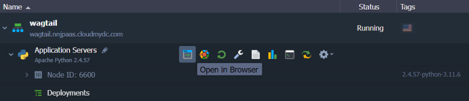
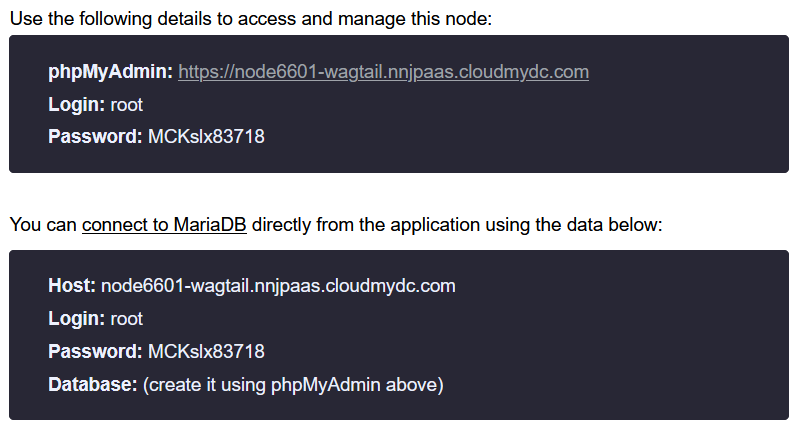
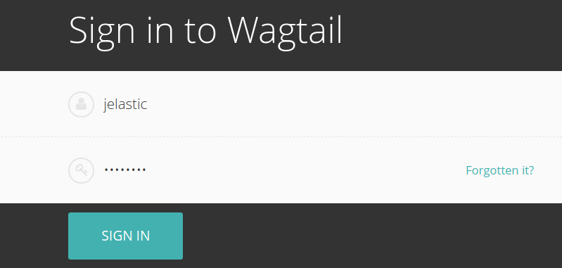

## Deploy Wagtail Python-Based CMS into Jelastic PaaS

<div style={{
    display: 'grid',
    gridTemplateColumns: '0.15fr 1fr'
}}>
<div>


</div>

<div>

[Wagtail CMS](https://wagtail.org/) (content management system) is a simple and agile [Django-powered CMS](https://www.djangoproject.com/), which offers a convenient and intuitive interface for editors to create and structure website content. Wagtail is published under the BSD license, which provides you as much freedom as possible. The exceptional performance and optimization of this CMS ensure lightning-fast page loading and searches. With the advantages of Wagtail, you can spend less time on configuring your site and more on perfecting your project (using a vast number of tools in the administration panel for working with content).

</div>

</div>

This article describes how to deploy Wagtail CMS into your Jelastic Python environment.

## Create Python Environment

To start with, you need to create an environment with the appropriate application server - the Apache web server with the Python engine.

1. To create **New Environment**, log into your Jelastic dashboard and click the same-named button at the top-left corner.

<div style={{
    display:'flex',
    justifyContent: 'center',
    margin: '0 0 1rem 0'
}}>


</div>

2. In the opened topology wizard, switch to the **Python** tab and choose the required Python version for the automatically selected Apache application server node.

<div style={{
    display:'flex',
    justifyContent: 'center',
    margin: '0 0 1rem 0'
}}>


</div>

:::tip Note

The latest Wagtail CMS versions support the Python 3.x only. On the Python 2.7 instances, run the 1.13 version of the application.

Configure all other settings up to your need (e.g. [cloudlet limit](/docs/application-setting/scaling-and-clustering/automatic-vertical-scaling), disk space, [region](/docs/environment-management/environment-regions/choosing-a-region), etc), set the desired domain name and click the Create button.

3. Wait a minute for your environment to be created.

<div style={{
    display:'flex',
    justifyContent: 'center',
    margin: '0 0 1rem 0'
}}>



</div>

Now, you are ready to start the Wagtail CMS application deployment. Below, we’ll overview how to deploy it automatically using the pre-packaged archive and manually from scratch.

## Wagtail CMS Automatic Deployment

We’ve prepared a deployment archive with already configured Wagtail CMS of the latest version available at the moment (i.e. 2.2) and SQLite database, which can be installed in a matter of minutes without any manual configurations required.

:::tip Note

If configuring own deployment archive, please ensure your Wagtail CMS package contains the following files in its root:

- **_requirements.txt_** file with the names of all the Python modules your application requires, it will be read by the deployment script to install the listed modules via the **_pip_** manager automatically
- **_wsgi.py_** file with the entry point script for running your application inside a virtual environment by means of the mod_wsgi for Apache

:::

1. Upload the package with your Wagtail CMS application into your [deployment manager](https://cloudmydc.com/) via the following link:

`https://download.jelastic.com/public.php?service=files&t=b01aabf6a7fb615884c27eb4101e5150&download 
`

<div style={{
    display:'flex',
    justifyContent: 'center',
    margin: '0 0 1rem 0'
}}>


</div>

2. [Deploy this archive](/docs/deployment/deployment-guide) into your **_Python 3.x_** environment.

<div style={{
    display:'flex',
    justifyContent: 'center',
    margin: '0 0 1rem 0'
}}>


</div>

3. After the operation is finished, select the **Open in Browser** button next to your environment.

<div style={{
    display:'flex',
    justifyContent: 'center',
    margin: '0 0 1rem 0'
}}>


</div>

4. That’s all! Now you can enjoy working with your Wagtail CMS application (the default credentials for the admin panel are - **_admin / verysecurepasswordforadmin)_**.

<div style={{
    display:'flex',
    justifyContent: 'center',
    margin: '0 0 1rem 0'
}}>


</div>

Enjoy your Wagtail CMS hosted at Jelastic PaaS!

## Wagtail CMS Manual Deployment

For the manual Wagtail CMS application deployment, we’ve divided the process into three major steps: application installation, database configuration and running Wagtail CMS.

## Install Wagtail CMS

1. Access your Apache application server via SSH. For example, we’ll utilize the inbuilt **[Web SSH](https://cloudmydc.com/)** tool.

<div style={{
    display:'flex',
    justifyContent: 'center',
    margin: '0 0 1rem 0'
}}>


</div>

2. It is a common practice to run Python web applications in isolated **virtual environments**, using the virtual environment tool. It allows keeping the dependencies required by different projects in separate places and manage them without the administrator privileges.

So, perform the following to create and activate a new virtual environment:

```bash
virtualenv virtenv
source virtenv/bin/activate
```

<div style={{
    display:'flex',
    justifyContent: 'center',
    margin: '0 0 1rem 0'
}}>


</div>

3. Now, download the Wagtail CMS installer using the pip package manager for Python:

`pip install wagtail`

<div style={{
    display:'flex',
    justifyContent: 'center',
    margin: '0 0 1rem 0'
}}>


</div>

:::tip Note

If running the **_Python 2.7_** instance, you need to specify the appropriate application version in your command explicitly, i.e. _pip install wagtail==1.13_.

:::

4. We are going to install the application to the **ROOT** context, so the existing folder (with the default application) should be removed beforehand:

```bash
rm -rf ROOT
wagtail start ROOT
```

<div style={{
    display:'flex',
    justifyContent: 'center',
    margin: '0 0 1rem 0'
}}>


</div>

Next, you need to choose and configure a database.

## Configure Database

As all the Django-based applications, Wagtail CMS supports different types of databases:

- **_SQLite_** is a default option, which does not require any additional configurations (data will be stored locally in **_~/ROOT/db.sqlite3_**); being fast, simple and light-weight, it is great for development and testing purposes
- **_external database_** (e.g. MySQL or PostgreSQL) is a more suitable solution for the production environment; it ensures a sufficient level of security and scalability

Below, we’ll provide a step-by-step guide on connecting the external database to your Wagtail CMS application. Herewith, if the first option is sufficient for your purposes, skip this section and proceed to the next **[Run Wagtail CMS](https://cloudmydc.com/)** one.

1. Create the desired database instance. For example, use the **Change Environment Topology** button to add the **MariaDB** server to your environment with the Wagtail CMS installed.

<div style={{
    display:'flex',
    justifyContent: 'center',
    margin: '0 0 1rem 0'
}}>


</div>

2. Open the database admin panel and log in with credentials from the appropriate email (automatically sent after DB node creation).

<div style={{
    display:'flex',
    justifyContent: 'center',
    margin: '0 0 1rem 0'
}}>



</div>

3. Navigate to the **User accounts** tab to create a user for accessing the Wagtail CMS database by clicking the Add user account link.

<div style={{
    display:'flex',
    justifyContent: 'center',
    margin: '0 0 1rem 0'
}}>


</div>

4. Within the opened frame, specify the _User name/Password_ and tick the Create database with _same name and grant all privileges checkbox_.

<div style={{
    display:'flex',
    justifyContent: 'center',
    margin: '0 0 1rem 0'
}}>


</div>

Click **Go** at the bottom of the page.

5. Return to the dashboard and open the **_/var/www/webroot/ROOT/ROOT/settings/base.py_** file. Locate the **_DATABASES_** section and add DB access credentials within the same section (as it is shown below):

```bash
  DATABASES = {
   'default': {
       'ENGINE': 'django.db.backends.mysql',
       'NAME': 'wagtail',
       'USER': 'wagtail',
       'PASSWORD': 'passw0rd',
       'HOST': 'node22551-wagtail.jelastic.com',
       'PORT': '3306',
   }
}
```

<div style={{
    display:'flex',
    justifyContent: 'center',
    margin: '0 0 1rem 0'
}}>


</div>
Here:

- **ENGINE** - change to the _django.db.backends.mysql_ value

:::tip Note

For the PostgreSQL database, use the django.db.backends.postgresql_psycopg2 value.

:::

- **NAME**, **USER**, **PASSWORD** - provide the data on the DB and account created in the previous step
- **HOST** - get the value from the appropriate email
- **PORT** - set the default 3306 port (or 5432 for **PostgreSQL**)

Don’t forget to **Save** changes.

6. Lastly, install the MySQL connector for Python via Web SSH (from the **_~/ROOT_** folder):

`pip install mysqlclient`

<div style={{
    display:'flex',
    justifyContent: 'center',
    margin: '0 0 1rem 0'
}}>


</div>

:::tip Note

To install the Python connector for the **_PostgreSQL_** database, get the psycopg2 module using **pip\***:PATH=$PATH:/usr/pgsql-9.6/bin/ pip install psycopg2\*
If needed, modify the **_pgsql-9.6_** part according to the used version of the PostgreSQL server.

:::

## Run Wagtail CMS

After your DB is prepared, you need to create the application database schema.

1. Enter the **~/ROOT** folder and run the **_manage.py_** script.

```bash
cd ROOT
python manage.py migrate
```

<div style={{
    display:'flex',
    justifyContent: 'center',
    margin: '0 0 1rem 0'
}}>


</div>

2. Next, set the admin credentials for the Wagtail CMS control panel:

```bash
python manage.py createsuperuser
```

<div style={{
    display:'flex',
    justifyContent: 'center',
    margin: '0 0 1rem 0'
}}>


</div>

In the dialog, you need to provide the Username, Email address and Password with confirmation.

3. To run the application we are using **_mod_wsgi_**, so the wsgi handler should be created.

Enter the **_/var/www/webroot/ROOT_** directory and create the **_wsgi.py_** file with the following content there:

```bash
import os,sys
virtenv = os.path.expanduser('~') + '/virtenv/'
virtualenv = os.path.join(virtenv, 'bin/activate_this.py')
try:
  if sys.version.split(' ')[0].split('.')[0] == '3':
      exec(compile(open(virtualenv, "rb").read(), virtualenv, 'exec'), dict(__file__=virtualenv))
  else:
      execfile(virtualenv, dict(__file__=virtualenv))
except IOError:
  pass
sys.path.append(os.path.expanduser('~'))
sys.path.append(os.path.expanduser('~') + '/ROOT/')
sys.path.append(os.path.expanduser('~') + '/ROOT/ROOT/')
os.environ['DJANGO_SETTINGS_MODULE'] = 'ROOT.settings.dev'
from django.core.wsgi import get_wsgi_application
application = get_wsgi_application()
```

<div style={{
    display:'flex',
    justifyContent: 'center',
    margin: '0 0 1rem 0'
}}>


</div>

**Save** the newly created file.

4. Also, as we want to serve static content by our Apache Python server, we need to collect such content (run from the **~/ROOT** folder):

```bash
python manage.py collectstatic
```

<div style={{
    display:'flex',
    justifyContent: 'center',
    margin: '0 0 1rem 0'
}}>


</div>

After performing this action, all the static content of the current application is stored in the **~/ROOT/static** directory.

5. That’s all! Now, you can click the **Open in Browser** button next to your environment with Wagtail CMS.

<div style={{
    display:'flex',
    justifyContent: 'center',
    margin: '0 0 1rem 0'
}}>


</div>

6. As a result, you will see the application’s welcome page.

<div style={{
    display:'flex',
    justifyContent: 'center',
    margin: '0 0 1rem 0'
}}>


</div>

Click the **_here_** hyperlink to access the admin panel.

7. Log in using the credentials specified during the installation process.

<div style={{
    display:'flex',
    justifyContent: 'center',
    margin: '0 0 1rem 0'
}}>



</div>

Now, you can use the functionality of the admin panel to create pages and fill them with the content.

<div style={{
    display:'flex',
    justifyContent: 'center',
    margin: '0 0 1rem 0'
}}>


</div>

Jelastic provides you with great possibilities in deploying and serving Django-based Python applications such as Wagtail CMS. Get started easily at jelastic.cloud
