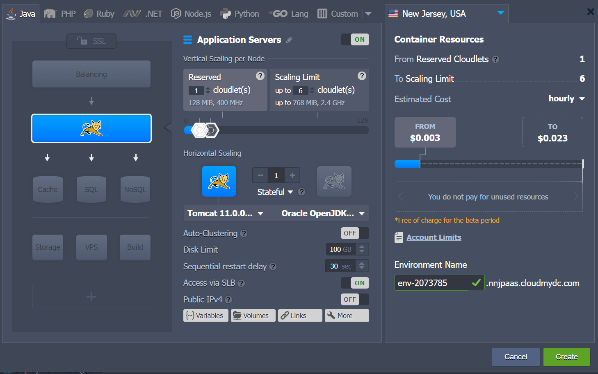
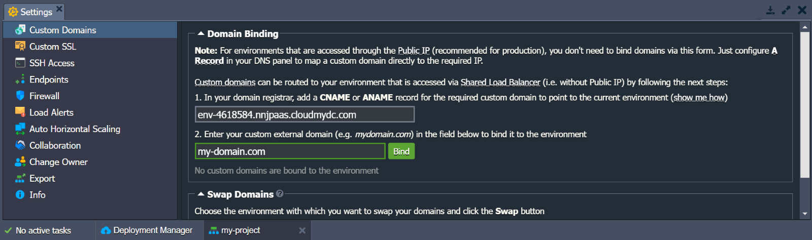
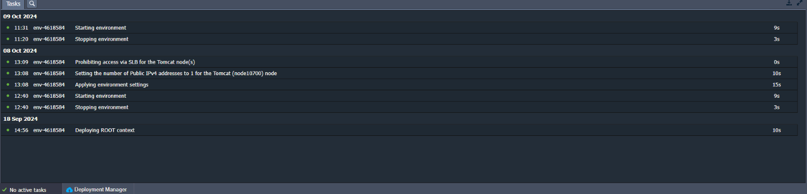
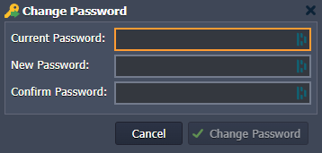

This guide offers essential information on using the platform dashboard and familiarizes you with its available features.

:::tip Tip

An interactive tutorial is accessible within the dashboard under **Help >** [Tutorial](https://cloudmydc.com/) in the top-right corner.

:::

## Setting up and Managing Environments

1. Click **New Environment** in the upper left corner of the dashboard.

2. The **Topology Wizard** will open, allowing you to customize your environment settings in detail.

3. After setting up the configurations, name your environment and click on the create button.

4. All of your environments will be listed in the central panel of the dashboard.

**The following information is available in the columns:**

- **Name** - Displays the name (or [alias](/environment-management/environment-aliases) if specified) of the environment along with its domain. You can expand the list of nodes by clicking the arrow icon next to the environment name.
- **Status** - Indicates the current state of your environments (e.g., Running, Sleeping, Stopped, Creating, Launching, Stopping, Cloning, Redeploying, Exporting, Installing, Migrating, Deleting).
- **Tags** - Shows [Environment Groups](/quickstart/dashboard-guide#environment-groups) the [region](/environment-management/environment-regions/choosing-a-region) of the environment, versions (tags) , and the name of the deployed project.
- **Usage** - Reflects the current load, including cloudlet and disk space usage. .

## Function Icons for Environments

Hover over a running environment to see various management icons: _Set Alias, Open in Browser, Settings, Change Environment Topology, Clone Environment, Start/Stop, and Delete Environment._

- **Set Alias:** Use this icon to give the [environment a new name](/account-and-pricing/resource-charging/monitoring-consumed-resources) (the domain will stay the same).

- **Open in Browser:** Click this  icon to open the environment in a new browser tab.

- **Settings:** Click this  icon to access a new tab with several [configuration panels](/quickstart/dashboard-guide#environment-settings).

- **Change Environment Topology":** Select the  option from the menu. Make your changes in the Topology Wizard dialog and click **Apply** to save.

- **Clone Environment:** Click the clone button  enter a name for the new environment in the popup, and click **Clone** to create it.

- To change the environment's status, use the Start  and Stop  buttons from the menu.

- To delete the environment, click the  icon in the dropdown menu and confirm the action by entering your password.

- Hover over the Tags column to manage [environment groups](/quickstart/dashboard-guide#environment-groups) using the **Env Groups**  dropdown menu .

The platform allows you to create _Environment Groups_ to help categorize your environments. This makes managing multiple projects much easier, as each project can be organized into its own dedicated group.

:::tip Note

When the environment is stopped, only the **Settings, Clone Environment, Start**, and **Delete** buttons are available .

In the [Settings](/environment-management/cloning-environment) tab for a stopped environment, you’ll find the following active options: Collaboration, Change Owner, Load Alerts, Auto Horizontal Scaling and Info.

:::

## Environment Settings

The environment **Settings** tab has eleven options: _Custom Domains, Custom SSL, SSH Access, Endpoints, Firewall, Load Alerts, Auto Horizontal Scaling, Collaboration, Change Owner, Export, and Info_.

1.**Custom Domains:** To access sub-options for _Domain Binding and Swap Domains_.

l

2. **Custom SSL:** Choose to upload the necessary files to apply for your custom SSL certificate.

3. **SSH Access:**

- Public Keys: Manage your [public SSH keys](/deployment-tools/ssh/add-ssh-key).
- SSH Connection: Instructions for accessing your environment via SSH Gate or Web SSH.
- SFTP/Direct SSH Access: Details on SFTP/FISH protocol connections.

4.  **Endpoints:** Manage TCP/UDP port mapping for your containers to connect with external resources.

5. **Firewall:** Set _Inbound_ and _Outbound Rules_ to control access to your containers, specifying which connections are allowed or blocked.

6. **Load Alerts:** Set or adjust triggers to receive email notifications when resource usage exceeds defined limits.
   The **History** tab lists all the triggered alerts with the details.

7. **Auto Horizontal Scaling:** Configure triggers to control the number of containers based on CPU, Memory, Network, Disk I/O, and Disk IOPS consumption.
   The History tab displays all scaling operations triggered by these settings.

8.**Collaboration:**

- View and manage accounts that have access to the environment.
- To grant access to another user, click Add, enter their email, and select permissions.
- Click **Save** to apply changes.

9. **Change Owner:** Transfer the environment to another user account within the same platform.

10.**Export:** Download all environment settings and data into a single file, which can be restored on another hosting provider to create an identical environment.

11.**Info:** View details about the environment including its _Domain , Owner, Creator, [Region](/environment-management/environment-regions/choosing-a-region), and Creation Date_.

That concludes the environment settings.

## Function Icons for Each Instance

Click on the environment in the dashboard to view its [components](/platform-overview/basics-&-terminology#layer) , such as application servers, and databases. You can expand these groups to manage individual containers, deployed contexts, and attached IP addresses.

Hover over a specific component or container to see pop-up icons that indicate different functions.

**Use these options to perform the following actions:**

- Click the **Set Alias** button to assign an [alternative name](/environment-management/environment-aliases) to your component/node (e.g., to define primary and secondary servers in a DB cluster).
- Use **Open in Browser** to access a node of the component in a new browser tab (this option may be hidden for some stacks, like Shared Storage or Maven build nodes).
- Select **Restart Node(s)** to restart the appropriate service within a specific container or all containers in the component.
- Choose **Config**  to open the [configuration file manager](/application-setting/configuration-file-manager), allowing you to adjust nodes by [mounting data](/data-storage-container/data-sharing/mount-points), creating/uploading new files, and modifying/removing existing ones.
- Select **Log**  to view the log files for the nodes in the component. The list of [log files](/application-setting/built-in-monitoring/log-files) varies based on the selected instance.
- Click **Statistics**  to monitor [real-time data](/application-setting/built-in-monitoring/statistics) on CPU, RAM, Network, Disk space, and IOPS consumption for a specific node or a group of nodes.
- Select **Web SSH**  to connect to your [container via SSH](/deployment-tools/ssh/ssh-access/web-ssh) directly in the browser.
- Use the **Redeploy Container(s)**  option to [update nodes](/category/container-deployment) to the preferred tag (version).
- Some nodes can have additional options, such as **Add-Ons**  (for installing pluggable modules) for installing pluggable modules.
- The **Additionally**  list allows you to configure [container settings](/container/container-configuration/configuration-tools) (_Variables, Links, Volumes, CMD / Entry Point_), view SFTP / Direct SSH Access details, and access Scaling Nodes functionality. Depending on the node, it may also include other options (_e.g. Reset Password or Admin Panel Login_).

## Import

- Next to the _New Environment_ option, you can find the **Import**  list allows you to configure [container settings](/container/container-configuration/configuration-tools) button. This allows you to upload a **_.json_**, **_.jps_**, **_.cs_**, **_.yml_**, or **_.yaml_** file to create a new environment or modify an existing one based on the provided settings.

:::tip Tip

This feature can be used to create a copy of the environment from another PaaS installation (by [exporting](/environment-management/environment-export-and-import/environment-export) it from one platform and [importing](/environment-management/environment-export-and-import/environment-import) it to another).

:::

In the opened **Import** frame, you’ll see three tabs along with an _[Examples](https://github.com/jelastic-jps)_ link to the JPS Collection containing various ready-to-use solutions:

- **Local File** - Select a file stored on your local machine using the Browse button. This file will be uploaded and executed on the platform.
- **URL** - Enter a direct link to the desired manifest file.
- **JPS** - Use the built-in JSON/YAML editor to insert and edit your code before deployment, or even create your package from scratch.

## Marketplace

Clicking **Marketplace** option at the top of the dashboard will open a separate window displaying a list of pre-packaged solutions available for automatic installation.

These packages are organized into two groups:

**Applications**\_ for creating new environments.

**Add-Ons** for modifying existing ones.

You can search for a specific solution using the search field in the top-left corner or browse through the categorized list in the left-hand menu.

Once you’ve found the desired package, click **Install** and follow the steps in the installation frame that appears.

## Dashboard Search

The platform includes a built-in search feature in the dashboard.  
To use it, go to the search form at the top-right corner or press _Ctrl+F (Cmd+F on Mac)_ .
Enter your search term and press Enter. You can search for items like a container by its IP or ID, specific deployed projects or environments, and applications in the [platform Marketplace](/deployment-tools/cloud-scripting-&-jps/marketplace).

## Deployment Manager

The Deployment Manager is located at the bottom of the dashboard. It helps automate the deployment of applications to your environments.

There are two main sections within the tab:

- _[Archive](/deployment/deployment-manager#application-archives)_  - This stores the application package itself. You can **Upload** it from your local machine (Local File) or via any external link (URL)

- _[Git / SVN](/deployment/deployment-manager#git--svn-projects)_  - This section saves your access credentials for remote Git or SVN repositories. Click the **Add Repo** button and enter the necessary details.

Once you add your package to the Deployment Manager, you can [automatically deploy](/deployment/deployment-guide) deploy it to the desired environment.

:::tip Notes

- the VCS deployment type for Java application servers is performed with the help of the [Maven build node](/java/build-node/java-vcs-deployment-with-maven)
- the [.NET deployment process](/windows-and-.NET/dot-net-core) for the Windows-based IIS application server is different from the standardized flow

:::

## Tasks Panel

The _Tasks panel_ is located at the bottom of the dashboard. It provides real-time and historical data on tasks that the platform is currently performing or has completed

You can expand a task to see the action parameters and server response after it’s completed.
There’s a button that appears when you hover over these sections, making it easy to copy the content.

Using the **Tasks** panel, you can always track the activity on your account, as well as troubleshoot issues. -->

To view a complete list of actions performed on your account (not just recent ones), switch to the _Active Log tab_ (
icon). This section offers advanced search and filter options to help you quickly find the tasks you need.

## User Settings

Click the **Settings** button at the top-right corner of the dashboard to access **_User Settings_** .

The **Account** section lets you manage [two-factor authentication](/account-and-pricing/two-factor-authentication) and change your password.

In the **_Access Tokens_** tab, you can set up [personal access tokens](/account-and-pricing/personal-access-tokens) for your account.

The **SSH Keys** and **SSH Access** section contains four sub-tabs:

- **Public Keys** - This stores the [public keys](/deployment-tools/ssh/add-ssh-key) added to the platform, needed for remote access via a local SSH client.
- **Private Keys** -This lists the [private keys](/deployment/ssh-access-to-git-repository) added to the platform , necessary for accessing your private Git repository over SSH.
- **SSH Connection** - This provides the steps to connect to your account via [SSH Gate](/deployment-tools/ssh/ssh-access/ssh-gate) and allows direct access to specific nodes in the browser using [Web SSH](/deployment-tools/ssh/ssh-access/web-ssh).
- **SFTP / Direct SSH Access** - This displays connection data for [SFTP/FISH protocols](/deployment-tools/ssh/ssh-protocols).

The **Collaboration** section has two options - **Shared by Me** and **Shared with Me**.

**'Shared By Me'** ets you share your environments with other users on the platform.

**'Shared With Me** lists the collaborations you are involved in.

## Help and Account Overview

The last two sections of the dashboard are **Help** and **Account** (email address).

1. The **Help** drop-down menu includes multiple useful links:

- **Contact Support:** Redirects to the platform customers support page.
  

- **Go to Community:** Links to the PaaS online community on [Stackoverflow](https://stackoverflow.com/nocaptcha?s=722a305e-abdf-4aa5-aaa3-570a78a9e6a4).
- **Documentation:** Directs to the [Platform Devs Documentation](https://docs.cloudmydc.com).
- **API:** Opens the [Platform API Documentation](https://docs.cloudmydc.com).
- **CLI:** Redirects to the [Platform Command-Line Interface Overview](/deployment-tools/api-&-cli/platform-cli/platform-cli-overview).
- **Video:** Links to the [Platform YouTube Channel](https://www.youtube.com/user/JelasticCloud).
- **Tutorial:** starts a short, [interactive guide](/quickstart/welcome-tutorial), that explains the basics of using with the platform
- **How do I..?** Displays a list of documents relevant to your request.

  2.In the **Account** (email address) drop-down menu, you can find the following options
  

- **Settings:** Redirects you to the [User Settings](/quickstart/dashboard-guide#user-settings) section
- **Change Password:** Opens a dialog box where you can enter the required fields (_Current Password, New Password, and Confirm Password_)
  

- **Sign out:** Logs out of the current account.

The dashboard is designed to provide users with an intuitive and efficient way to manage their applications and settings. You can easily navigate the platform, access essential resources, and customize your user experience.  
Familiarizing yourself with these features will enhance your productivity and ensure you make the most of the platform's capabilities. If you have any questions or need assistance, the Help section is always available to guide you.

The dashboard offers an intuitive way to manage your applications and settings, allowing easy navigation and access to essential resources. Familiarizing yourself with its features will boost your productivity and help you maximize the platform's capabilities. For assistance, the Help section is always available.
